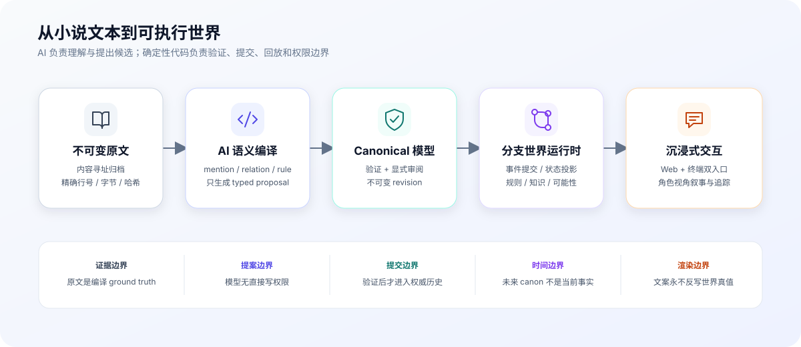
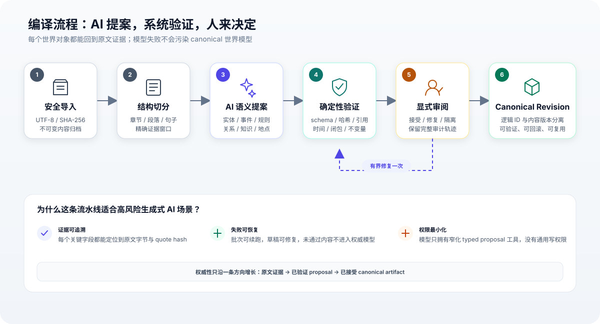
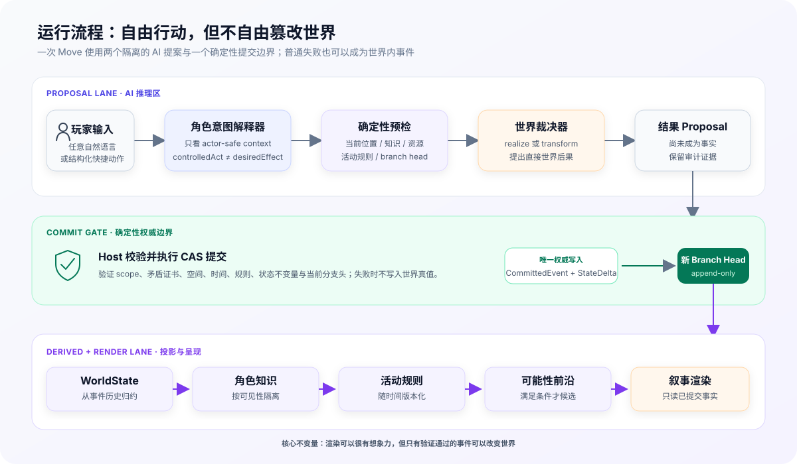
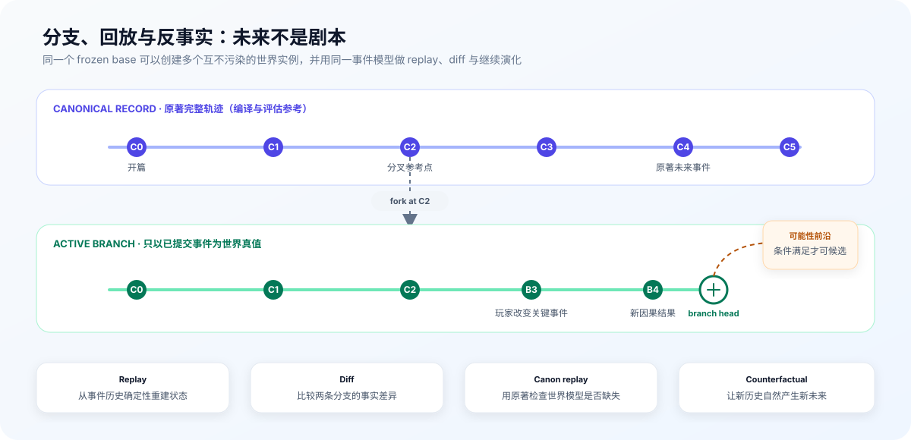
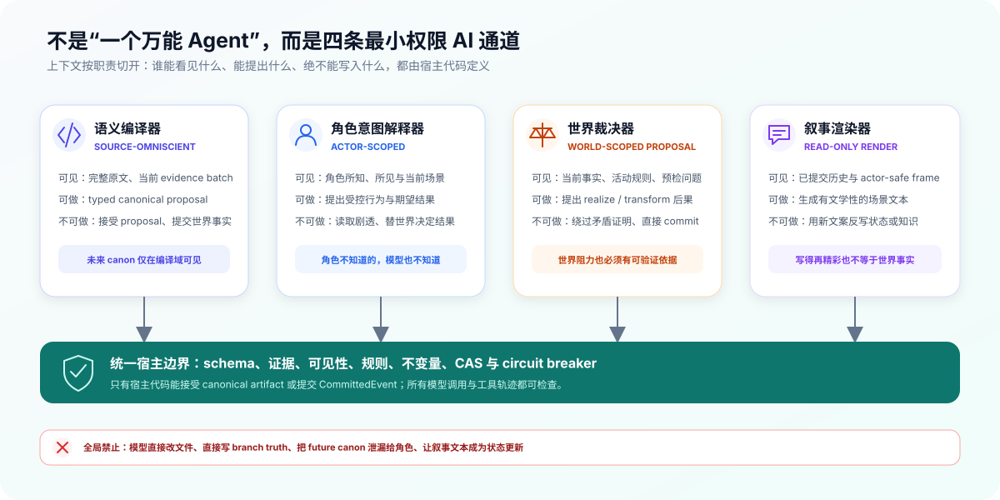

# Hackson AI 参赛项目说明：Novel World Harness

> **把小说从“可检索文本”编译成“可验证、可分支、可回放的 AI 世界”。**

| 项目 | 内容 |
| --- | --- |
| 项目名称 | Novel World Harness（NWH） |
| 项目形态 | Local-first Web 工作台 + Terminal-first CLI/TUI |
| 适用方向 | AI 原生应用 / 互动内容 / Agent 基础设施 / 开发者工具 |
| 核心技术 | TypeScript、Node.js、Pi Agent Runtime、React、Fastify、事件溯源、确定性验证 |
| 当前阶段 | 已完成端到端 MVP 与受约束的可执行世界 vertical slice |
| 开源协议 | MIT |
| 文档日期 | 2026-09-01 |

## 1. 一分钟摘要

大语言模型很会续写小说，却不天然擅长维护一个长期一致、可以验证的世界。如果玩家改变了原著中的关键事件，普通小说聊天机器人往往会出现三类问题：把原著后文继续当作必然剧本、让角色知道其不该知道的信息、用一段看似合理的新文案悄悄改写世界事实。

Novel World Harness 的解法不是再做一个更长上下文的小说 RAG，而是引入“**小说编译器 + 分支世界运行时**”：

- 编译器把原文转换为带精确证据的实体、事件、关系、地点、规则、角色知识与可能性；
- 所有模型输出都只是 typed proposal，必须经过确定性验证与显式接受；
- 运行时把分支上的已提交事件历史作为唯一世界真值，当前状态只是可重建的投影；
- 原著未来不会自动成为当前事实，而是进入带前置条件的 possibility frontier；
- 角色、裁决器、叙事器使用相互隔离的上下文与权限；
- 最终叙事只读取已提交结果，永远不能反向修改世界。



最重要的工程不变量可以概括为：`proposal → validate → commit → render`。

## 2. 我们想解决什么问题

### 2.1 小说不是世界模型，只是世界的一条观测轨迹

一部长篇小说记录了“作者选择讲述的一条历史”，但一个可继续运行的世界还需要回答：

- 某一时刻有哪些事实已经发生，哪些只是未来可能发生？
- 一个角色亲眼见过、听说过、误信了什么？
- 某事件发生的必要条件是什么，玩家破坏条件后会怎样？
- 法律、阵营制度、空间通路或超自然规则在什么时间、什么辖区有效？
- 玩家改变历史后，系统如何保持因果、时间、资源与角色行为一致？
- 新剧情如何回放、审计、比较，而不是只保存在聊天上下文里？

传统检索增强可以帮助模型找到原文片段，却不能独立解决这些“动态世界权威”问题。检索告诉模型文本中写过什么，不等于定义分支中现在什么为真。

### 2.2 三种常见方案的缺口

| 方案 | 优势 | 当历史发生分叉时的核心缺口 |
| --- | --- | --- |
| 小说 RAG / 问答 | 找原文、回答事实、实现快 | 检索到未来情节后容易把它误当当前事实；缺少事件提交、回放和状态约束 |
| 纯 LLM 角色扮演 | 语言自然、想象力强 | 世界状态依赖提示词与聊天记忆；知识泄漏、设定漂移和“文案即事实”难审计 |
| 手工剧情树 | 结果稳定、产品体验可控 | 每条分支都要人工编排，长篇世界的组合爆炸成本极高 |
| **Novel World Harness** | 原文证据 + AI 理解 + 确定性世界内核 | 当前仍需继续建立多小说语义质量 benchmark，但权威边界和端到端机制已经贯通 |

### 2.3 核心命题

> **Canon 是证据、评估基线和结构吸引子，不是必须执行的调度脚本。**

编译器可以知道原著结局；运行角色和活跃分支不可以因此“提前知道”或“被迫走回”结局。只要玩家破坏了某个未来事件的前置条件，该事件就应被延迟、变形、取消，或被新的因果结果替代。

## 3. 解决方案概览

系统被刻意拆成两个权威域：

1. **Novel Compiler Harness**：读取完整原文，生成可溯源、可审阅、带版本的 canonical artifacts。
2. **World Runtime**：只从 frozen base 与当前分支已提交历史出发，处理行动、规则、知识、时间、分支和叙事。

两者之间不是一段自由文本，而是稳定的类型、证据引用、不可变 revision 与提交协议。这让“理解小说”和“运行世界”可以分别改进，也避免编译器的全知视角污染玩家体验。

### 3.1 世界真值模型

系统不维护一个可被模型随意覆盖的 `current-state.json`。分支真值是 append-only 的 `CommittedEvent + StateDelta` 历史，状态满足以下语义：

```text
WorldState(branch, t)
  = reduce(initial world, committed events <= t, active temporal rules)
```

快照只是可验证、可重建的缓存，不是第二套权威数据。由此，继续游玩、历史回放、分支比较与反事实改写共享同一套事件模型。

### 3.2 Stable identity 与 temporal facts 分离

“曹操是谁”属于稳定实体身份；“曹操此刻在哪里、持有什么、相信什么”属于分支与时间相关的事实。系统将两者分开，因此同一角色可以存在于多个互不污染的分支状态中，而 canonical artifact 也不会因为运行时变化而被覆盖。

### 3.3 未来是可能性，不是事实

未来发展以 `Possibility` 表达：它包含时间窗口、参与者、前置条件、阻断条件、因果来源、失效条件和候选效果。概率或原著相似度可以影响策略，但不能直接把候选升级为事实。

## 4. 端到端工作流程

### 4.1 证据驱动的语义编译



编译阶段的关键设计：

- **不可变输入**：原始字节以 SHA-256 内容寻址保存；即使原文件随后移动或删除，证据身份仍然稳定。
- **精确证据**：证据引用保留行号、字节区间和 quote hash，读取时重新验证，不接受模型自报 offset。
- **分层语义**：mention、resolution、canonical artifact 被分开。看到“丞相”“孟德”“他”不等于系统立即把它们合并成一个角色。
- **类型化提案**：模型只获得有限的 proposal 工具，分别提出实体、事件、参与关系、时空、规则、命题与角色语义等候选。
- **确定性闭包**：宿主验证 schema、引用、证据哈希、时间关系、依赖、图环、作用域和跨对象一致性。
- **人在回路**：有效 proposal 仍需显式接受；失败项可以修复、拒绝或隔离，不能为了批次完成而静默吞掉。
- **可续跑**：长篇小说按受限 batch 编译，断点和草稿持久化；单次失败不会迫使全书重跑。
- **不可变版本**：逻辑 ID 与内容 revision 分离，便于审计、回滚和 frozen-base 固化。

这套流程把 LLM 的开放理解能力放在它擅长的位置，同时把权威增长限制在一条可检查的路径上。

### 4.2 分支世界的一次行动



玩家的一句话不会直接变成世界更新。一次 Move 的语义分为三部分：

- **角色控制行为**：角色现在真正能做的动作，例如尝试开门、询问某人、向某地出发。
- **期望结果**：可能依赖他人、环境或未知事实的目标，例如“说服守卫放行”或“在房间里找到密信”。
- **世界后果**：结合当前事实、活动规则、知识、空间和能力后，世界实际允许发生的结果。

自由文本先由 actor-scoped 模型翻译成 typed intent；世界裁决器只能提出 `realize` 或带矛盾依据的 `transform`；宿主最后验证并以 compare-and-swap 方式提交。这样，“复活一个已死亡且无超自然例外的角色”不会得到生硬的游戏报错，也不会真的篡改生死状态，而可以变成一次世界内可感知、可回放的失败尝试。

技术故障与世界阻力也被明确区分：普通世界阻力可以形成已提交事件；模型契约失败、权限越界或分支头过期则保持 head 不变并进入恢复路径。

### 4.3 分支、回放与反事实演化



每个新实例固定在一个 immutable canonical snapshot 上。玩家可以从某个角色真正进入故事的 source-backed checkpoint 开始，或从现有分支的任意安全提交点 fork：

- fork 前共享可验证祖先；fork 后各自追加事件，互不污染；
- `replay` 从历史重建状态，验证确定性；
- `diff` 比较两条历史产生的事实差异；
- `canon replay` 用原著关键检查点暴露世界模型缺失，而不是硬编码剧情；
- 原著未来只在条件仍成立时进入 possibility frontier。

这使“如果当时做了另一个选择”不再只是让模型写一篇同人短文，而是创建一条拥有独立事实、知识与后续因果的可执行历史。

### 4.4 AI 上下文与权限隔离



项目没有把所有事情交给一个全知 Agent，而是使用职责明确的 AI 通道：

| AI 通道 | 允许看见 | 允许输出 | 明确禁止 |
| --- | --- | --- | --- |
| 语义编译器 | 完整原文、当前编译批次与检索结果 | canonical typed proposals | 接受 proposal、提交分支事件 |
| 角色意图解释器 | 角色可见状态、知识、当前场景与同域检索 | `PlayerIntent` | 读取 future canon、替世界决定期望结果 |
| 世界裁决器 | 当前世界事实、活动规则、确定性预检问题 | `PlayerWorldResolution` | 绕过验证、直接 commit |
| 叙事渲染器 | 已提交历史、actor-safe frame、允许的文学上下文 | 场景文本与受限呈现元数据 | 把新文案写回状态、规则或知识 |

这种隔离同时解决了剧透、安全和一致性问题：角色不知道的信息不会因为“同一个模型先前读过整本书”而自然泄漏；模型也没有一条隐藏的通路将语言生成升级为世界真值。

## 5. 技术架构

### 5.1 分层设计

| 层 | 主要职责 | 权威性 |
| --- | --- | --- |
| Source Material Store | 原文字节归档、内容寻址、完整性验证 | 编译证据 ground truth |
| Annotation / Resolution Plane | mention、引语、话语结构、身份与事件消歧 | 非权威编译观察与决策 |
| Canonical Model | 实体、事件、关系、角色、地点、规则、来源与不可变 revision | 已接受的原著模型，不是活跃分支事实 |
| World Store / Engine | branch、commit、event、delta、snapshot、rule、knowledge、frontier | 活跃分支世界真值 |
| Application Services | 准备、审阅、实例、游玩、维护、trace 与恢复编排 | 只能通过领域协议调用内核 |
| Pi Agent Boundary | provider、stream、tool call、session 与模型路由 | 生成 proposal，不拥有领域真值 |
| Web / TUI | 工作台、进度、图谱、游玩、轨迹检查与用户确认 | 呈现和意图入口 |

### 5.2 核心领域对象

- `SourceSpan`：不可变证据位置与哈希；
- `Entity`：稳定身份，不承载当前动态状态；
- `CanonicalEvent`：原著轨迹中有证据的事件；
- `CommittedEvent`：某条分支上已经成为事实的事件；
- `StateDelta`：由已提交事件产生、可确定性应用的变化；
- `WorldRule`：带时间、辖区、例外和优先关系的世界内规则；
- `KnowledgeFact`：按角色隔离的知识、信念与获取方式；
- `Possibility`：未提交的未来候选及其条件；
- `Branch` / `Snapshot`：分叉关系与可重建检查点；
- `NarrativeObservation`：叙事解释与呈现信息，明确不等于世界真值。

### 5.3 为什么选择本地文件而不是先上数据库

Phase 0 的数据位于用户级 `$NWH_HOME`（默认 `~/.novel-harness/`），使用人可读文件、不可变对象和原子指针：

- 比赛演示无需外部数据库、云账号或向量服务；
- 本地持久数据不需要上传到 NWH 云端；模型调用只向用户选定的 provider 发送职责所需的受限上下文；
- 调试时可以直接审计 branch、proposal、trace 与 revision；
- 内容寻址和原子提交比“随手覆盖 JSON”更适合回放与恢复；
- 等多用户、云同步和大规模协作需求成立后，再通过正式 ADR 引入外部存储。

本地优先不是限制扩展，而是让 MVP 先证明世界模型与权威协议，而不是让基础设施复杂度掩盖核心问题。

### 5.4 技术栈

| 范围 | 选型 |
| --- | --- |
| 语言与运行时 | TypeScript、ESM、Node.js ≥ 22.19 |
| Agent Runtime | Pi（provider、流式响应、tool call、session、登录与模型目录） |
| Web | React 19、Fastify 5、TanStack Router/Query、ECharts |
| Terminal | Pi TUI + NWH CLI commands |
| 类型与验证 | TypeBox、Zod、确定性领域 validator |
| 测试 | Vitest、Playwright、生产 Fastify host 下的浏览器验收旅程 |
| 持久化 | 用户级 local-first 文件、content-addressed immutable objects、atomic refs |

## 6. 核心创新与亮点

### 亮点一：从“会聊小说”升级为“运行小说世界”

NWH 的输出不是一次聊天回答，而是一套能重建历史、验证状态、继续演化的世界协议。文本只是世界的一次观测或一次渲染；事件历史才是运行时权威。这一抽象使小说续写、角色扮演、反事实探索、回放和评估首次落在同一数据模型上。

### 亮点二：把 AI 幻觉变成可控 proposal，而不是产品事故

模型可以大胆发现语义，但不能直接写真值。精确 evidence binding、typed tool、确定性 schema、引用闭包、显式接受、不可变 revision 和 circuit breaker 共同组成一条可信生成链。失败 proposal 是可检查、可修复的数据，而不是已经混入世界的隐性错误。

### 亮点三：原著未来可参考，但不会“剧情回弹”

很多互动小说系统在玩家偏离后仍把下一章当调度表，导致角色和事件被强行拉回 canon。NWH 把 future canon 降级为有条件的可能性：只有角色目标、资源、规则、时空和因果条件仍成立时，类似发展才可能重新获得资格。

### 亮点四：角色知识真正与编译器全知隔离

系统区分世界事实、角色知道/相信的内容、叙述者主张、编译器看到的后文和读者 recap。后段登场角色可以获得完整但 reader-only 的前情提要，同时 actor 模型仍只收到其角色应该知道的内容，避免剧透渗入行动与 NPC 反应。

### 亮点五：自然语言自由度与确定性世界约束同时存在

宿主不通过中英文关键词猜玩家意图。模型负责跨语言、跨表达的语义翻译；代码负责作用域、知识、时间、空间、规则和提交。结构化按钮和自由输入最终进入同一验证与 commit pipeline，因此 UI 便利不会形成第二套规则。

### 亮点六：叙事很自由，事实很保守

文学渲染器可以改变措辞、节奏、视角和风格，但只能读取已提交事实。即使生成了非常可信的新细节，只要没有经过事件提交，它就不能成为下一回合的世界状态。这一边界显著降低“模型上一句随口写、下一句当成设定”的漂移。

### 亮点七：完整可观测性不是后台附属，而是产品能力

每次 compiler/play run 都有持久 trace：模型请求、上下文组成、tool call、usage、耗时、重试、故事时间变化与 commit boundary。Web 工作台可检查 ontology、provenance 和 branch-scoped projection。评委不仅能看到结果，还能看到 AI 为什么拿到这些上下文、在哪一步跨过权威边界。

### 亮点八：停止、重试与恢复不会重复写世界

长操作使用 idempotency 与持久 operation state；短 mutation 有本地 journal。若世界事件已经提交但叙事流被中断，系统只允许 narration-only repair，不会重放行动。启动时会对中断 trace、turn audit、commit ancestry 与 branch head 做核对，无法确认的结果保持 unknown，而不是猜测成功或失败。

## 7. AI 与确定性代码如何分工

本项目不是“尽量少用 AI”，而是让 AI 的创造性与软件系统的可验证性各司其职。

| 问题 | 交给 AI | 交给确定性代码 |
| --- | --- | --- |
| 原文理解 | mention、语义角色、因果解释、角色特质候选 | 精确 selector、哈希、结构边界、引用闭包 |
| 身份消歧 | 提出 resolved/new/ambiguous 决策 | 候选召回、revision、依赖完整性、冲突检查 |
| 玩家输入 | 跨语言意图、controlled act 与 desired effect | scope、知识、时间、空间、资源与 head 校验 |
| 世界后果 | 提出 realize/transform 与矛盾解释 | 证书引用、规则适用、不变量、event commit |
| NPC 行为 | 结合目标、认知、情绪提出反应 | actor visibility、允许 delta、因果提交 |
| 叙事 | 文学表达、节奏、场景连续性 | 只读 frame、事实边界、失败恢复 |
| 未来发展 | 候选可能性与解释 | eligibility、blocking、expiry、commit |

设计判断标准很简单：需要开放语义理解的交给模型；影响世界权威、可见性与可回放性的交给代码。

## 8. 产品体验

### 8.1 Web 工作台

本地 Web MVP 覆盖同一应用服务和 Pi runtime：

- 上传或粘贴小说，查看准备进度并恢复中断任务；
- 审阅 proposal、处理无效项、生成 opening、发布 prepared revision；
- 创建、fork、移除世界实例，选择角色并持久化 resume；
- 在 Play 页观察当前 actor、branch/head、故事时间、运行阶段与 commit 状态；
- 查看按 branch/time 限定的 world model、event、place、rule、provenance 图谱；
- 检查模型 request、context part、tool、retry、usage 与 commit boundary；
- 管理 Pi provider 登录和分角色模型路由，API key 只写不回显；
- 对破坏性操作先 preview，再显式确认。

服务默认只绑定 `127.0.0.1:3080`。没有显式 `--allow-remote` 时拒绝远程绑定，因为 MVP 尚未引入产品级账号与 RBAC。

### 8.2 Terminal-first 体验

CLI/TUI 不是 Web 的简化壳，而是完整的本地工作流入口：

- 小说导入、编译、审阅、审计、世界创建和 fsck；
- 具有持久 transcript、流式模型输出、工具轨迹、滚动与恢复的全屏 TUI；
- `novels`、`instances`、`characters`、`progress`、`resume` 等目录命令；
- 角色模式下自由输入与 2–4 个上下文行动建议共享同一受限执行管线；
- 普通助手默认只有本地 lexical discovery 与 bounded read，不拥有通用写工具。

双入口共享同一个 `$NWH_HOME`、world store、session pointer 和模型配置，不存在 Web 世界与 CLI 世界不一致的问题。

## 9. 演示方案（建议 6 分钟）

| 时间 | 演示动作 | 评委应观察的证据 |
| --- | --- | --- |
| 0:00–0:40 | 用一句话说明“小说不是 RAG，分支历史才是真值” | 展示系统总览图与核心不变量 |
| 0:40–1:40 | 上传一段小说，启动准备流程 | source hash、分段、batch 进度和 typed proposal |
| 1:40–2:30 | 打开 proposal 与 provenance | 精确原文 excerpt、字段支持、验证结果与显式接受 |
| 2:30–3:20 | 创建实例并选择一个角色进入 | frozen base、角色 entry checkpoint、无剧透 actor context |
| 3:20–4:20 | 输入一个明显改变 canon 的自由行动 | intent 与 desired effect 分离、裁决、commit boundary、branch head 前进 |
| 4:20–5:15 | 查看世界图谱、历史和角色知识 | 新事实属于当前 branch；future canon 仍不是真值 |
| 5:15–5:45 | fork 并执行另一选择，再比较分支 | 两个实例共享祖先但后续状态互不污染 |
| 5:45–6:00 | 打开 trajectory inspector 总结 | request、tool、重试、耗时与提交证据完整可查 |

### 推荐的演示冲突

选择一个条件明确、结果易观察的小场景，而不是追求全书规模：

1. 当前角色掌握的信息有限；
2. 某扇门、路线、权限或人物状态受一条明确规则约束；
3. 玩家先尝试违反规则，观察 `transform` 为世界内失败；
4. 玩家再通过获取信息、资源或许可改变前置条件；
5. 重试后成功，展示前后两个已提交事件如何改变 eligibility。

这能在最短时间内同时证明角色知识隔离、规则执行、自然语言裁决、事件提交和因果演化。

## 10. 当前完成度

截至当前分支，已经落地的关键闭环包括：

- local-first source ingest、内容哈希、证据分段与安全章节发现；
- 可恢复的 Pi compiler batches、typed proposals、finish handshake 与显式审阅；
- entity/event mention、resolution、quotation、proposition、attribution、participation；
- character、relationship、spatial、world-rule ontology 及其 evidence gates；
- canonical immutable revisions、prepared snapshot、rollback 与 activation；
- append-only world commits、state projection、temporal rules、knowledge isolation；
- possibility frontier、canon replay、fork、diff、snapshot 与 fsck；
- 角色意图、世界裁决、NPC reaction、第三人称 scene rendering 的受限模型通道；
- Web/TUI 双入口、模型设置、可恢复 operations、trajectory inspector 与 ontology inspector；
- Vitest 单元/集成测试与 Playwright 真实浏览器 MVP 验收旅程。

本次参赛文档提交已在当前代码基线上执行 `pnpm run check`，并通过
`pnpm test` 的 132 个测试文件、750 项测试。

仓库的 [Implementation status](implementation-status.md) 会把“引擎原语已实现”和“面向任意小说的产品质量已证明”分开记录；参赛演示也遵守同一口径。

## 11. 诚实边界与风险

### 11.1 尚未完成的部分

- 还没有多体裁、多语言、人工标注的全书 benchmark，不能宣称任意长篇小说都能高精度自动编译；
- 当前是受约束 vertical slice，广泛的物理、经济、社会与群体仿真仍需扩展；
- proactive NPC/background actor 的丰富度仍低于玩家直接交互路径；
- prepared bundle 的字段级 evidence assertion 仍有 portability gap；
- scene occurrence、跨章传递失效闭包和 condition-aware typed causality 仍在路线图中；
- 本地 Web MVP 没有远程多用户账号、RBAC、云同步和生产部署层。

### 11.2 为什么这些边界不削弱本次参赛价值

比赛版本要证明的是一个新的、正确的系统切分已经可运行：AI 可以把小说编译为 proposal，确定性内核可以验证和提交，用户可以在隔离角色视角中改变历史，系统可以回放并解释结果。泛化 extraction quality 是可测量、可逐步改善的模型问题；如果世界权威边界一开始就是错的，再高的抽取覆盖率也只会更快地产生不可审计的错误。

### 11.3 主要风险与应对

| 风险 | 应对 |
| --- | --- |
| LLM 抽取错误 | 精确证据、proposal 状态、显式接受、gold schema 与后续 benchmark |
| 角色知识泄漏 | actor-safe projection、源访问隔离、future-canon 默认隐藏、专门测试 |
| 规则冲突或状态漂移 | deterministic validators、temporal rules、event sourcing、fsck/replay |
| 重试造成重复提交 | idempotency key、mutation journal、CAS branch head、narration-only repair |
| 长篇成本与中断 | chapter-bounded batches、durable checkpoint、paged retrieval、单批次推进 |
| 隐私与凭据泄漏 | local-first、loopback 默认、secret redaction、write-only API key |

## 12. 评估指标

为了避免只用“生成文本看起来不错”评价系统，项目将指标拆成四层：

| 层 | 示例指标 | 当前验证方式 |
| --- | --- | --- |
| 数据完整性 | source hash 命中率、悬空引用数、revision closure、fsck 通过率 | deterministic validation + tests |
| 世界一致性 | replay 后状态哈希一致、非法 delta 拒绝率、branch 隔离、规则适用正确率 | engine tests + replay/diff |
| AI 可靠性 | tool contract 成功率、纠正重试率、无证据 proposal 拒绝率、知识泄漏率 | durable trace + conformance tests |
| 语义质量 | mention/entity/event/role/relation precision/recall、跨章 coreference、因果条件质量 | gold corpus 与多小说 benchmark（路线图） |
| 产品体验 | 首次可玩时间、恢复成功率、每回合延迟、任务完成率、分支持续一致回合数 | Web telemetry/trace + user study |

特别重要的比赛验收条件：

- 在同一输入和已提交历史下，replay 得到相同状态；
- 角色不可读取其未获知的 future-canon 信息；
- 叙事生成失败不会撤销已提交世界事件，也不会重复提交；
- fork 后两个分支可独立演化且共享祖先可验证；
- 每个演示中的关键 canonical artifact 都能追溯到原文证据。

## 13. 应用价值

### 面向读者

从“问一本书问题”升级为“以一个角色身份安全地进入书中，并承担选择的长期后果”。

### 面向作者与编剧

把世界观设定、时间线、角色知识和规则变成可检查模型，用于反事实推演、连续性检查、改编方案比较与 writer's room 协作。

### 面向 IP 与互动内容团队

减少手工维护巨大剧情树的成本，允许人类创作者设定权威边界与关键规则，让 AI 扩展局部可能性而不是接管世界真值。

### 面向教育与研究

用于历史/文学中的视角讨论、因果推理、叙述可靠性和“如果改变一个条件”实验；同时为长文本 Agent、知识隔离、event-sourced world model 提供可重复评测平台。

## 14. 路线图

### 下一阶段：语义质量闭环

- 建立多小说 gold corpus 与 precision/recall scorer；
- 完成 source scene occurrence 与跨章 membership；
- 将字段级 assertion/binding 打包进 portable prepared revision；
- 实现 mention → resolution → canonical → runtime 的传递失效闭包；
- 让 typed causal required conditions 进入 runtime eligibility。

### 随后阶段：世界丰富度

- 扩展群体、经济、资源、制度、地理与长期 background process；
- 让 proactive actor 共享同一知识、规则与提交管线；
- 增加更长周期的角色发展与关系演化评测；
- 建立跨模型、跨语言和跨题材的 canon replay suite。

### 产品阶段

- 面向创作者的世界规则编辑与 evidence review 工作台；
- 可导出的 branch package、协作评审与审计报告；
- 在正式安全架构下支持可选云同步、多用户与权限系统；
- 构建小说/IP 的可执行世界发布格式，而不是绑定单一前端。

## 15. 快速运行

环境要求：Node.js 22.19 或更高版本、Corepack、pnpm。

```bash
corepack enable pnpm
pnpm install --frozen-lockfile
pnpm run build
```

启动本地 Web 工作台：

```bash
pnpm dev web --no-open
```

默认访问 `http://127.0.0.1:3080`。启动 Terminal assistant：

```bash
pnpm dev
```

无需 API key 即可打开本地 UI 和检查已有数据；运行真实 compiler/player/narrator 模型需要在 `/login`、Web Model Settings 或环境变量中配置 Pi 支持的 provider。

运行验证：

```bash
pnpm run check
pnpm test
pnpm test:e2e
```

Playwright 首次运行如缺少 Chromium，可执行：

```bash
pnpm exec playwright install chromium
```

## 16. 评委可重点查看的仓库入口

| 入口 | 说明 |
| --- | --- |
| [README](../README.md) | 安装、Web/TUI 使用方式与当前能力总览 |
| [Architecture ADR 0001](adr/0001-world-truth-history-and-possibility-space.md) | 分支真值、未来可能性与事件溯源的核心决策 |
| [Player adjudication ADR 0004](adr/0004-model-first-player-intent-and-world-adjudication.md) | 自然语言意图、世界阻力与确定性提交边界 |
| [Implementation status](implementation-status.md) | 已实现能力与未完成边界的逐项核对 |
| [Technical design](technical-design.md) | 类型、存储、验证、调度、回放与里程碑 |
| [中文语义编译计划](novel-semantic-compilation-plan.zh-CN.md) | 长篇小说语义、证据与 benchmark 路线 |
| [`src/compiler`](../src/compiler) | evidence、proposal、resolution、validation 与 prepared revision |
| [`src/world`](../src/world) | event、state、branch、knowledge、rule、frontier、replay 与 narrative |
| [`src/application`](../src/application) | Web/TUI 共用的准备、游玩、实例、trace 与恢复服务 |
| [`e2e/web-mvp.spec.ts`](../e2e/web-mvp.spec.ts) | 浏览器完整验收旅程 |

## 17. 结语

Novel World Harness 的价值不只是让 AI 写出“更像原著”的下一段，而是建立一条从原文证据到动态世界真值的可信路径：原文可以被编译，模型建议可以被验证，历史可以被分叉，状态可以被回放，角色只能知道其应知之事，而新叙事必须尊重已经发生的一切。

**我们希望证明：下一代 AI 互动内容的核心，不是更大的聊天上下文，而是一个模型可参与、却不能越权的可执行世界。**
