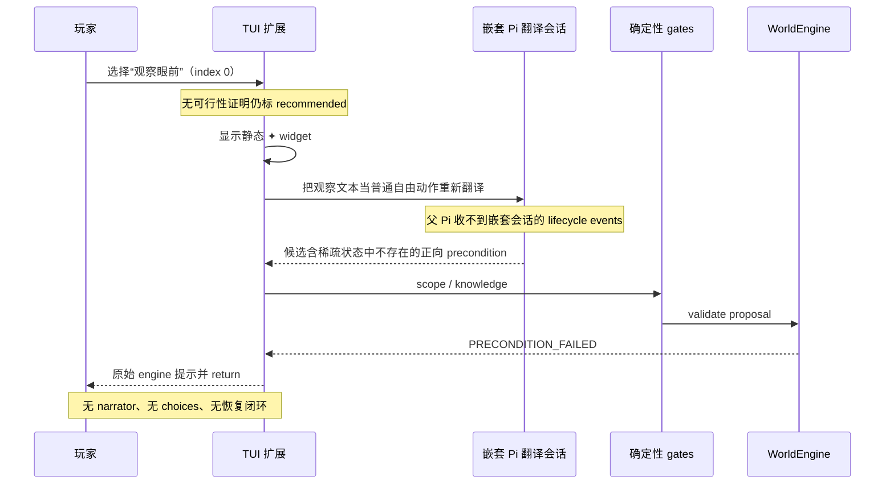
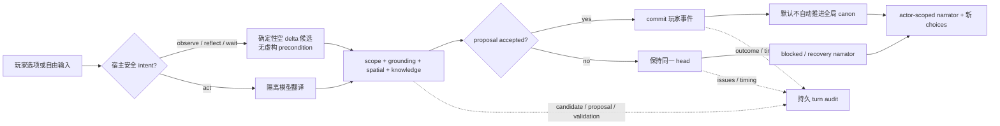

# 玩家推荐选项停滞事故复盘

## 范围与结论

- 会话：`01a00ba3-e266-7e2d-9859-6af1ad23bd8b`
- 分支：`huozhe-11cfe977`
- 角色：`fugui`
- 事故 head：`b611b27c7531ef6244e36fd9ffc779294f67c86de3daa318b831ca1d3c3a55cc`
- 用户动作：选择第一项、被 UI 标为 recommended 的“观察眼前”
- 结果：约 19 秒只有静态 `✦` 提示，随后以 `PRECONDITION_FAILED` 结束交互；branch truth 未改变。

这不是“空 delta 不能提交”。同一分支已经存在可提交的空 delta 玩家事件；修复后的宿主 observation 候选也是空 delta，并在原 head 上只读通过 scope、grounding、spatial 和 engine validation。直接触发事故的是模型为稀疏状态虚构了一个正向前置条件，旧流程又把该候选的失败错误地升级成了整个开放式交互的终点。

## 事故链路

## 根因

### 1. Loading 生命周期接错层级

统一的动画组件只订阅父 Pi 的 `agent_start`、`message_update`、tool 和 `agent_settled`。玩家输入先被扩展拦截，再由一个 `saveSession: false` 的嵌套 Pi 会话翻译；它的事件不会冒泡到父会话。因此主动画完全没有启动，玩家路径另行渲染了一个没有 timer 的静态 `✦` widget。

### 2. “推荐”只是数组位置，不是安全承诺

旧 UI 无条件使用 `index === 0` 标记 recommended。场景 fallback 恰好把“观察眼前”放在第一项，但选项没有类型、来源或可行性信息；选中后仍经过不受约束的自然语言重翻译。UI 的推荐承诺和执行语义没有连接。

### 3. 稀疏 committed state 被误当成可推断事实

事故 head 的 `fugui` actor view 没有可用的动态 self state。旧提示允许模型“加入真实 preconditions”，但没有明确说明缺失字段是 unknown；模型可以从人物身份或常识补出 `character.alive = true` 一类条件。确定性引擎正确地把缺失字段求值为 false，最终返回 `PRECONDITION_FAILED`。

### 4. Gate 拒绝被错误地当成交互拒绝

引擎只拒绝一个 proposal effect，并没有拒绝“继续玩”。旧扩展却在任何 rejected result 后输出内部 stage/code 并立即 `return`，跳过 narrator 和下一轮 choices。这把世界真相的 fail-closed 约束错误扩散到了产品交互层。

### 5. 空间、可见性与引用身份混为一谈

`referenceableEntities` 被命名为 `visibleEntities`。同时，只要任一角色缺少 location，物理互动就被归类为 remote。于是“未知是否同场”和“确定在远处”没有区分；在旧 prepared revision 的稀疏状态上尤其容易误拒绝。

### 6. 普通玩家行动隐式调度全局 canon

每个 accepted 玩家事件默认追加一个 background candidate。Frontier 没有使用 `candidateWindow` 约束，多个无 parent、无 precondition 的 canon roots 可以只按分数/ID 排序，导致一次观察也可能跳到几十年后的事件。Frontier store 还从对象目录反推了错误 workspace root，形成二次哈希的缓存路径。

### 7. 诊断信息不可持续

嵌套翻译会话不保存；扩展又丢弃了 `PlayerTurnResult` 中的 candidate/proposal/validation。会话只剩一个笼统 engine code，无法在事后直接回答“哪条 predicate 失败”。旧 prepared revision 是否稀疏或落后也没有进入玩家告警。

## 修复后的流程

## 修复矩阵

| 问题 | 修复 | 保持的系统不变量 |
| --- | --- | --- |
| 玩家等待期间无统一动画 | 玩家翻译、gate、场景 narration 都使用同一 animated loading 组件和 phase 模型 | UI 进度不参与 world truth |
| 第一项被盲目标为 recommended | choice 增加 `act/observe/reflect/wait` intent；只把第一个宿主可保证的 observe 标为 recommended；旧 transcript 做保守迁移 | 推荐变成可执行承诺，不改变模型权限 |
| 推荐观察仍走模型 | 三种窄 intent 由宿主生成空 delta、空 precondition 候选，并保留当前 scene participants | Narrative 不直接写 truth；事件仍经过同一 gates/commit |
| 缺失字段导致伪前置条件 | 提示明确 absent = unknown；新增 actor-visible grounding gate，区分 ungrounded 与 known-false | 引擎仍 fail-closed，没有放宽 deterministic validation |
| rejection 终止交互 | rejection 保持 head，生成 `recovery` 或 `blocked` actor-scoped scene，并恢复 choices；narrator 失败时仍回退到安全 choices | 被拒 proposal 不进入 history，玩家 agency 不被拒绝 |
| unknown location 被当 remote | known unequal 才是 remote；缺失位置返回 unknown；当前 committed event participants 可提供 scene presence | 不向模型暴露完整 world state，不凭名称证明在场 |
| referenceable 被描述为 visible | frame 分离 `presentEntities` 与 `referenceableEntities`，旧 `visibleEntities` 仅兼容并指向 present | Character knowledge/visibility 与 compiler omniscience 隔离 |
| 玩家 turn 自动触发 canon | `performPlayTurn`、TUI、`play-world` 默认 background=0；显式 opt-in 才推进 | Canon 是 attractor，不是 mandatory scheduler |
| 时间倒退/远期 root 抢跑 | Frontier 加 active/current-window 与 explicit-advance 模式；拒绝过去窗口，未来需显式推进，forward 按时间排序；无场景/条件/因果支持的 root canon 保持 latent | Branch history 是时间权威，future canon 仍在 possibility frontier |
| Frontier 缓存落错目录/模式互相覆盖 | Engine 保存真实 workspace root；缓存按 workspace、commit、temporal mode 分开，兼容读取旧布局 | 缓存不成为 truth，也不跨 workspace 混淆 |
| 候选事后不可见 | 每 turn 持久化 utterance、origin/intent、candidate、proposal、validation、issues、heads、background outcome 和 timing | 模型输出仍只是 proposal；audit 不修改 truth |
| prepared revision 稀疏/落后静默 | 进入实例时告警 actor state 稀疏；branch pinned revision 与 active revision 不同时说明应新建实例而非改写旧分支 | 可重放性和 branch pinning 保持不变 |
| 中文“我”误命中 narrator 实体 | 第一/第二/第三人称代词不再作为显式实体名匹配 | 玩家第一人称不会意外扩大 reference scope |

## 兼容与恢复

- 旧 choices 没有 `intent` 时默认按 `act` 处理；仅对明确以“观察/查看/倾听”“整理/回想/思考”“等待/静候”开头的旧标签升级到窄宿主 intent。
- 旧会话若最后一条玩家 transcript 是原始 `Action rejected at ...`，启动时自动从保存的同一 branch head 进入 recovery scene。
- 旧 frontier cache 仍可按 current-window 只读加载；新缓存文件带 temporal mode，不会互相覆盖。
- 已有 branch 绝不被换绑到新 prepared revision；告警只建议创建新实例。

## 验证

- 原事故 head 上的只读验证结果：宿主 observe 候选 participants 为 `jiazhen`，preconditions 和 operations 均为空；scope、grounding、spatial issues 均为空；engine validation accepted。
- 回归覆盖：嵌套玩家 loading 动画、推荐 observation 不调用模型、rejection scene 恢复、旧 raw-rejection transcript 恢复、稀疏前置条件、scene presence/unknown/remote、代词实体、turn audit、prepared revision 告警、默认零 background、时间窗/场景 root gating、frontier cache root/mode。
- 最终验证命令：`pnpm run check`、`pnpm test`、`pnpm run build`。

