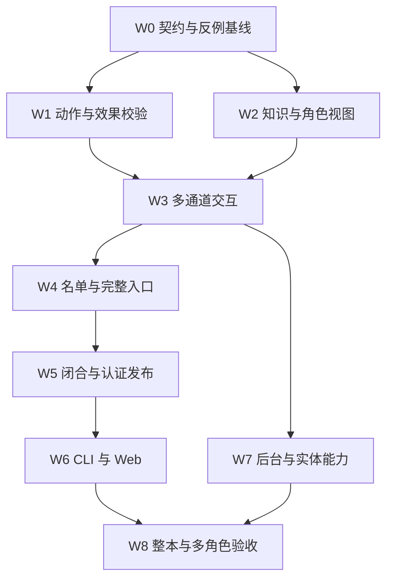

# 小说到 Play：实施工作包与验收计划

- **状态：** Proposed；下列工作包均为待实施，不表示当前主线已通过。
- **基准：** `b2c010548edc519ea957e0ddc9fffdb47c297a5d`，2026-09-05。
- **技术契约：** [完整链路技术设计](novel-to-play-technical-design.zh-CN.md)。
- **决策依据：** [ADR 0010](adr/0010-major-character-play-and-world-closure.md)。
- **执行原则：** 每个工作包交付代码、真实入口回归和可回查结果；没有直接验证记录时保持未完成。

## 1. 实施顺序与依赖



W7 的通用实体扩展可按小说适用域拆分，但该小说必要机制必须在 W8 前完成。W5 的完整性检查不得因 W7 未完成就把必要场景排除。

### W0：固定契约、基线和版本切换

- 核对主线与本设计基准的差异，更新 F1—F8/R1 的状态及源文件定位。
- 将三个报告反例转为实际入口回归：使用有 sourceId 的 fixture；验证最终 actor context；移动只删除标签而保持效果不变。
- 冻结 OutcomeProposal、ActorDecisionView、EntryCut、certificate 的共同命名和错误码；复用当前 delta 类型。
- 制定一个集成版本提交：prepared V4、world schema V3、engine 0.3.0、storage v3 及 cache/fingerprint；与首次不兼容修改同时合入。
- 交付：基准 manifest、预期失败的复现记录、schema 变更清单。不能为了让 W0 变绿而放宽原有约束；修复提交必须包含相应回归变绿。
- 关联：N05、N07、N09；A01—A05、K01—K04、V01。

### W1：动作契约与效果义务

- 现有：`src/world/player-action.ts`、`action-constraint.ts`、`engine.ts`、`state.ts`、`spatial-ontology.ts`、`norm-ontology.ts`。
- 计划新增：`src/world/action-invocation.ts`、`effect-obligations.ts`。
- 玩家 candidate → EventProposal 必须产生 action；NPC、自主 actor 及手工提议使用同一验证器。
- host 根据状态差分触发移动、所有权、资源及身体状态检查；所有 effects 对应合法 mechanism witness。
- 区分有权限实施、物理可能、违反制度和人物意愿；动作型 norm 识别不再因缺 action 跳过。
- 交付：F1/F3 回归通过，直接 engine 调用同样无法绕过，合法移动／传送／物品转移不被误拒。
- 关联：N05、N12；A01—A07。

### W2：知识准入与统一决策视图

- 现有：`knowledge.ts`、`source-scope.ts`、`actor-visible.ts`、`projection-service.ts`、`player-action.ts`、`npc-reaction.ts`、`model-actor-policy.ts`。
- 计划新增：`src/world/actor-decision-view.ts`。
- source evidence 与 branch event provenance 使用同一可信准入函数；验证祖先、actor 获取、来源和有效时间。
- 玩家翻译、NPC 直接答话、自主 actor 共用目标、关系、评估、义务和知识投影；缓存必须绑定 actor/head。
- 错误原因在 host trace 中保留，角色可见信息不得泄漏隐藏规则或其他角色知识。
- 交付：F2 回归通过；相同人物在不同入口的领域视图 hash 一致，允许各自的策略提示不同。
- 关联：N06、N07；K01—K05、S03。

### W3：自由交互的多通道效果

- 现有：`model.ts`、`engine.ts`、`player-action.ts`、`npc-reaction.ts`、`model-actor-policy.ts`、`frontier.ts` 及各 typed effect reducers。
- 计划新增：`src/world/outcome.ts`；与 W0 的版本变更同步。
- 三类模型策略输出都能提出 state、knowledge、semantic、process、norm；localRef 由 host materialize。
- 新承诺的提出、接受、知情、到期、履约／免除／违约形成完整生命周期；对话叙述不能直接创建债务。
- 每个 channel 校验失败均原子拒绝，不留下半次资源扣减、空义务或孤立知识。
- 交付：自拟“假钥匙＋夜间禁令＋送信承诺”场景通过全部实际入口；未来选择改变后不强制原著后继。
- 关联：N05—N08；S01—S05、A06、L01。

### W4：主要人物名单与完整时点入口

- 现有：`compiler/annotations.ts`、`entity-resolution.ts`、`world/entry-context.ts`、`instance.ts`、`play-choice.ts`、`initial.ts`、`model.ts`。
- 计划新增：`compiler/role-roster.ts`、`compiler/playability.ts`。
- roster 从全书语义和独立复核冻结；保留缺实体 ID 的主要人物候选，不从 ready list 反推分母。
- 入口按实际发生与故事时间切面派生；同一事件在回忆中再出现不能重复应用。
- EntryProjectionSeed 覆盖状态、知识、社会语义、有效规则、norm/process；cut 当前事件还未发生。
- 每个 major 生成可玩档案和确定性探针，未知必要条件阻断，非关键未知明确记录。
- 交付：首章、晚出场、化名、历史回忆及不同知情路径的人物均有准确结果；缺数据者明确 blocked。
- 关联：N02—N04、N07；C04、R01—R06。

### W5：依赖闭合、修复与认证发布

- 现有：`compiler/source-accounting.ts`、`evidence-assertions.ts`、`validator.ts`、`converge.ts`、`audit.ts`、`prepared-cache.ts`、`commands/reparse.ts`、`commands/prepare-all.ts`、`workflow/prepare.ts`。
- 计划新增：`compiler/closure.ts`、`compiler/certification.ts`。
- typed revision dependency graph、关键 issue、竞争解释、场景执行包、传递失效集合落地。
- 保留现有来源、accounting 和审计维度；增加 independent roster、角色认证和 capabilityClosure，禁止“任一角色可玩”替代全体 major。
- 修复仅针对受影响来源与依赖；旧 active prepared 保持可读，全部通过后原子激活。
- 证书用 subjectSnapshotHash 避免哈希循环；publish、activate、restore、loadFreshActive 同门。
- `evaluateCandidate` 在隔离命名空间复用生产 play 内核，先冻结仅绑定 subject 的评测 manifest，再生成证书；候选准入仅由 host 构造，不新增公共绕过开关。
- 交付：故意遗漏一个核心人物／机制／获取路径时不能发布；修复后的新修订可发布且旧分支不变。
- 关联：N01—N04、N09、N12；C01—C06、R01、V01—V05。

### W6：CLI／Web 一致的角色 Play

- 现有：`application/preparation-service.ts`、`preparation-projection.ts`、`play-service.ts`、`web/contracts.ts`、`web/host.ts`、`web/mutation-journal.ts`、`apps/web/src/api.ts`、`router.tsx` 及共享 TUI 选择路径。
- preparation 显示全量主要人物名单、认证进度和阻断；正式角色列表来自同一 frozen revision。
- startFreshPlay 复核角色、entry cut、certificate 和 expected prepared hash；重试幂等，不复用新 play 的旧 branch。
- CLI 不绕过应用发布门；编译工作台的 omniscient diagnostics 不传给角色策略。
- 取消／恢复分别检查提交前、提交后语义；角色列表过期执行一次明确刷新。
- 交付：Web 和 CLI 对同一 source/actor/cut 得到相同认证结论；同一角色两次有意新建得到独立世界。
- 关联：N03、N04、N09、N10；U01—U05。

### W7：后台活性、未知策略与必要实体能力

- 现有：`runtime.ts`、`frontier.ts`、`state.ts`、`time.ts`、`policy-time.ts`、`norm-ontology.ts`、`projection-service.ts`、`fsck.ts`。
- 先复现死亡义务人队首阻塞风险；只根据复现修复失败排除、唤醒和规范结算。
- predicate 的 open／closed-world、unknown 和 conflicting 在 authority 与 visibility 层明确区分。
- 按待发布小说的必要机制实现 branch artifact 创建；更广生命周期独立拆分，所有新身份参与 snapshot/fsck/fork。
- 交付：其他合法候选不被错误队首饿死；未知不当作 false；新造关键物品是可转移的持久实体。
- 关联：N05、N08、N09、N12；A07、L01—L04、E01—E03。

### W8：真实全文编译与全体主要人物验收

- 现有：`src/eval/compiler-eval.ts`、`fixtures/corpus/representative/`、`test/`、`e2e/web-mvp.spec.ts`。
- 计划新增独立 eval manifest／runner：预发布经受信任的候选评测用例复用生产 play 内核与真实 Pi 适配；发布后经公开 API／CLI 验证正式入口，不另建测试专用世界转移实现。
- 固定完整来源、独立 major 名单与语义 gold、模型配置和场景脚本；逐人完成入口、交互、跨回合演化、等待、分歧、resume、fork。
- 产出逐小说／逐人物／逐场景结果与失败来源定位，模型成本和渲染评价独立展示。
- 交付：第 4 节发布门全部通过；本轮设计中的状态改为 implemented 时必须附具体 commit、run ID 和结果哈希。
- 关联：N01—N12；全矩阵。

## 2. 现有测试与计划新增测试

现有可复用测试：

- [action-ontology](../test/action-ontology.test.ts)、[executable-rules-processes](../test/executable-rules-processes.test.ts)、[spatial-runtime](../test/spatial-runtime.test.ts)。
- [branch-character-semantics](../test/branch-character-semantics.test.ts)、[hybrid-actor-runtime](../test/hybrid-actor-runtime.test.ts)、[long-horizon-executable-world](../test/long-horizon-executable-world.test.ts)。
- [entry-context](../test/entry-context.test.ts)、[character-entry-play](../test/character-entry-play.test.ts)、[world-time-development](../test/world-time-development.test.ts)。
- [source-loop](../test/source-loop.test.ts)、[prepared-cache](../test/prepared-cache.test.ts)、[prepare-all](../test/prepare-all.test.ts)、[compiler-eval](../test/compiler-eval.test.ts)。
- [web-play-service](../test/web-play-service.test.ts)、[tool-recovery](../test/tool-recovery.test.ts)、[Web E2E](../e2e/web-mvp.spec.ts)。

计划新增测试文件，实施前不视为存在：`test/action-outcome-contract.test.ts`、`actor-decision-view.test.ts`、`major-character-playability.test.ts`、`compiler-closure.test.ts`、`world-certification.test.ts`、`runtime-candidate-fairness.test.ts`。适合扩展既有测试的场景不必为凑文件数量重复创建。

## 3. 必须覆盖的场景与 oracle

### 3.1 编译与角色入口

| ID | 构造／干预 | 通过 oracle |
| --- | --- | --- |
| C01 | 有空白、章节标题、引语、非场景段落的完整源 | 原字节 hash 不变，partition 无洞重叠，所有单元有合法处理结果 |
| C02 | 重要日常段落被标 background-only 或 duplicate | 独立复核发现知识／关系遗漏后 issue 阻断，补齐关联产物才关闭 |
| C03 | “众人都说甲杀了乙”、愿望、梦境和否定 | 归因与模态正确，未确认陈述不写客观死亡状态 |
| C04 | 后文揭示化名属于乙而非甲 | 身份修订传递到事件、知识、机制、入口和证书；无 stale 产物发布 |
| C05 | 缺钥匙身份、关键规则、时间条件或获取路径 | capabilityClosure 找到具体悬空／未知依赖并拒绝 full-novel-ready |
| C06 | 修复连续返回相同输入／诊断，或被取消 | 不无限重试，不清空有效产物，不激活 staging；下次从正确检查点恢复 |
| R01 | roster 含一个尚不能创建实体或入口的 major | 分母仍包含此人，coverage 不达标，不能从列表静默删除 |
| R02 | 晚出场者当前事件将获得钥匙 | seed 中尚无该钥匙；过去义务与有效规则正确；当前事件可因玩家选择不发生 |
| R03 | 倒叙中再次提及已发生的转移；预叙未来死亡 | 实际转移只应用一次，未来死亡未进入 entry state |
| R04 | 甲亲历、乙缺席、丙稍后收到消息 | 各自知识时间不同，读者前情不改变 actor knowledge |
| R05 | 囚犯、已死亡人物的历史亲历入口、仅信件署名 | 合法受限入口可认证；只有提及而无可证明亲历者 blocked；不伪造历史 |
| R06 | 每个 major 的实际 create → move/interaction → wait → resume/fork | 角色相关状态与能力可用；推进或终止均有机制依据，各投影保持一致 |

### 3.2 动作与知识

| ID | 构造／干预 | 通过 oracle |
| --- | --- | --- |
| A01 | any 动作约束；显式 action 与普通玩家转换 | 同样拒绝；普通入口不能通过缺 action 免检 |
| A02 | 删除／伪造 arrive，仍改写 location | 由状态差分触发路线与耗时检查；直接 engine 提交同样受限 |
| A03 | 合法足时移动、允许的传送与远程交互 | 各自正确通过；远程／梦境不改变身体物理位置 |
| A04 | wait/speak action 附带任意转移资源或扣血 | mechanism witness／效果权限不匹配，原子拒绝 |
| A05 | 同意图分别从玩家、NPC、自主 actor、frontier 提交 | 共享内核判断一致；source 标记不能伪造 host 权限 |
| A06 | 盗窃物理可行但违反有效规范 | 允许物理成功，按知情与制度条件产生违规／追责，不等同物理禁行 |
| A07 | unknown 能力的 eq 与 not；明确 closed-world 库存 | 未知能力不被否定变成已知；closed-world 仅在声明范围生效 |
| K01 | 有真实 sourceId 的分支中新 claim＋learn | projector 与最终 ActorDecisionView 均包含合法新知识 |
| K02 | 伪造 branchGrounded、空 evidence、别来源 claim | 拒绝未经可信 provenance 引入的条目 |
| K03 | fork 前已知／fork 后 sibling 才听闻 | 祖先知识继承，分叉后知识隔离 |
| K04 | 在不同 actor/head 请求视图并交错缓存命中 | 无跨角色或旧 head 泄漏；cache key 完整 |
| K05 | 世界已知隐藏规则，但玩家不知情 | 权威可裁决，角色输出不泄漏隐藏解释；不误判成世界未知 |

### 3.3 社会、长期与开放能力

| ID | 构造／干预 | 通过 oracle |
| --- | --- | --- |
| S01 | 提出并接受送信承诺 | 同一提交形成必要语义、义务、规范／过程和知情记录 |
| S02 | 截止前履行、双方免除、超时违约 | 状态机正确终结，deadline 可比较，不重复履约或重复处罚 |
| S03 | 分支 trust／goal 改变后，NPC 答话及自主决策 | 两个入口消费同一领域变化；不是只改变台词风格 |
| S04 | 模型只说“已经答应”或提出未被接受的帮助 | 不凭渲染文字创建权威义务 |
| S05 | 同事务一个 semantic ref／norm 参数不合法 | 所有 channel 原子失败，head、资源、知识均不部分更新 |
| L01 | 玩家拒绝原著召唤或改变必要原因 | 后续资格重算，其他人物仍推进；原著事件不强制照演 |
| L02 | 死亡义务人队首候选＋另一个合法后台过程 | 若原风险成立，修复后合法过程可执行；失败原因和 norm 结算可解释 |
| L03 | 无候选、全部暂时阻断或合法结尾 | 正确返回 awaiting-player／quiescent／blocked／terminated，不混淆 |
| L04 | 两角色争用唯一资源，后提交者读旧 head | 刷新并重验，最多一人获得资源 |
| E01 | 已声明制作机制消耗材料生成新钥匙 | 唯一稳定 branch entity，所有权正确，后续可转移／使用 |
| E02 | fork 前创建实体、fork 后各自创建同名对象 | 祖先实体可达；同名新对象不合并、不跨支出现 |
| E03 | 请求未支持创建机制或任意新增字段 | 明确 unsupported／版本变更需求，台词不承认未提交对象 |

### 3.4 发布与产品入口

| ID | 构造／干预 | 通过 oracle |
| --- | --- | --- |
| V01 | 旧 V3 bundle／旧 world V2 与新引擎 | 明确版本拒绝，不隐式迁移或重写原数据 |
| V02 | 改名单、canonical artifact、compiler fingerprint 或子证书 | subject/hash 不匹配，证书失效，不可发布／激活 |
| V03 | cache restore、activate、prepare/prepare-all 走不同入口 | 所有路径执行相同 readiness 门，不能旁路 |
| V04 | reparse 中断／失败、成功发布另一 revision | 失败保持旧 active；成功只影响新 play，旧 branch hashes 不变 |
| V05 | 尚无证书的候选评测；外部请求伪造候选准入 | 内部 runner 能经同一内核认证，无 prepared/manifest 哈希循环；外部请求不能跳过发布门，评测实例不混入产品目录 |
| U01 | 同 actor 两次有意 startFreshPlay | 不同 sibling branches 和 conversations，同 frozen base |
| U02 | 同 clientRequestId 的网络重试 | 返回同一已创建实例，不重复 genesis |
| U03 | 人物选择后 active revision 改变 | 409/FROZEN_BASE_MOVED，刷新 exact hash/cut 后一次有改动重试 |
| U04 | CLI 与 Web 选择同一不可认证主要人物 | 同样阻断，preparation 呈现可修复原因，无客户端自建入口 |
| U05 | 提交前取消／提交后取消＋resume | 前者无世界变化；后者已提交历史可恢复，叙述不重复提交 |

## 4. 质量门与真实模型实验

### 4.1 区分三层数据

| 层次 | 数据与目的 | 不能据此声称 |
| --- | --- | --- |
| 确定性回归 | 现有三篇原创微小说、手工机制 fixture、上述反例 | 自然语言整本编译质量 |
| 独立语义评测 | 从完整小说分层标注人物、事件、知识、关系、时序和机制；标注者看原文，不先看编译输出 | 有限 gold 已覆盖原著所有可能解释 |
| 完整 play 实验 | 固定 prepared，从 frozen roster 的每个 major 实际运行 | 一个主角的长程成功代表所有人物 |

首轮验收至少包含：一部完整长篇、另一部在时间叙事或世界机制上有明显差异的完整作品，以及现有三篇小型回归语料。来源必须有可用权限并固定字节 hash；不能用删减版但仍沿用整本书名和名单。首次模型试点可以先用一个完整章节定位问题，但不得据此签发整本质量结论。

major 名单、关键语义检查项与试验脚本在运行之前冻结；发现标注错误通过版本修订披露，不能为了本次结果删去失败角色。主要人物应全量检查，普通段落与次要角色采用按章节／时序层／叙述方式的分层抽样。

### 4.2 首发验收阈值（设计目标，非已测成绩）

| 门 | 拟定阈值与处理 |
| --- | --- |
| 原文／结构 | 字节覆盖 100%，结构单元 accounting 100%，来源完整性错误 0 |
| 主要人物 | 独立名单中 major 认证 100%，未解析身份 0，缺必要入口状态 0；分母为 0 时阻断 |
| 关键语义 | 冻结的关键身份、归因、发生性、知识路径、时序和机制断言全部正确；未关闭关键 issue 为 0 |
| 非关键语义统计 | 各适用 evaluator layer 的 precision 和 recall 均以 0.95 为首轮目标，分别报告分母及 95% 区间，不跨层平均掩盖低分 |
| 执行硬门 | 上述确定性用例非法效果接受、知识越界、原子性破坏和回放差异均为 0；合法对照用例全部通过 |
| 真实 play | 每个 major 至少 3 次独立运行，每次 50 个 committed events 或到达经核对的合法终止；不得把工具失败／无候选算终止 |
| 模型行为 | 预定义必要任务各角色均完成；每个场景记录是否可恢复，发现关键知识／因果违规即阻止版本发布 |
| 叙事表现 | 独立评价人物阶段、信息边界和语言质量；不以复现原著措辞作为反事实唯一标准 |

0.95 是拟议工程目标，并非论文推导或当前能力承诺；应在实施开始时随 release profile 审定，测试后若调整必须新建 profile、披露原因并重跑。空分母返回 null；真正不适用的 layer 由语料 manifest 预先声明，不能用 N/A 掩盖漏抽取。统计区间披露样本局限，不把点估计称为全书绝对无误。

50 个事件和 3 次运行是评测工作量，不是生产 play 的 token／模型请求上限。no-op、拒绝、修复和模型失败另行计数；runner 有场景级超时和无进展停止条件，以 failure 输出，防止永远凑不到 50 个 commit。

### 4.3 运行 manifest

每次产出以下文件结构，归属本地 eval run，不混入 canonical truth：

```text
manifest.json        source/hash、基准 commit、模型/provider/config、评测版本
roster.json          冻结主要人物名单、独立复核记录与 hash
gold.json            各层断言、允许的竞争解释、适用分母
scenario-results.json 逐人物/seed/场景的通过、失败、未知、耗时与成本
artifacts.json       subject/prepared/certificate/branch/head 的可回查引用
failure-cases.json   错误来源、作用域、重现步骤、是否可恢复
summary.md          分层结果和限制；不只给一个总分
```

模型不支持可控随机 seed 时记录其事实、采样参数和独立 invocation ID，不伪造可重复确定性。LLM judge 只用于辅助语言与行为评价；状态、资源、来源、时间及知识边界尽可能使用确定性 oracle，关键歧义由独立人工复核。

证书引用的 manifest 在候选评测结束时冻结，只绑定 subject 与结果哈希。发布后才得到的 prepared/certificate 映射写入单独的 artifacts.json，不修改被证书引用的 manifest，不形成递归哈希。

## 5. 实施阶段的验证命令与 PR 完成标准

当前设计 PR 只做文档链接、引用路径、差异和契约一致性检查。以下命令是后续实现 PR 的 gates：

```bash
pnpm run check
pnpm test
pnpm run build
pnpm test:e2e
```

按工作包先跑对应回归；跨类型／版本／公共入口集成时执行完整 gates。真实 provider 运行使用单独冻结的 eval manifest，不让普通 CI 依赖付费凭据，也不把没有执行的实验显示为 skipped=passed。

每个实现 PR 应注明：关闭哪些 F/N/case IDs、哪些新能力已贯通、哪些仍 blocked、涉及何种格式变化、结果文件与 run ID。更改 status 为 complete 需要 W8 全门证据；代码 schema 齐全或旧单测通过不构成这一条件。

## 6. 本设计 PR 的验收

- [x] 重新核对 latest main，报告缺口与现状一致。
- [x] 明确主要人物名单分母、完整性边界、逐人入口和持续 play 契约。
- [x] 给出模块接口、作用域、版本、失败恢复与原子发布方案。
- [x] 给出工作包依赖、现有测试映射和逐场景 oracle。
- [ ] W0—W8 的产品实现与真实模型评测（后续实现工作，不属于设计完成的声明）。

本文件的勾选只表示设计交付范围，不能作为世界模型可玩认证。
