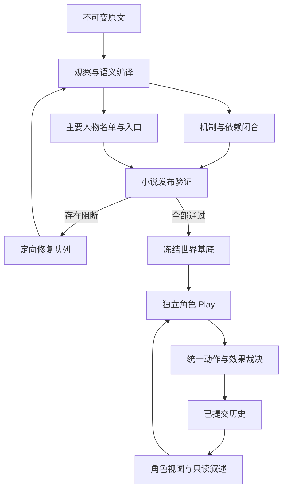

# 小说编译到主要人物 Play：完整链路技术设计

- **状态：** 核心实现已进入本分支；本文保留完整目标契约，不能将所有章节视为已验收。具体实现、命令与边界见[核心编译与 rebuild](novel-world-core-and-rebuild.zh-CN.md)及[实施记录](novel-to-play-implementation-progress.zh-CN.md)。
- **日期：** 2026-09-05。
- **代码基准：** [`main@b2c010548edc519ea957e0ddc9fffdb47c297a5d`](https://github.com/skyfore/novel-world-harness/commit/b2c010548edc519ea957e0ddc9fffdb47c297a5d)，创建本分支前已重新 fetch 并确认。
- **依据：** 本次小说世界模型调研及三个 API 反例；文献与复现条件见第 15 节。
- **决策：** [ADR 0010](adr/0010-major-character-play-and-world-closure.md)。
- **实施与验收：** [工作包、测试矩阵及发布门](novel-to-play-acceptance-plan.zh-CN.md)。
- **与既有计划的关系：** 延续 [可执行世界优化计划](executable-world-optimization-plan.zh-CN.md) 已完成的领域基础，补齐其真实交互链路和整本小说验收；不把旧阶段的 complete 当作本轮完成证据。

## 1. 目标、承诺与范围

### 1.1 本轮产品目标

对一份固定字节版本的小说，完成 ingest → 全文编译 → 证据与语义审查 → 全局消歧与机制闭合 → 主要人物入口认证 → frozen prepared 发布 → 选择人物 → 独立 play → 对话／行动／后台演化 → resume／fork 的统一链路。

每个**主要人物**至少有一个来源支持的、发生在其亲历场景之前的认证入口；从该入口能按自己的状态、知识、目标和关系接受玩家控制，产生经验证的世界变化，并继续推进。较晚出场人物同样在验收分母内。

“解析完全性”采用以下可核对定义：

1. 全部原文字节可定位，全部结构单元有明确处理结果；
2. 人物、事件、引语、时空、知识、关系和机制的关键语义没有未处理的阻断项；
3. 已声明的场景和行动具有闭合的执行依赖；
4. 独立标注或复核能够发现抽取器没有列出的遗漏；
5. 主要人物名单中的每一人均通过真实入口与持续游玩验收。

原文未说明的信息保存为 unknown／竞争解释／有出处的运行假设。没有文本或独立验证依据时，不宣称恢复了唯一的完整现实世界。运行关键条件的未知会阻止相应能力认证；非关键环境细节可保留未知并公开能力边界。

### 1.2 本轮必须保留的架构

- Pi 负责 provider、流式输出、工具调用和会话；不新增专有模型网关或 `/connect`。
- 来源不可变，状态放在 `$NWH_HOME` 管理的文件中，继续使用本地词法检索。
- 编译提议、接受的 canonical revision、branch committed history、角色知识、渲染文本保持不同权威。
- 新 play 建立 sibling genesis；resume 恢复原 branch；fork 从明确祖先创建新历史。
- 保留第三人称聚焦叙述与 reader-only 开场上下文；读者前情不进入角色策略。
- 不新增应用级总 token／总模型请求额度。记录成本；沿用局部恢复、作用域和防止无进展循环的工程约束。
- 沿用当前 MVP 的显式版本切换与重新编译策略，不引入自动历史数据迁移，不改写旧事件哈希。

### 1.3 本轮及后续边界

主要人物在任意原著时刻切换、无限物理模拟、无限层他人信念和任意字段自扩展不作为本轮完成条件。受控新物品创建若为小说关键行为的必要条件，必须在该小说发布前实现；更广的新人物出生、建城和模块动态安装列为扩展工作包。不得通过将必要机制划为“后续”来给本不支持的小说签发认证。

## 2. 当前实现与待改造位置

| 编号 | 已有能力及缺口 | 当前代码定位 | 处理 |
| --- | --- | --- | --- |
| F1 | 玩家候选不含 action，转换也未构造；ActionConstraint 在无 invocation 时不匹配 | [player-action](../src/world/player-action.ts)、[action-constraint](../src/world/action-constraint.ts)、[norm-ontology](../src/world/norm-ontology.ts) | 统一必备动作调用；非行动事件仅由可信 host 构造 |
| F2 | branch claim 被投影为 branchGrounded，但 source-scoped actor context 仍要求原文 evidence | [knowledge](../src/world/knowledge.ts)、[source-scope](../src/world/source-scope.ts)、player-action | 统一来源与分支事件的知识准入 |
| F3 | 路线／最短耗时检查由可省略 arrive 标签触发，location delta 可独立提交 | player-action 的 validatePlayerActionSpatialScope／意图规范化、[engine](../src/world/engine.ts) | 由最终状态差分触发空间义务 |
| F4 | 引擎和 frontier 有完整语义效果；玩家、NPC、自主角色输出未完整接入；NPC 与自主角色读取的社会状态不同 | [npc-reaction](../src/world/npc-reaction.ts)、[model-actor-policy](../src/world/model-actor-policy.ts)、[frontier](../src/world/frontier.ts) | 统一 outcome 和 ActorDecisionView |
| F5 | 已有全阶段批次、source accounting 和多维 audit；已检测对象的分母不能发现所有漏检 | [batches](../src/compiler/batches.ts)、[source-accounting](../src/compiler/source-accounting.ts)、[audit](../src/compiler/audit.ts) | 增加独立角色名单、语义复核及依赖闭合证书 |
| F6 | 已有晚出场亲历入口；候选列表仅包含已能产生入口者，没有主要人物完整分母 | [entry-context](../src/world/entry-context.ts)、[play-service](../src/application/play-service.ts) | 全名单列出 ready／blocked，逐人认证 |
| F7 | 实体／字段目录冻结；authority predicate 与可见前置条件的 unknown 语义不同 | [state](../src/world/state.ts)、[model](../src/world/model.ts)、[runtime-context](../src/world/runtime-context.ts) | 声明机制能力、未知策略；按需受控实体生命周期 |
| F8 | 已有直接证据依赖重解析，通用传递失效规划仍欠缺 | [reparse](../src/commands/reparse.ts)、[prepared-cache](../src/compiler/prepared-cache.ts) | revision 级依赖索引与暂存发布 |
| R1 | 后台首候选提交失败后 break，可能阻塞后续候选；尚未动态复现 | [runtime](../src/world/runtime.ts)、frontier | 先复现，再加入失败分类与当前 head 的排除 |

F1—F3 在报告基准上已运行复现。F4—F8 为代码确认的接口或能力边界，R1 为静态风险。现有状态校验、资源守恒、原著候选验证和知识存储有效，不能把上述缺口扩大解释成这些能力完全不存在。

## 3. 发布契约与需求编号

| ID | 硬要求 | 通过条件 |
| --- | --- | --- |
| N01 | 原文完整处理 | 字节 partition 无洞／重叠；所有结构单元有合法 accounting；no-artifacts 必须有可复核解释 |
| N02 | 关键语义完整 | 独立复核发现的关键遗漏、错误身份、错误归因和关键机制冲突全部关闭 |
| N03 | 主要人物全覆盖 | frozen roster 中 major 全部认证；unresolved 主要人物不得从分母消失 |
| N04 | 时点与角色入口正确 | pre-event cut，不预先施加当前事件；过去状态完整，未来状态／知识不泄漏 |
| N05 | 动作与效果统一裁决 | 所有入口都满足相同动作、空间、资源、权限与规则契约 |
| N06 | 社会与认知持续演化 | 新 claim、承诺、目标、关系、规范和过程可提交且被后续角色消费 |
| N07 | 角色与来源隔离 | 同 head 的视图一致；来源、角色、分支、时间和信息获取路径均通过校验 |
| N08 | 反事实与后台推进 | 改变必要条件后未来重新判定；等待可推进；失败候选不造成饥饿 |
| N09 | 历史与版本完整 | prepare、genesis、缓存和证书绑定同一修订；resume／fork／回放等价 |
| N10 | UI／CLI 一致 | 公共应用服务执行同一发布与角色入口门；重试幂等，旧选择过期可恢复 |
| N11 | 质量有独立证据 | 固定语料、模型配置、标注分母、场景与运行记录，区分结构质量和模型行为 |
| N12 | 能力边界可解释 | 关键 unknown 阻断认证；不支持动作不凭台词创造世界事实；非关键未知可查看 |

逻辑上：`fullNovelReady = N01 ∧ N02 ∧ N03 ∧ N04 ∧ capabilityClosure ∧ existingReadiness`。N05—N11 是执行器／产品版本的发布门；每份小说的证书必须绑定通过这些门的引擎与验证器指纹，而不是重复跑整个仓库单测作为每本书的编译步骤。

## 4. 总体架构



现有三阶段仍按全书 phase-major 执行：observation → semantic → executable。新的 closure finalization 位于批次完成与 prepared 激活之间，是可恢复的 host 工作流，不是一个获得全库写权限的“大模型总审”。

建议新增模块（均为计划路径）：

- `src/compiler/closure.ts`：依赖图、闭合检查、影响集合。
- `src/compiler/role-roster.ts`：人物重要性决议及独立名单。
- `src/compiler/playability.ts`：入口认证与确定性探针。
- `src/compiler/certification.ts`：证书、指纹、发布门。
- `src/world/action-invocation.ts`：统一动作规范化契约。
- `src/world/outcome.ts`：复用现有五类增量的统一提议 schema。
- `src/world/actor-decision-view.ts`：同一角色决策视图。
- `src/world/effect-obligations.ts`：由状态差分产生校验义务。

这些模块不接管已有 event reducer、canonical store 或 Pi session；复用现有接口、仅集中重复或遗漏的边界。

## 5. 编译完整性与全局修复

### 5.1 保留并加强现有 source accounting

`SourceStructureManifest` 已按原文字节建立 partition，`SourceAccountingManifest` 已有 represented、background-only、paratext、duplicate-description、unresolved、intentionally-deferred。沿用这些状态，不新增另一套覆盖计数。

- represented 继续由 host 根据真实 annotation／assertion 派生，模型不得自报。
- background-only／duplicate-description 等保留 reason 与 reviewedBy；duplicate 应指向等价内容，不能用来隐藏不同时间的新事实。
- 包含人物意图、隐含知识、关系变化或机制条件的日常段落仍属于语义材料，不能因“无主线事件”而豁免。
- 对所有单元统计处理覆盖；独立复核专门抽查被排除于执行图的内容。已发现的关键遗漏必须重新进入图。
- intentionally-deferred／unresolved 涉及 major、关键事件或机制依赖时阻断；一般未知也必须有内容和影响范围，不以空记录表示已理解。

### 5.2 语义依赖索引

索引节点为 `(artifactKind, logicalId, revisionHash)`；边记录字段指针和用途：identity、evidence-support、temporal-order、causal-precondition、state-effect、knowledge-acquisition、entry-seed、capability、certificate。

链路示例：来源单元 → 提及 → 身份决议 → 事件参与 → 状态／知识效果 → 角色入口 → 认证探针 → 小说证书。边由 host 从已接受的 typed 引用派生；模型可提出新语义，不能任意修改依赖边以规避检查。

索引负责：找悬空引用；区分关键依赖与叙事解释；从某个修订变化计算传递失效集合；列出修复的最小来源范围。语义关联允许环，先做强连通分量收敛；严格 earlier-than、必要因果等有向无环约束独立校验，不能因整个知识图有环就误拒。

### 5.3 场景执行包

每个承载主要人物决策或关键事件的 SceneOccurrence 派生 `SceneExecutionContract`：

```ts
// 新增设计类型；所有引用均来自当前待认证修订。
type SceneExecutionContract = {
  sceneId: string;
  revisionHash: string;
  actualOccurrenceEventIds: string[];
  participantIds: string[];
  entryCutIds: string[];
  requiredEntityIds: string[];
  requiredPredicateIds: string[];
  requiredMechanismIds: string[];
  knowledgeAcquisitionRefs: string[];
  terminationConditions: Predicate[];
  blockingIssueIds: string[];
};
```

例：“偷走钥匙”必须闭合钥匙身份、行动者、原持有人、转移机制、前后所有权、在场观察及后续知情路径。若原文没有说明失主何时发现，保持未知；不能默认同回合知情。

### 5.4 语义支持与机制支持分开

在 evidence assertions 上派生 `SupportAssessment`：字段目标、来源引用、supports／contradicts／underdetermined、评估方式、适用域、反证和复核状态。锚点有效不自动等于字段被支持；明确发生过一次不自动等于可反复执行的机制。

来源规则、版本化 domain module 和运行假设分别标记。物理限制、权限、社会禁令、人物自我约束分别编码；社会违法可以物理成功并触发后果。谓词签名应声明参数 kind、值域、时间语义、open／closed-world；仅存在 entity-ref 并不证明 domain／range 合法。

### 5.5 定向修复与停止条件

host 产生 `ClosureIssue`：稳定 issueId、输入修订、code、severity、受影响 major／场景／能力、来源范围、缺失引用、同作用域 finder、可接受的关闭证据。修复提议仍走现有窄工具、validate、accept／reject。

修复按 identity → temporal／attribution → effects／mechanisms → entry → certification 排序；先解根依赖。新修订改变受影响集合后才允许继续。相同输入哈希与诊断在一次规定修正后仍重复，停止并保留阻断；不以不断改写提示词或删掉产物“收敛”。遵循 [工具恢复协议](agent-tool-recovery.md)，不得建议当前 scope 中不存在的工具。

### 5.6 新修订发布的事务边界

在暂存目录接受本轮提议并构造候选 snapshot；传递失效节点重新派生、认证完成后，才原子切换 active prepared pointer。失败／取消保留诊断和可恢复进度，旧 active base 保持可用。reader、角色列表和新建 play 必须使用同一修订，不可混读 staging。

源修改产生新 source content identity；解释修改产生新 canonical/prepared revision。旧 branch 永远绑定其原始 frozen base。恢复某个来源的失败不能阻断另一本小说的准备流程。

## 6. 主要人物名单与逐角色认证

### 6.1 独立名单，不从“可玩者列表”反推分母

`MajorCharacterRoster` 从全书观察、引语主体、关键因果参与、视角、目标和发展轨迹提出候选。提及次数仅为特征，不能作为唯一门槛。主角、关键决策者、核心关系对手、晚出场但改变结局的人物均必须被检查。

名单决议保留 roleClass（major/supporting/incidental）、理由、来源、提出者、复核者及变更历史。生产默认执行第二遍独立 roster 复核；发布基准中的名单由独立标注冻结。两遍模型一致仍不能被称作全文绝对召回的证明。

未完成身份消歧的主要人物候选以 mention refs 保留，actorId 可暂缺并阻断。不能因其缺少实体 ID、入口或通过探针而降级／删除。若复核改变名单，产生新 rosterHash，重新计算指标和证书；质量报告同时披露增删项。

### 6.2 可玩档案与状态

```ts
type CharacterPlayability = {
  rosterEntryId: string; // 未消歧的主要人物也有稳定名单身份
  actorId?: string;
  rosterHash: string;
  subjectSnapshotHash: string;
  entryCutId?: string;
  status: "ready" | "blocked" | "unresolved-identity";
  checks: Array<{
    kind: "identity" | "entry" | "state" | "knowledge"
      | "motivation" | "relationships" | "capability"
      | "continuation" | "reader-context";
    status: "pass" | "fail" | "unknown";
    evidenceRefs: string[];
    issueIds: string[];
  }>;
  supportedCapabilityIds: string[];
  explicitUnknowns: string[];
  probeResultHashes: string[];
};
```

ready 要求 actorId、entryCutId 均存在且每项必需检查 pass；unresolved-identity 不允许 ready，unknown 不能当 pass。持久化 schema 应以 status 判别联合落实这些约束，而不只依靠 TypeScript 可选字段。角色状态、能力和知识只要求该入口与声明行动域的闭合；不能为填满档案生成无来源的性格分数或人生经历。

每个 major 至少检查：稳定身份；可亲历入口；生命／身体／位置及必要资源；自身经历形成的知识与误信；当前目标或有依据的被动处境；重要关系与义务；支持当下合理决策的机制；一个持续推进场景。被囚禁角色不要求能离开牢房，但应按场景支持观察、交谈、等待等合法选择及其实际后果。

### 6.3 从原著时间切面产生入口

复用 `deriveCharacterEntryOptions`／`deriveCharacterEntrySeed` 的亲历要求，补上 `EntryCut` 和明确的时序依赖。当前实现按 discourse 前序与部分正向事件拼接 delta；认证应额外证明故事时间切面正确，不能把叙述顺序当作完整的世界时间。

算法：

1. 选定人物首次有证据支持的亲历场景，cut 位于目标事件发生前。
2. 从 actual-occurrence 图取已证明在 cut 之前的事件集合；回忆可代表历史真实事件，但去重后只落地一次。假设、梦境、预叙不直接作为当下事实。
3. 对关键不可比时间约束生成 issue；非关键不可比信息保留 unknown，不臆造日期。
4. 按确定的偏序重建状态、知识、有效规则、人物目标／评估、关系／义务和活动 process／norm；截止时间按入口的逻辑／故事时间解释。
5. 对世界切面再做角色观察与获取渠道投影；世界知道的秘密不等于角色知道。
6. 生成 pre-event seed，当前事件效果尚未施加。后续 canon 全部进入 frontier，而不是直接激活。

当前 `CharacterEntrySeed` 主要包含 state／knowledge 与 presence；需扩展为经验证的 `EntryProjectionSeed`，完整覆盖社会语义、规范与过程。genesis 初始效果使用 source／domain provenance，不伪装成角色刚刚在分支中经历的事件。无法重建必要过去状态的 major 必须显示 blocked，不静默回退到小说开场。

### 6.4 认证探针

对每个 major，在临时隔离 world 中实际调用创建 branch 和 play 用例：读取角色视图；提交至少一个场景相关合法行动；验证一个非法／未知条件行动；执行跨回合知识或社会变化；等待一次后台推进；resume、fork 与全量回放比较。具体场景采用角色相关脚本，而非每人机械重复“走一步”。

角色死亡、被束缚或无对话对象均由场景决定探针。终止本身可为正确结果，但必须有已提交条件；不能把无候选、LLM 失败或死循环标作“小说结尾”。

## 7. 统一动作、效果与裁决

### 7.1 单一提议契约

新增 `OutcomeProposal` 复用现有类型：

```ts
type OutcomeProposal = {
  expectedParentCommit: string;
  action: ActionInvocation; // actor-origin 新提交必需
  proposedDelta: StateDelta;
  proposedKnowledge?: KnowledgeDelta;
  proposedSemantics?: BranchSemanticProposalDelta;
  proposedProcesses?: ProcessProposalDelta;
  proposedNorms?: NormProposalDelta;
  mechanismWitnesses: MechanismWitness[];
};
```

`MechanismWitness` 是计划新增的执行依据：mechanismId/version、角色与参数绑定、对应效果索引及支持来源。其作用是证明为什么该动作能产生这些效果，而非仅声明“我会写这些字段”。actorId、source、branch、head、可用引用和权限来自 host；LLM 不能借请求字段冒充 background/system。

玩家候选、NPC 回应、自主 actor 统一携带这些通道；frontier 与 process/norm 触发器也通过同一内核。环境自然事件可以没有人物 action，但必须由可信调度入口构造 `environment transition`、绑定已声明机制；不能让模型用缺失 action 选择这一通道。

### 7.2 动作规范化

- schema-bound：验证 action schema、角色参数、前置条件与允许效果。
- ad-hoc：映射到声明的机制组合；校验 host 派生读写／资源 footprint 与实际效果一致。
- 不接受“说话动作＋任意扣血增量”或“等待动作＋位置任意变化”。动作类型合法不代表附带的每个 effect 合法。
- 新动作超出机制域时返回 unsupported-capability／needs-world-evidence；不得通过重命名 actionKindId、空 footprint 或省略 action 放行。

### 7.3 最终效果义务

先在临时状态应用拟议变化，再按差分产生 obligations：

| 变化 | 必须验证 |
| --- | --- |
| character.location | 出发／目的地、路线、方式、总时间、载具、在场／存在模式、传送例外 |
| artifact.owner／custodian／quantity | 实体与持有关系、转移权限、排他性、资源流入流出及对应机制 |
| alive／身体状态 | 攻击、疾病、疗愈等适用机制和角色／目标权限 |
| claim／knowledge | 命题、归因、获取渠道、知情角色、时间、来源及分支可达性 |
| goal／relationship／obligation | 参与人、提出／接受、有效范围、终止与后续 normative effects |
| process／norm | 模板资格、实例化参数、触发／到期与取消条件 |

移动路由在 `WorldEngine.commitProposal` 的最终边界复核。intent.sceneTransition 可以帮助表达意图，但不控制是否运行移动检查。梦境／远程交互的 existence mode 不能修改物理 location；传送必须由相应机制允许。

### 7.4 事务与结果

action → 领域机制 → state／knowledge／semantic／process／norm 校验 → 临时投影检查 → 当前 head CAS → 写 commit → 再产生 actor-safe 观察与叙述。复用已有多效果原子提交，不增加新的直接写入者。

结果至少区分 accepted、rejected、needs-world-evidence、unsupported-capability、no-material-change、stale-head。角色不知情与世界本身未知不同：权威层已有隐藏规则时可以裁决，给角色的说明只包含其能观察到的后果。无进展结果不伪造事件；必要的失败尝试可按机制产生时间、观察等合法后果。

## 8. 统一角色视图与分支知识

### 8.1 ActorDecisionView

`buildActorDecisionView(engine, actorId, atCommit)` 组合现有 projection service：可见状态、知识／误信、目标、情境评估、发展片段、关系、义务、活动规范／过程的角色可知部分，以及可用能力。缓存键至少包括 source base、branch/head、actorId、projectionSchemaVersion；不缓存整本小说的共享“人物答案”。

`buildActorScopedActionContext` 迁移为该视图的兼容适配；NPC 和自主 actor 复用同一来源，避免各自只读 canonical goals 或关系。直接对话与主动行动可以有不同策略，但不能有不同版本的领域事实。

### 8.2 知识准入规则

分支投影已有 event 来源语义，新增统一 helper 从可信 projector 获得 provenance：

- source-backed：验证 exact source 归属、有效时间、归因及角色获取；
- committed-event：验证 claim 由当前 head 的可达事件／genesis seed 引入，归属当前来源，并有该人物的 learn／观察记录；
- domain-module：仅在已声明的机制知识授权范围内提供，不能默认给角色引擎知识。

不得仅信任模型提交的 branchGrounded 布尔值；不得以 evidence=[] 自动放行。分支知识不补造原文 evidence。fork 共享祖先知识，分叉后消息不可跨支泄漏；corrupt ancestry 按 fsck 错误处理。

### 8.3 新承诺的端到端生命周期

“我明天替你送信”先形成提议／陈述；有明确接受或适用制度条件后才实例化 obligation／norm／process。各参与人通过亲历或告知获得相应知识。时间到达后，由规范结算驱动 fulfilled／waived／violated／cancelled，必要时产生可验证社会效果。

renderer 只锁定并表达 committed dialogue/outcome。不能只在台词里写“已经答应”，也不能把任意礼貌话自动编译成债务。终止和反悔同样走窄效果提议与裁决。

## 9. 未知、时间与开放实体

### 9.1 谓词求值分层

权威层区分 true、false、unknown、conflicting；角色可见层仍可对权威已知事实返回不可知。每个 predicate／field 的知识世界假设由版本化 schema 声明：库存的显式闭合集合可以采用 closed-world；文本未描述的身体能力不能默认 false。

前置条件未知时，先判断是否有同作用域证据可补充；否则让机制声明失败尝试、风险分支或需要补全，不从 `not(unknown)` 得到 true。关键冲突阻止状态确认；有归因的不同人物信念可同时存在，不作为客观状态冲突强制合并。

### 9.2 时间与截止

沿用 LogicalTime 的提交顺序和 StoryTime 的表达，增加用于 entry／closure 的偏序和时间窗求解。严格时间边有环则阻断；不可比不臆造排序。月份／年份及不精确相对时间不能一律换成固定天数。到期规范需声明使用 step、明确 elapsed duration 还是 story-calendar；关键截止缺少可比较基准会生成 issue。

### 9.3 受控新实体

当前固定目录对“新造钥匙”这类行为有实际限制。优先为声明制作机制提供 branch artifact 创建：host 生成分支命名空间 ID，验证 kind、父材料／资源、创建者、位置及最小字段；同一 transaction 中按 localRef 引用，CAS 成功后获得稳定身份。

更广的 entity lifecycle 采用 create／identify／retire typed effects，并进入 shared projection、snapshot、fsck 和 fork；名称相同不自动合并身份，retire 不抹去历史。branch 的新实体不得写回 canonical catalog。字段模块的安装或升级属于显式引擎／世界版本变更，不接受对话中任意增加字段。

若某小说的关键场景需要这一能力，capabilityClosure 会在发布前发现它；只有与本书必要行为无关的更广实体能力才可延期。

## 10. 证书与发布一致性

### 10.1 三类不同状态

保留 preparation 阶段，并增加可解释的子状态：`compiling`、`reviewing`、`repairing-closure`、`certifying-roles`、`ready`。不要复用 `SourceLoopComplete` 表达小说可玩：它目前只说明批次处理完成。

- **artifact-valid**：结构、锚点、引用及现有审计合法。
- **role-ready**：某人物的必要切面、机制与探针通过。
- **full-novel-ready**：完整性、全体 major 和引擎版本门同时通过。

开发诊断可以在 staging 执行探针，但正式 `startFreshPlay` 仅读取经过 full-novel-ready 发布的基底；不存在以“有一个能玩的人物”替代整本就绪的产品路径。

### 10.2 WorldReadinessCertificate

证书由 host 派生并以内容哈希保存，包含：

```ts
type WorldReadinessCertificate = {
  version: 1;
  sourceContentSha256: string;
  subjectSnapshotHash: string;
  compilerFingerprint: string;
  validatorFingerprint: string;
  engineContractVersion: string;
  rosterHash: string;
  closureGraphHash: string;
  roleCertificateHashes: string[];
  evaluationManifestHash: string;
  counters: {
    totalMajor: number;
    readyMajor: number;
    unresolvedMajor: number;
    unaccountedUnits: number;
    blockingIssues: number;
  };
  verdict: "ready" | "blocked";
};
```

避免哈希循环：先对不含证书的 canonical＋compiler snapshot 算 subjectSnapshotHash；角色证书与总证书引用它；prepared envelope 最后包含 snapshot、certificate hash，得到 preparedRevisionHash。证书内部不再引用包含自身的最终 prepared hash。验证时重算 subject 与全部子证书哈希，再确认 frozen base 的来源和 revision。

`majorCoverage = readyMajor / totalMajor`，totalMajor=0 返回 null 并阻断；必须 readyMajor=totalMajor 且 unresolvedMajor=0。不能从 readyRoles 计算 totalMajor。证书的“通过”只代表绑定的范围与检查，不构成独立人类验证的签名或对抽取真值的密码学证明。

### 10.3 发布与使用时的复核

在 `PreparedNovelCache.publish`／`activate`／`loadFreshActive` 共用一项 readiness validator；prepare、prepare-all、Web preparation 不能各自定义较弱门槛。cache restore 不能绕过新证书要求。

在新建 play 时验证 expected preparedRevisionHash、角色 certificate 与 entryCutId；创建期间 active base 移动则沿用已有 FROZEN_BASE_MOVED 恢复协议。最终 branch 固定来源、canonical snapshot、prepared revision、entry cut 和 engine contract。新证书不得升级旧 branch。

### 10.4 先认证再发布，避免验收启动循环

认证需要执行 play，而正式新建 play 要求已有证书；二者通过显式的候选世界评测用例衔接。host 内部 `evaluateCandidate` 接收不可变的 candidate snapshot、subjectSnapshotHash 和 run ID，在隔离的 evaluation namespace 建立临时 branch。它复用与正式 play 相同的创建内核、Pi 适配、角色投影和 commit 校验，仅以受信任的候选准入代替“已激活 prepared”查找。

候选准入由 host 验证来源、结构、闭合和执行安全前置条件后构造，不能来自模型参数、HTTP 字段或用户可传入的 `skipCertification` 开关。尚待验证的入口检查必须产出 pass／fail，不能被假定通过。评测 branch 绑定 candidate subject，不伪装成带最终 prepared hash 的产品实例，不进入正式实例列表。

先执行逐角色探针并冻结结果，生成 evaluationManifestHash，再生成证书与最终 prepared envelope。证书引用的 manifest 只引用 subject 和输入／结果哈希，不反向包含最终 prepared/certificate hash；最终发布产物的映射另写运行报告，防止第二种哈希循环。真实模型的候选评测沿用此路径；发布后的 smoke 再经公开 API／CLI 验证正式准入、哈希绑定和实例隔离。候选评测与公开入口测试均须通过版本发布门，不能只测其中一个。

## 11. 持续 Play、后台调度与终止

每回合共享 ActorDecisionView，规范化玩家意图，生成世界后果提议，commit 后再由观察决定 NPC 反应与自主候选。所有候选在实际提交的最新 head 重验，禁止使用上一 head 的资格绕过独占资源冲突。

对后台失败按原因区分：

- stale-head：刷新一次，重新评估资格；
- 临时不满足：挂起并记录唤醒依赖；
- 永久不适用（如义务主体死亡且规则要求其亲自履行）：按明确 norm 规则取消／继承／转交，而非改写历史；
- 模型提议非法：本 head 排除该候选并记录诊断，尝试其他候选；
- 世界数据损坏：停止推进并返回 host repair。

`(head, candidateId, reasonCode)` 是当前轮排除键；新的合法 commit 产生新 head 后重新评估。若所有候选被阻断，返回明确的 quiescent／blocked／awaiting-player 状态，不无限循环，不生成“大家继续聊天”的假进展。

终止条件必须由已有状态／规则产生，例如目标完成、死亡、已定义幕终或玩家选择结束。原著结尾仅是 canonical baseline；玩家改变原因或关系后，不可把终止条件强行重绑回原著结局。

## 12. CLI、Web 与工具契约

### 12.1 对现有服务做增量扩展

| 入口 | 当前 | 设计变更 |
| --- | --- | --- |
| `GET /api/v1/novels/:sourceId/play-roles` | 返回 deriveCharacterEntryOptions 产生的角色 | 从 frozen roster 返回 major/supporting 及 ready/blocked；携带 entryCutId、证书摘要与可安全展示的原因 |
| `POST /api/v1/play-instances` | 校验 preparedRevisionHash、actorId、幂等 request ID | 加选定 entryCutId；复核 role certificate；复用 startFreshPlay 的独立实例流程 |
| `GET /api/v1/novels/:sourceId/preparation` | 当前阶段与下一步 | 增加 coverage、major counts、closure issues、certification stage；未发布时在这里查看阻断名单 |
| CLI/TUI `prepare`、`prepare-all`、人物选择 | 应用既有审查和选择逻辑 | 使用相同 readiness／role service；展示“主要人物 7/8 可玩，1 人待修复”等真实计数 |
| resume／fork | 绑定已有 branch 历史 | 验证原版本，不读 active 新证书来改变已有世界 |

UI 不展示引擎私有知识或机制隐藏条件；详情可在编译工作台查看，但不得注入角色推理。预发布的 blocked 名单来自 preparation 的 staging 诊断；正式 play-roles 列表不混入另一个修订的候选。

新增可读错误码：`WORLD_CLOSURE_BLOCKED`、`MAJOR_ROLE_NOT_CERTIFIED`、`ENTRY_CUT_STALE`、`WORLD_VERSION_UNSUPPORTED`。模型侧诊断通过 `withNwhToolRecovery` 注册，保留 isError；给出同 scope 的 finder、应复制的字段和最多一次有实际修正的重试。Web 使用已有 preparation／play-roles discoveryEndpoint，不为修复新建无限自动审批旁路。

### 12.2 取消、恢复与失败

复用 `src/web/mutation-journal.ts` 的幂等模式。编译取消只结束当前未完成工作，不把未通过 finish 的批次标为完成。认证取消不激活候选基底。play 提交前取消不改变 branch；提交后取消只能停止呈现／后续计划，resume 必须能看到已经成功提交的事件。

## 13. 本地持久化与版本决策

在 `worldStorageRoot(workspaceRoot)` 下规划以下相对目录，source 原始字节继续沿用现有 source material store：

| 计划路径 | 内容与权威 |
| --- | --- |
| `compiler/closure/v1/<sourceId>/<subjectHash>/` | 可重建依赖索引、issue 与工作进度；非世界真值 |
| `compiler/rosters/v1/<sourceId>/` | 不可变名单决议与 current ref；发布时冻结 |
| `compiler/certificates/v1/<hash>.json` | host 派生的角色／小说证书；由 prepared 引用 |
| `compiler/evaluation-runs/v1/<runId>/` | manifest、输入、逐场景结果、成本／失败记录 |
| prepared bundle／branch history | 继续使用现有存储与内容地址；新增字段需要版本切换 |

设计基准为 prepared V3、world schema V2、engine 0.2.0、world storage v2。本分支已切换到 prepared V4、world schema V3、engine 0.3.0、world storage v3、cache format V3、canonical snapshot V9、compiler pipeline 32、compiler prompt 28。验证指纹同时绑定依赖闭合、场景契约、语义支持与入口切面等契约版本。

旧数据不删除、不隐式迁移、不双读为新格式；不兼容的 resume 返回明确版本错误和“使用相应版本／从不可变来源重编译”的恢复路径。重新编译创建新世界，不延续旧分支身份。纯修复不改日志语义的早期工作包可先保留现有格式；首次不兼容字段或 reducer 语义改动必须连同版本门一起落地，不能等整轮结束再补。

回放固定 engine/schema/module 版本。相同版本下 checkpoint-plus-tail 与 full replay 的 state、knowledge、semantic、norm、process、scene、causal 以及新增 entity projection 必须等价。

## 14. 实施文件与可观测性

| 领域 | 现有文件 | 主要改造 |
| --- | --- | --- |
| 编译闭合 | compiler/batches、source-accounting、evidence-assertions、validator、converge、audit；commands/reparse | 保留阶段限制；增加依赖、关键 issue、定向修复和传递失效 |
| 逐角色入口 | world/entry-context、instance、play-choice；compiler/prepared-cache | 完整 EntryProjectionSeed、名单分母与角色证书 |
| 提交内核 | world/model、engine、state、action-constraint、spatial-ontology、norm-ontology | outcome schema、动作／效果义务、unknown 和版本门 |
| 角色策略 | world/player-action、npc-reaction、model-actor-policy、knowledge、projection-service | 统一视图与语义效果通道 |
| 发布服务 | workflow/prepare；commands/prepare-all；application/preparation-service、play-service | readiness validator、暂存发布、角色服务 |
| 客户端 | web/contracts、web/host；apps/web/src/api.ts、router.tsx；TUI 选择用例 | 同一 API/用例的认证状态与失败恢复 |
| 评测 | eval/compiler-eval；test；e2e/web-mvp.spec.ts | 独立分母、跨入口反例、逐 major 验收和真实 provider 基准 |

具体任务、依赖及已存在／拟新增测试分开列在[验收计划](novel-to-play-acceptance-plan.zh-CN.md)，不根据这张表批量创建空模块。

记录 sourceHash、subjectHash、preparedHash、rosterHash、entryCut、branch/head、actorId、proposal/action kind、effect channel、适用规则、拒绝码、closure issue、知识过滤原因计数、候选排除与唤醒原因。私有 trace 可解释失败；用户叙事只接收 actor-safe 输出。指标包括 major 分母变化、每层漏检／误判、合法动作误拒、非法效果接受、语义写入后消费率、后台饥饿、回放差异与模型成本，不用单一完整度分数替代这些指标。

## 15. 调研结论的落点与证据

### 15.1 本次三个反例

使用带 `sourceId=novel` 的隔离引擎 fixture 与合成 EvidenceRef，直接测试 API；不代表真实全文编译已经通过。原有 `pnpm test` 为 148 文件／866 项通过，`pnpm check` 通过；这是报告阶段基准记录，本设计 PR 不将其当作新功能验证。

| 反例 | 构造与观察 | 必须新增的验收 |
| --- | --- | --- |
| F1 | any 动作禁令；同一 plan delta。显式 action → ACTION_CONSTRAINT_FORBIDS；playerActionToKnowledgeAwareAction 不生成 action，普通提议被接受 | 所有入口相同语义；缺 action 不免检 |
| F2 | 提交分支 proposition／attribution／claim＋learn。KnowledgeProjector=1、branchGrounded=true；source-scoped actor context=0 | 同来源真实 actor context 消费；未知者与 sibling 不可见 |
| F3 | 村庄到港口最少 2h，1h 到达。声明 arrive 被拒；只删除 sceneTransition，location delta 仍被引擎接受 | 差分驱动校验；错误／缺失 intent 不放行 |

对应固定快照：[玩家 schema／转换](https://github.com/skyfore/novel-world-harness/blob/b2c010548edc519ea957e0ddc9fffdb47c297a5d/src/world/player-action.ts#L170-L182)、[转换代码](https://github.com/skyfore/novel-world-harness/blob/b2c010548edc519ea957e0ddc9fffdb47c297a5d/src/world/player-action.ts#L1337-L1364)、[知识过滤](https://github.com/skyfore/novel-world-harness/blob/b2c010548edc519ea957e0ddc9fffdb47c297a5d/src/world/player-action.ts#L830-L835)、[空间 gate](https://github.com/skyfore/novel-world-harness/blob/b2c010548edc519ea957e0ddc9fffdb47c297a5d/src/world/player-action.ts#L1237-L1269)。

### 15.2 科研依据与设计边界

| 参考 | 本方案采用的启发 | 不外推的结论 |
| --- | --- | --- |
| [TextWorld（2018）](https://arxiv.org/pdf/1806.11532) | 状态、转移、局部观察分开，形成可执行 oracle | 手工环境不证明小说自动恢复 |
| [Narrative Planning（JAIR 2010）](https://faculty.cc.gatech.edu/~riedl/pubs/jair.pdf) | 因果连贯与人物意图分别验证 | 作者结局不能替代人物目标 |
| [Story2Game（2025 预印本）](https://arxiv.org/html/2505.03547v1) | 故事动作、前置条件、效果和交互验证 | 短故事实验不代表任意长篇 |
| [Text-Based World Simulators（ACL 2024）](https://aclanthology.org/2024.acl-short.1/) | 分开测动作转移和环境后台变化 | 叙事合理不等于状态正确 |
| [TimeChara（Findings ACL 2024）](https://aclanthology.org/2024.findings-acl.197/)／[FANToM（EMNLP 2023）](https://aclanthology.org/2023.emnlp-main.890/) | 时间、在场、误信、他人知情边界 | 大上下文／检索本身不保证隔离 |
| [CoSER（ICML 2025）](https://proceedings.mlr.press/v267/wang25dk.html)／[ArcANE v2（2026 预印本）](https://arxiv.org/html/2606.05553v2) | 情境和人物发展阶段影响行为评价 | 原著台词不作为反事实分支唯一答案 |
| [DREAM（KDD 2026）](https://arxiv.org/html/2608.05170) | 时间受限记忆与发展档案 | 不把离线档案当作在线分支已闭环 |
| [Concordia（2023 预印本）](https://arxiv.org/html/2312.03664v1) | 角色意图与环境裁决边界 | 多代理协商不能替代引擎确认 |

以上来源已在前一轮报告阅读；本轮将其转化为当前代码的契约，不声称新的模型实验或论文结果。本设计的百分比硬门只用于有确定分母的结构／角色检查；语义与行为统计阈值按下一份[验收计划](novel-to-play-acceptance-plan.zh-CN.md)冻结。
