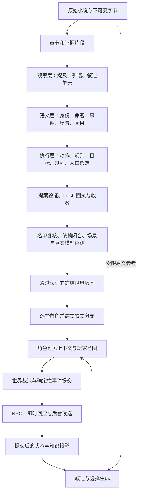

# 小说世界解析、可执行建模与角色体验：现状和演进报告

审查日期：2026-09-15。代码基线：`335cdfe2c8ba3b7c626f978d82c700d6a26ece8b`。

## 摘要

**当前项目已经具有可验证的世界执行内核，以及覆盖多层小说语义的编译管线；尚无可核验的证据证明，它能可靠地把任意完整小说转换为所有核心角色都能长期游玩的产品。** 这两个判断可以同时成立。已有分支、知识、规则、事件提交能力值得保留；下一步的重点应是：让解析产物以较小的工作集支撑具体场景中的判断、行动和表达，并在真实模型与独立文本上验证。

本报告的主要建议是：

1. **将“完整”定义为声明范围内的体验与因果闭合。** 核心人物不能遗漏，关键情节的前提、行动、后果和信息传播需要可执行；未被小说确定的反事实细节必须保留不确定性。
2. **完整保留原文，选择性编译可执行语义。** 原文与证据索引在本地长期保存；每回合只加载当前决策需要的状态、机制、动机、相关记忆和少量原文。
3. **把文学保真作为独立交付对象。** 人格数值、事件摘要和规则图不能替代人物的表达方式、关系语境、关键话语和场景节奏。已有原文引用与叙述链路应继续完善。
4. **用场景与能力要求管理 agent 工作。** 一个任务完成，应意味着明确后置条件成立；不能只意味着模型提交了某个提案、批次结束或覆盖率上升。
5. **把执行正确、解析正确和体验可信分别验收。** 当前测试对第一项提供了大量证据，对后两项的完整小说证据仍然不足。

下文用“事实”“推断”“建议”区分证据等级。建议中的规模和验收方案是工程提案，不是论文证明的最优参数。

## 1. 审查方法与结论边界

### 1.1 本次直接检查了什么

- 阅读源文档注册、三阶段编译、提案验证、收敛、准备与认证、角色入口、玩家回合、世界调度、知识投影和文学叙述的主要调用链。
- 对照 ADR 0001、0007、0008、0010 的相关实现、实施记录和已有架构审查；存在差异时以当前代码为准。
- 在上述代码基线上运行 `pnpm test`：**177 个测试文件、1026 项测试通过**。运行 `pnpm check`：服务端、Web 和 E2E TypeScript 检查通过。Node 为 22.19.0，pnpm 为 11.21.0。
- 运行三个不写世界数据的函数级探针，复核引语字段支持、部分修复报告、叙述原话顺序与重复问题，结果见第 8 节。
- 统计固定测试语料与标注文件大小；通过 `git show 1c2ecac:<路径>` 核对一份已移出工作树的历史编译记录。
- 查阅论文原文、作者主页或 ACL/AAAI 官方论文页面。研究结论与对本项目的迁移建议分别陈述。

本次没有调用真实 provider 重新解析整本小说，没有进行人工长期游玩实验，也没有运行 Playwright 浏览器验收。因此不会给出未经测量的解析成功率、文学质量分数、模型成本或实际上下文溢出率。

### 1.2 三个容易混淆的“正确”

| 层次 | 实际要回答的问题 | 现有证据能说明什么 |
| --- | --- | --- |
| 工程正确 | 相同历史能否重放？非法写入是否被拒绝？分支是否隔离？ | 大量确定性回归覆盖这些契约 |
| 语义正确 | 小说真的支持这个身份、原因、规则、知识来源吗？重要内容是否漏掉？ | 有证据、复核和评测设施；没有完整小说可靠性的充分实测 |
| 体验可信 | 角色是否像这个人？行动是否自然影响局势？场景是否保留小说质感？ | 有叙述与角色适配实现；缺少对应的系统性真实体验证据 |

一个通过 schema、哈希与引用检查的模型，可能语义解释错误；一个语义上正确的模型，也可能讲出乏味、失真的场景。这不是否定现有验证，而是明确每项验证的能力边界。代码自身也明确区分原文定位与语义支持。见 [semantic-support.ts](/root/workplace/novel-world-harness/src/compiler/semantic-support.ts:23)。

## 2. 应当建立怎样的整体世界模型概念

### 2.1 产品所需的是能回答行动问题的模型

这里的“世界模型”至少要回答：

- 此刻谁在哪里，拥有什么，能够接触什么？
- 每个人看见、听见、相信了什么？哪些信息尚未获得？
- 某个行动为什么可能或不可能，代价是什么，谁有决定权？
- 行动之后，哪些状态、关系、义务和后续可能性改变？
- 这些变化怎样用契合小说和人物的语言呈现？

只识别人名、地点和事件标题，无法完成上述任务。只保留当前 JSON 状态，也难以解释状态从何而来、如何分支和回放。项目采用已提交事件历史作为分支真相，是合适的基础。见 [ADR 0001](/root/workplace/novel-world-harness/docs/adr/0001-world-truth-history-and-possibility-space.md)、[projection-service.ts](/root/workplace/novel-world-harness/src/world/projection-service.ts:50)。

**建议采用以下概念分解。这是对已有模型的归纳与补足，不是要求新增八套独立存储：**

| 部分 | 内容 | 权限边界 |
| --- | --- | --- |
| 原文与证据 | 原始字节、精确文本范围、话语与叙述出处 | 保留文本实际写了什么；不能自动把角色的谎话变成事实 |
| 稳定身份 | 人物、地点、物品、组织及指代决议 | 身份与此刻的地点、年龄、所有权分开 |
| 原著轨迹 | 有证据的发生事件、故事时间、因果关系、角色入口 | 编译器可见全书；未发生的未来仍然不是分支事实 |
| 可执行机制 | 行动前提、效果、物理与术法限制、规范、过程 | 代码验证并应用，模型只能提议 |
| 角色视角 | 已获得信息、错误信念、观察与传播路径 | 按人物、时间、分支隔离 |
| 行为倾向 | 当前目标、关系立场、承诺、情境性评估、成长 | 影响选择，不保证行动成功，也不能强迫玩家选择 |
| 文学表达 | 语气样本、关键话语、意象、场景关系与节奏 | 指导表达；具有持久后果的内容仍须进入事件链 |
| 未决事项 | 歧义、未支持机制、缺失入口、扩展假设 | 显式保留，不能在“完成”指标中消失 |

分支运行可概括为：

```text
H_b                 = 分支 b 已提交的事件历史
S_b(t)              = Reduce(冻结的入口状态, H_b 截至 t 的事件)
View_b,actor(t)      = 该角色在此刻合法可见的状态、知识和经历
Candidates_b(t)     = 当前机制、目标、压力支持的未发生候选
NextEvent           = Validate(LLM/玩家/后台提出的候选)
SceneText           = Render(已提交结果, 角色视角, 文学参考)
```

原文和文学参考不会因进入最后一步而获得修改 `H_b` 的权限。当前内核已经采用相同方向：物理状态、知识、语义、过程、规范分别归约，并派生场景和因果索引。见 [WorldProjectionBundle](/root/workplace/novel-world-harness/src/world/projection-service.ts:86)。

### 2.2 “完全解析”应拆成可以验收的范围

小说提供的是被作者选择、组织和省略过的叙述。它可能明确说明一些一般规则，也可能只展示某一次结果。因此，“读完整本”并不等于“唯一确定所有可能世界”。

Pearl 对因果推断的说明指出，干预与反事实问题需要有关生成机制的假设，不能仅从观察分布推出。**迁移到本项目的推断是**：小说中的一次成功或一条时间顺序，不能独立确定玩家改变条件后的所有结果。这不否认小说中明确写出的因果解释，而是要求区分显式机制、有限归纳和仍未确定的部分。参见 [An Introduction to Causal Inference，第 2–3 节](https://ftp.cs.ucla.edu/pub/stat_ser/r354-reprint-corrected.pdf)。

建议把目标定义为四个范围：

1. **来源完整**：全书原文没有丢失；正文、序言、目录、回忆、梦境和假设等有可追溯区分。
2. **核心体验完整**：独立确认的全部核心人物具有入口，关键场景的行动与后果能执行。
3. **规则范围完整**：在所声明支持的行动、规则和过程范围内，合法行动能推进，不合法结果不能蒙混提交。
4. **开放扩展可控**：超出范围时能定位缺口、查证或提出受限扩展，而不是既声称自由又只剩拒绝，或者任由叙述修改事实。

“任意玩家”可以选择核心角色，不必意味着“任意角色、任意时点、任意行动都预先建模”。后者既不是当前实现，也不是本报告建议的首个交付目标。ADR 0010 已明确指出认证不代表小说唯一确定了完整物理现实，见 [ADR 0010](/root/workplace/novel-world-harness/docs/adr/0010-major-character-play-and-world-closure.md)。

## 3. 当前核心流程：从原文到 Play



### 3.1 来源与结构

原文采用内容寻址存储；章节识别有确定性规则及受控模型辅助，切片具有来源边界。长输入按章节分组，每组最多 8 个 segment，累计 prompt characters 和 source bytes 的分组阈值均为 `48 × 1024`。这是处理输入的边界，不能证明片段内的重要语义已经理解。见 [source-material-store.ts](/root/workplace/novel-world-harness/src/storage/source-material-store.ts)、[batch-plan.ts](/root/workplace/novel-world-harness/src/compiler/batch-plan.ts:25)。

### 3.2 三阶段编译

实际计划是**先遍历各分组的 observation，再遍历 semantic，再遍历 executable**，不是每章独立跑完所有阶段就结束全书。阶段权限由宿主限制。见 [compilerScopePlan](/root/workplace/novel-world-harness/src/compiler/batch-plan.ts:50)、[Pi 编译会话](/root/workplace/novel-world-harness/src/compiler/pi-compiler.ts:93)。

| 阶段 | 产物 | 主要解决的问题 |
| --- | --- | --- |
| observation | entity mention、event mention、quotation、discourse segment | 文本出现了什么，谁说话，哪些内容是回忆或假设 |
| semantic | 身份与事件决议、entity、proposition、attribution、claim、canonical event、participation、relation、scene、frame | 它们指向谁、发生了什么、信息归属于谁、事件如何关联 |
| executable | action schema、event execution、约束、世界规则、规范、过程、角色模型/目标及可能性 | 这些解释怎样变成可检查的行动和状态转换 |

每个模型任务使用隔离会话，不能继承普通聊天或其他编译任务的 transcript。普通来源批次不能任意读工作区，具体工具按阶段和 source scope 开放；模型主要通过窄类型提案工具写候选。见 [compilerModeInstructions 与会话生命周期](/root/workplace/novel-world-harness/src/compiler/pi-compiler.ts:29)、[编译工具表](/root/workplace/novel-world-harness/src/compiler/proposal-tools.ts:139)。

### 3.3 验证、finish 和收敛

这里至少有三种不同的完成：

1. 提案输入被接受，保存在 pending。
2. 批次通过来源、引用、覆盖、义务等检查，形成可恢复的 finish 回执。
3. 世界提案通过适当的收敛与验证，形成 canonical 或 possibility 工件。

观察、决议等 finish 副作用与世界收敛并非完全相同的操作。代码为跨文件 finish 中断提供持久化意图、冻结输入和幂等恢复；它是恢复协议，不是语义正确性证明，也不宣称断电级数据库事务。见 [finish-recovery.ts](/root/workplace/novel-world-harness/src/compiler/finish-recovery.ts:9)、[converge.ts](/root/workplace/novel-world-harness/src/compiler/converge.ts:28)、[恢复协议](/root/workplace/novel-world-harness/docs/agent-tool-recovery.md)。

**重要边界：精确哈希证明引用文字与来源一致；它不能单独证明模型对文字的解释正确。** 当前 `SupportAssessment` 已显式区分发生事实与可复用机制的支持，对未独立复核的抽取返回 `underdetermined`。这是应该保留的设计。见 [semantic-support.ts](/root/workplace/novel-world-harness/src/compiler/semantic-support.ts:23)。

### 3.4 世界准备与角色认证

当前准备流程已经超出“有角色即可开始”：

- 核心人物名单从实体与未解析提及建立，并要求独立于抽取的复核。
- 缺身份或缺入口的 major 仍保留在分母里。
- 入口位于角色亲历场景发生之前；前序事件按故事时间重建，不能预先应用入口事件的结果。
- 晚入场需要保存物理状态之外的知识、语义、规范、过程和有效规则。
- 冻结候选检查绑定来源、角色名单、依赖、入口和引擎版本。
- 发布、激活、恢复与新建 Play 使用严格认证门。

见 [role-roster.ts](/root/workplace/novel-world-harness/src/compiler/role-roster.ts)、[entry-cut.ts](/root/workplace/novel-world-harness/src/world/entry-cut.ts:16)、[certification.ts](/root/workplace/novel-world-harness/src/compiler/certification.ts:81)。

因此，某个低层测试可以构造世界运行，并不代表公开产品入口会允许一部未认证小说直接进入 Play。`assertPreparedReadiness` 明确要求 `entryReady` 与 `fullNovelReady` 等检查通过。

### 3.5 玩家回合与叙述

当前主要链路是：

```text
角色/分支/head 校验
→ 当前角色可见上下文
→ 玩家自然语言转换为意图与候选
→ 必要时查询受限来源上下文
→ 世界后果裁决
→ 作用域、知识、空间、机制、规则验证
→ 提交玩家事件
→ 直接 NPC 回应 / 唯一直接世界回应 / 有条件的原著衔接
→ 自主角色与后台推进
→ 派生最新视角并叙述
```

各段并非每回合必调，权限也不同。NPC 可以拒绝玩家请求；世界裁决不应把“玩家想要的效果”当作已经发生的结果。玩家事件已经提交后，叙述失败不能被当作世界没有改变。见 [performPlayTurnInternal](/root/workplace/novel-world-harness/src/world/play-experience.ts:339)、[WorldEngine 预检与提交共用入口](/root/workplace/novel-world-harness/src/world/engine.ts:645)。

当前默认 `advanceBackground = 0`、`advanceActors = 1`；明确等待或当回合改变某些原著前提，会影响后台推进机会。即时世界回应还要求与本次行动存在直接联系，不能只因“轮到这一段剧情”而触发。见 [play-experience.ts](/root/workplace/novel-world-harness/src/world/play-experience.ts:341)、[即时回应选择规则](/root/workplace/novel-world-harness/src/agent/pi-player-world-response.ts:26)。

## 4. 当前模型具体覆盖了哪些方面

下面的“已实现”指存在代码与相关测试，不表示真实整本抽取已经达到对应质量。

| 方面 | 当前覆盖 | 对 Play 的实际价值 | 仍有的边界 |
| --- | --- | --- | --- |
| 来源证据 | 字节/行号、精确 anchor、字段 JSON Pointer、支持/反证/语境 | 能定位错误与重新核查 | 精确定位不等于语义蕴含 |
| 人物与实体身份 | 稳定 ID、别名、提及、明确/歧义/未解决决议 | 避免把同人异称当多人 | 长距离指代的实际精度未获完整小说证明 |
| 事件与叙述层 | 原子发生、语义参与角色、物理/远程/提及/代理呈现、回忆假设等 | 避免“被提到就出现在现场” | 是否充分识别依赖模型与复核 |
| 时间与场景 | 故事时间、逻辑提交顺序、耗时、入口切面、场景进入/退出条件 | 晚入场、回放和时间推进有统一依据 | 重要顺序未知会阻断；不等于所有时点均可入场 |
| 因果与可能性 | 必要、促进、阻止、动机、解释等关系；候选生命周期 | 玩家破坏前提后，后续可失效或分化 | 泛化程度依赖已编译前提与机制 |
| 物理/资源/空间 | 位置、路线、方式、耗时、所有权、数量、健康等类型化变化 | 阻止瞬移、无依据写他人资源等 | 通用物理/社会模拟及新实体生命周期不完整 |
| 知识与信念 | claim/proposition/attribution、learn/forget、获知方式、角色可见投影 | 支持秘密、谎言、误信及分支新知识 | 某些观察来源与精确话语关联仍有不足 |
| 世界规则 | 物理/社会/法律/术法/制度，适用范围、例外、优先级、可见性、时效 | 禁令与物理不可能可区分 | 具体规则必须可表达且经过支持验证 |
| 行动与过程 | 角色/参数绑定、效果边界、过程阶段、截止时间、规范后果 | 支持规则约束下的行动与持续过程 | 非模板化复杂行动容易落入能力缺口 |
| 人物行为 | 目标、性格维度、情境评估、成长触发、定向关系、义务 | 行为可以随经历和社会状态改变 | 没有证据证明这些字段足以保持具体人物的声气与细节 |
| 分支与重放 | 冻结基底、事件历史、五类效果、checkpoint + tail、完整性检查 | 偏离原著后变化可持续，重试可区分提交与呈现 | 强工程保证只覆盖已定义语义 |
| 文学呈现 | 原文片段、原话保留、近期 prose 连续性、文风/戏剧分析 | 具备将结构重新呈现为场景的通路 | 关键场景与人物声音没有完整独立验收 |

对应代码集中在 [world/model.ts](/root/workplace/novel-world-harness/src/world/model.ts:119)、[state.ts](/root/workplace/novel-world-harness/src/world/state.ts:127)、[character-ontology.ts](/root/workplace/novel-world-harness/src/world/character-ontology.ts:18)、[action-ontology.ts](/root/workplace/novel-world-harness/src/world/action-ontology.ts:96)、[process-ontology.ts](/root/workplace/novel-world-harness/src/world/process-ontology.ts:63)、[norm-ontology.ts](/root/workplace/novel-world-harness/src/world/norm-ontology.ts:41)。

**评价：覆盖面已经相当宽，当前主要问题不能概括为“还缺多少字段”。** 更需要确认现有字段是否由原文正确产生、是否被运行时实际消费、是否保留决定体验的差异，以及这些差异是否可通过独立场景证明。

## 5. 问题一：为什么抽象结果会膨胀，怎样控制

### 5.1 先区分四种体积

| 体积 | 包含内容 | 应如何判断 |
| --- | --- | --- |
| 原文体积 | 完整小说及其不可变字节 | 是证据基底，保留即可 |
| 工件体积 | 提及、决议、命题、事件、机制、证据和修订 | 可以大于原文；要检查重复、维护成本和实际用途 |
| 运行记录体积 | 提案、回执、重试、模型请求、日志 | 不应混同于世界本身，更不应整包进入 Play |
| 每次模型工作集 | 本次 prompt、工具 schema、实际工具返回和对话 | 直接影响模型利用信息的能力与调用成本 |

**一个较大的本地证据库，与每次都向模型输入一个巨大世界，是不同的问题。** 项目已经做了部分隔离；不能根据仓库外日志大，就断言运行时每回合都读了全量内容。

### 5.2 本次可复核的体积事实

三篇 representative 微型小说原文合计 **2,207 bytes**；固定 `gold.v2.json` 为 **17,957 bytes**，约 **8.14 倍**。把同一 JSON 仅去掉格式空白、保留 UTF-8 字符后为 **15,310 bytes**，约 **6.94 倍**。

这只是**人工固定评测标注**，不是生产编译输出，也不是运行时 prompt。文本很短，元数据开销比例会偏高，不能外推为长篇小说的膨胀率。但它说明：将一句话拆为多个带身份、类型、关系、证据和来源的记录，序列化体积完全可能超过原文；删掉 JSON 缩进并不能解决全部问题。原始输入与标注见 [representative 说明](/root/workplace/novel-world-harness/fixtures/corpus/representative/README.md)、[固定 gold](/root/workplace/novel-world-harness/fixtures/corpus/representative/gold.v2.json)。

计算口径是三个 `.txt` 的字节和，以及 `json.dumps(..., ensure_ascii=False, separators=(',', ':'))` 的 UTF-8 长度。本次没有测量真实完整世界的存储倍数，因此不会把用户体验中的“多倍膨胀”写成已经获得生产统计的事实。

### 5.3 现有上下文管理并非空白

| 边界 | 当前代码值 | 实际含义 |
| --- | ---: | --- |
| 来源分组 | 最多 8 个 segment，分组字符/字节阈值 48 Ki | 限制单个来源批次 |
| 编译目录摘要 | 80,000 字符 | 目录抽样与裁减，不是完整工件全部注入 |
| 通用角色初始上下文 | 默认 32,000 字符 | 可见记录排序选取，并说明省略情况 |
| 选择分析 / 场景分析 / 最终叙述 | 40,000 / 56,000 / 96,000 字符 | 不同角色会话使用不同上限 |
| 文学原文参考 | 最多 4 段，每段 1,800，总计 6,000 字符 | 仅从符合来源与可见性要求的证据选取 |
| 近期文学连续性 | 最多 8 条，单条 3,000，总计 10,000 字符 | 保留近期原始表达，不是全历史 |

这些实现使用字符串长度或 Unicode 字符计数，口径不完全一致，**都不能直接当作 token 数量，也不能相加后当作一次请求的实际大小**。系统提示词、工具定义及后续检索仍需另外计量。见 [编译目录上限](/root/workplace/novel-world-harness/src/compiler/batches.ts:242)、[角色上下文检索](/root/workplace/novel-world-harness/src/agent/actor-context-retrieval.ts:7)、[叙述角色配置](/root/workplace/novel-world-harness/src/agent/pi-player-opening.ts:165)、[原文片段上限](/root/workplace/novel-world-harness/src/world/narrative-source.ts:6)、[连续性窗口](/root/workplace/novel-world-harness/src/world/play-opening.ts:630)。

角色上下文还支持同一可见范围内的精确只读检索；必需字段超限会明确失败，不会静默丢弃。这个方向是正确的。当前不足是：**关键词和 section 优先级只能给出相关性近似，并未证明当前行动的所有必要依赖都已进入工作集。** 见 [selectRecords](/root/workplace/novel-world-harness/src/agent/actor-context-retrieval.ts:138)。

### 5.4 膨胀主要来自什么

以下是由数据结构和编译协议支持的结构性推断，不是生产空间占比统计：

- 同一句话可能被分别表示为 mention、quotation、resolution、proposition、attribution、claim、knowledge acquisition、event 与多个字段证据。这些区分有语义作用，但存在重复内容与引用开销。
- 每个物质变化都做细粒度提案、每个材料字段都带出处，会增加模型生成、验证和修复工作。
- 旧 `Claim` 与新 `Proposition/Attribution` 兼容存在：知识操作保留 claimId，同时连接 proposition 和 acquisition mode，增加了双重表示的维护责任。见 [知识编译协议](/root/workplace/novel-world-harness/src/compiler/batches.ts:731)。
- immutable revision、finish receipt、评测和 trace 解决可追溯问题，也会产生额外持久化数据；它们不应成为人物的思考材料。

**因此，不宜通过“去掉证据、去掉身份层”减肥。** 更可取的是把重复数据改成引用，区分可执行信息与可追溯信息，并按实际消费者检验每类抽象是否有用。

### 5.5 用“是否保留决策差异”判断抽象好坏

Li、Walsh、Littman 的状态抽象研究讨论不同抽象保留哪些决策性质，而非单纯比较表示长度。对本项目的启发是：压缩以后，如果玩家行动的合法性、后果、人物知情或关键情节解释改变了，压缩就丢掉了重要信息。这是迁移原则，不是声称小说系统满足其 MDP 理论假设。参见 [Towards a Unified Theory of State Abstraction for MDPs](https://thomasjwalsh.net/pub/aima06Towards.pdf)。

信息瓶颈方法同样强调针对目标保留相关信息。**本报告建议把目标设为行动裁决和文学体验，而非复原全部标注。** 小说精髓不必全部变成数值，语气和场景可以通过原文指针保留。参见 [The Information Bottleneck Method](https://arxiv.org/abs/physics/0004057)。

实际可使用以下纳入规则：

| 信息 | 默认处理 | 需要结构化的触发条件 |
| --- | --- | --- |
| 一次普通天气描写 | 保留原文位置与场景纹理 | 影响路线、感知、时间或行动结果 |
| 人物衣着 | 保留原文/外观参考 | 影响身份识别、伪装、地位、保护或装备 |
| 一次“冷笑” | 留作表达与情境样本 | 后续明确形成误解、威胁、关系变化等可追踪后果 |
| 一句承诺 | 保存准确话语 | 被接受或具有制度效力时，建立义务与获知边 |
| 一次攻击 | 记录本次事件与后果 | 有足够机制依据时才抽象为可复用能力 |
| 一次特别称呼 | 保留说话者、对象、场景与原话 | 如果揭示身份或关系，另外建立相应语义 |

这里的“默认”是建议，不是当前代码已经实施的自动分类能力。轻量层也必须可检索；一旦后续剧情显示它重要，应能从原文增量提升为类型化语义。

### 5.6 建议的工作集组织

保留三个层次：

1. **长期证据层**：完整原文、所有证据和修订。主要供审计及按需读取。
2. **场景与故事线工作层**：当前冲突、角色目标、关键机制、前序原因、尚未履行的承诺、相关原文索引。
3. **本回合工作层**：玩家意图、可见状态、本次候选所需依赖、少量相关记忆、已经提交的准确话语。

选择顺序应先经过来源/分支/时间/知识权限过滤，再取行动依赖，最后补充关键词相关材料。**不应先把隐藏信息混入摘要，再希望提示词让角色忽略它。** 当前 actor-safe retrieval 已提供良好基础；后续主要补充依赖驱动选择与可检查的“缺失原因”。

《Lost in the Middle》在问答与键值检索中发现相关信息位置影响模型表现。它不能直接证明当前 provider 一定会在某个长度失效，但支持一个稳健工程判断：长窗口不是充分的组织策略，必须用本项目的真实任务测量重要信息是否被实际利用。参见 [Liu 等，TACL 2024](https://aclanthology.org/2024.tacl-1.9/)。

## 6. 问题二：为什么有了模型仍会失去小说精髓

### 6.1 项目已有文学保留机制

不能说当前实现只剩规则和摘要。它已经有：

- `Quotation` 与 `DiscourseObservation` 保存话语位置、说话者及叙述类型。
- `NarrativeSourceReference` 引入准确原文，明确标为 `style-only`。
- `spokenUtterances` 保存已提交对话；叙述将本回合相关话语作为 `lockedUtterances`。
- `playContinuity` 保留近期实际呈现的 prose。
- 私有的文风分析、戏剧场景分析和下一步选择会话，然后交给最终叙述会话。

见 [引语 schema](/root/workplace/novel-world-harness/src/compiler/annotations.ts:124)、[原文参考构建](/root/workplace/novel-world-harness/src/world/narrative-source.ts:37)、[已提交原话进入叙述](/root/workplace/novel-world-harness/src/world/play-opening.ts:599)、[专家会话汇合](/root/workplace/novel-world-harness/src/agent/pi-player-opening.ts:369)。

### 6.2 仍然存在四个断点

**第一，行为倾向与人物声音是不同信息。** 当前人物本体有风险、审慎、亲和、支配、规范遵从、信任、坚持和接受修正等八个维度，也有情境、评估与成长。它们有助于约束行为，却不直接编码“面对特定对象如何说话”“如何遮掩心虚”“某个称呼何时才使用”。当前不能用“已经有人格字段”替代人物声音验收。见 [character-ontology.ts](/root/workplace/novel-world-harness/src/world/character-ontology.ts:18)。

**第二，原文样本选择偏向已提交历史，而非精华片段的稳定索引。** 当前从近期到早期的角色可见事件证据里取样，并受数量、长度与不可见姓名筛选限制。它可能获得好样本，也可能没有覆盖该人物最有辨识度的说话情境。代码没有保证名场面或特定语气必被召回。见 [sourceCandidates](/root/workplace/novel-world-harness/src/world/play-opening.ts:323)。

**第三，“原著引语”与“本回合必须保留的原话”没有成为同一条完整契约。** `CanonicalEvent` 有状态和知识结果，`canonicalEventToPossibility` 将它们转成候选；该映射不携带原著 quotation 到本回合锁定台词的专用绑定。当前锁定原话主要来自已提交事件的 `spokenUtterances`。因此，能忠实保留玩家/NPC 本回合说过的话，不等于能自动忠实重现全书的关键台词。见 [CanonicalEvent](/root/workplace/novel-world-harness/src/world/model.ts:1340)、[canon-runtime.ts](/root/workplace/novel-world-harness/src/world/canon-runtime.ts:5)、[playerNarrativeResolvedAct](/root/workplace/novel-world-harness/src/world/play-opening.ts:599)。

**第四，叙述校验主要是格式、视角、原话包含和段落重复检查。** 它不构成完整的世界事实、人物声音或审美校验。原文文学参考和专家分析又允许缺失后继续生成，因此“成功返回叙述”不代表它使用了足够的文学依据。见 [assertPlaySceneNarration](/root/workplace/novel-world-harness/src/world/play-opening.ts:763)、[可选原文失败处理](/root/workplace/novel-world-harness/src/world/play-opening.ts:348)、[softExpert](/root/workplace/novel-world-harness/src/agent/pi-player-opening.ts:360)。

### 6.3 文学信息应分成三种保存方式

以下是建议，在现有 quotation、scene 和 narrative reference 上建立，不要求复制全文：

| 信息 | 应保留什么 | 使用方式 |
| --- | --- | --- |
| 人物表达样本 | 说话者、对象、时期、局势、准确文本指针 | 给 NPC 说话和最终叙述提供情境化例子 |
| 关键话语 | 内容、话语行为、为何重要、说出的条件 | 条件与当前选择一致时可复现；分支改变后不能硬塞 |
| 关键场景 | 参与者、目标冲突、信息差、不可跳过的因果步骤、代表性纹理 | 保留戏剧作用，并允许不同的合法解决方式 |

每个样本只需少量结构元数据加原文引用。尤其不应为一句很有辨识度的话附加几十项空泛人格解释。

关键台词还要区分：

- **已在本分支说出的台词**：是已提交话语，应准确保留。
- **原著在类似局势说出的台词**：是候选表达；当前人物动机、知情、关系和行动选择需要支持它。
- **只有风格价值的样本**：可以提取句法、语域和节奏，不能将其情节当成当前事实。

这能同时避免“名台词全部丢失”和“无论玩家做什么，都强迫角色说原话”。

### 6.4 表达细节与世界真相之间仍需一道明确界线

非持久的感官描写可以有生成空间，但具有后续可利用性的细节需要进入世界契约。例如：

- “房间安静下来”可以是当前已知场景的表达。
- “桌下藏着一把可以开门的钥匙”会改变玩家行动机会，应先成为受验证的发现/实体/状态事件。
- “他听懂了暗号”改变知识，不能只由最终 narrator 补写。
- “她答应偿还债务”改变社会承诺，应通过人物回应和相关语义效果提交。

这些是建议的判定示例，不是对某篇小说或现有运行日志的陈述。关键原则是：**叙述中会影响下一回合裁决的内容，应当有可追踪依据。**

当前默认强制以焦点角色为中心的第三人称叙述，有利于统一产品体验；如果原作独特性依赖第一人称不可靠叙述，这种固定选择也存在保真取舍。未来若增加视角模式，应作为显式产品与架构决策，继续保留读者与人物知识分离。见 [叙述系统提示](/root/workplace/novel-world-harness/src/agent/pi-player-opening.ts:78)。

## 7. 怎样让自由行动既合规则，又有剧情合理性

### 7.1 合法行动需要通过三层判断

1. **可能性**：身体、空间、时间、物品和术法是否允许？
2. **人物与社会解释**：行动者为何愿意做，对方为何接受或拒绝，信息从哪里来？
3. **后续连续性**：后果是否保留，原著前提是否改变，相关人物和过程是否响应？

规范可以被违反，物理约束不能仅靠“想要”解除。当前规则、norm 和 action 模型已经做出这种区分。例如固定文本《灰庭审判》有“越灰线的术法限制”和“盗印受审的法令”：长钩取印在物理上成功，规范后果仍然触发。见 [原始测试文本](/root/workplace/novel-world-harness/fixtures/corpus/representative/ash-court.zh-CN.txt)、[规范实现](/root/workplace/novel-world-harness/src/world/norm-ontology.ts:216)。

Riedl 与 Young 的叙事规划研究区分因果完整与人物意图可解释：一个动作即使前提满足，也不意味着观众能理解人物为何做它。对本项目的直接启发是保留“触发局势—人物目标—行动—后果”的连接，并允许失败与目标冲突。不能把该论文当成自动解析任意小说的现成方案。参见 [Narrative Planning: Balancing Plot and Character，第 4 节](https://faculty.cc.gatech.edu/~riedl/pubs/jair.pdf)。

### 7.2 原著体验与自由发挥应共用内核，采用不同选择策略

| 模式 | 什么可以不同 | 什么必须相同 |
| --- | --- | --- |
| 原著导向体验 | 更优先提供有原著依据、当前可行的行动与场景机会 | 人物知识、行动前提、提交与后果规则 |
| 自由发挥 | 玩家可选择其他目标与方案；失效的原著未来退出或改道 | 同上，并保留已造成的改变 |
| 历史重放 | 从已提交历史重建，或给定原著决策验证关键 checkpoint | 相同事件/状态模型与版本依据 |

这是建议的产品语义，不是在宣称当前已有完善的模式切换。若同时要求玩家任意改动关键原因、后果仍完全等于原著，两者会冲突；应通过产品模式解释可预期行为，而不是在底层悄悄修正玩家选择。

### 7.3 当前原著候选的能力与限制

`canonicalEventToPossibility` 复用原著事件的前提、参与者、时间、状态与知识结果；`frontier` 检查必要原因、阻止关系、状态、时间和场景。已有测试证明某些原著前提被破坏后，不会强制执行该事件。见 [canon-runtime.ts](/root/workplace/novel-world-harness/src/world/canon-runtime.ts:5)、[frontier.ts](/root/workplace/novel-world-harness/src/world/frontier.ts:110)、[canon-replay.test.ts](/root/workplace/novel-world-harness/test/canon-replay.test.ts:74)。

但这里仍有三个建模限制：

- **结果复用不是完整机制推导。** 原著记录的结果在原条件下成立，不保证在修改了未建模因素后仍成立。关键场景需要独立扰动测试。
- **人物换绑范围有限。** `CanonicalScaffold` 是最多四个功能角色的 participant-remap，并保留核心效果身份；它不是任意情节结构的重写器。见 [CanonicalScaffold](/root/workplace/novel-world-harness/src/world/model.ts:1003)。
- **证据可信度与推进压力有混用。** 转换中使用 `pressure: event.confidence`，而 pressure 参与候选评分。抽取置信度和故事内发生压力是不同概念。这是需要分离的语义设计问题；不能据此断言某次游玩已经被错误推进。见 [canonicalEventToPossibility](/root/workplace/novel-world-harness/src/world/canon-runtime.ts:37)、[候选评分](/root/workplace/novel-world-harness/src/world/frontier.ts:213)。

### 7.4 主线应保留“为什么必须处理”，而非“下一章必须发生”

建议从全书独立审阅中识别少量关键节点，记录：

- 哪个未解决冲突、愿望、危险或承诺使节点重要；
- 谁拥有行动动机和决定权；
- 哪些条件是必要原因，哪些只是原著恰好采用的安排；
- 玩家能从什么合法渠道察觉压力；
- 达成、失败、拒绝、绕开分别影响什么；
- 哪些原文话语或场景结构承载该节点的体验价值。

这些内容尽量引用已有 goal、event relation、scene、norm/process 与 source span，不另造一份重复全书的“主线百科”。导演层只能排序和呈现已经具备条件的机会，不能把叙事重要性当成事件提交授权。

Façade 使用故事 beat 组织局部对话行为与整体戏剧推进，说明两种尺度的协调是独立设计问题；其大量人工编写内容也提醒我们，分层本身不会自动产生优质内容。这里借鉴组织方式，不借鉴数千条人工脚本的制作规模。参见 [Mateas 与 Stern，AIIDE 2005](https://ojs.aaai.org/index.php/AIIDE/article/view/18722)。

### 7.5 未知应进入受限扩展，而非无限补齐社会模型

**已实现的限制：** action schema 的来源模式要求至少两个 supporting events，另一种来源是宿主管理的 domain module；通用分支实体创建/识别/退休生命周期尚未完成。见 [动作归纳类型](/root/workplace/novel-world-harness/src/world/action-ontology.ts:113)、[实施记录的未完成目标](/root/workplace/novel-world-harness/docs/novel-to-play-implementation-progress.zh-CN.md)。

两个例子可能支持归纳，但不是一般机制成立的充分证明；一条明确写出的特殊能力规则，也可能只有一次实际使用。**建议区分**：原文明示机制、多个场景支持的有限归纳、已有宿主机制、未定的反事实假设。不同来源采用不同审查要求，而不是把事件数当作统一语义标准。

当前谓词采用 `true / false / unknown` 三值，缺证据不能简单视为否定；但还没有统一的 `conflicting` 真值投影。小说中的互相矛盾叙述应保留归属与反证，关键事实未决时阻断依赖它的结果，而不是任挑一条塞入初态。这里既有的 proposition/attribution 与 counter-evidence 可以继续使用，统一冲突处理则仍需补足。见 [evaluatePredicateTruth](/root/workplace/novel-world-harness/src/world/state.ts:275)、[实施记录](/root/workplace/novel-world-harness/docs/novel-to-play-implementation-progress.zh-CN.md)。

对缺口采用以下处理顺序：

1. 原文有答案但没进入上下文：受限检索并投影。
2. 已有合法机制能组合表达：生成绑定与候选，交给同一验证器。
3. 小说留白、已有范围适合默认机制：使用有版本与范围的宿主机制，并保留来源性质。
4. 需要新持久对象或机制：进入窄类型扩展提案；在实现验证与版本规则前保持能力缺口。

若允许后续进行分支扩展，扩展必须有自己的提交与来源记录，不得伪装成原著证据、覆盖冻结基底或倒改已经发生的历史。这部分需要明确架构契约，目前不能靠 narrator 即兴补上。

人类社会模型只需借鉴会影响小说行动的少量内容：目标与意图、知情与信念、关系与地位、承诺与规范、资源与期限。没有当前剧情用途的宏观社会模拟、完整经济系统或人格量表全集，不应成为通用前置任务。

## 8. 本次复核的具体契约缺口

本节列出三个函数边界事实，用于说明“现有检查仍不完整”。前两项也在既有审查中出现，本次重新调用当前函数得到相同结果。**它们不是完整发布绕过或真实玩家会话泄露的证明。** 其余验证与发布门可能继续阻断坏输入。

### 8.1 引语内容的一个结构字段，可以掩盖真实内容越界

`attributionContentTraceIssues` 把 `/object` 及全部子指针聚到一起，再用 `content.some(...)` 判断支持。

函数级输入与结果：

```text
引语范围 [0,10)
/object/value 的证据在 [20,30)          → 1 个问题
再增加 /object/kind 的证据在 [0,5)     → 0 个问题
```

因此，“对象类型字段在引语里”可能替代“实际内容在引语里”。修复应验证本次话语归属边对实际语义字段的支持，不能简单要求复用命题的全部历史证据都在同一引语内。见 [attribution-trace.ts](/root/workplace/novel-world-harness/src/compiler/attribution-trace.ts:96)。

### 8.2 部分修复可以被记为 proposed，但剩余能力没有同粒度义务

同一角色仍缺成长能力，只提交一个 character-goal，再在 summary 中说明缺口：

```text
reconciliationReviewIssues             → []
reconciliationAuditResults             → status=unresolved
                                         hostReviewRequired=false
```

模型有任意匹配提案就需要报告 `proposed`，而后续宿主 deferral 要求针对非 proposed 项。剩余能力被挤入自由文本。建议以 `requirementId` 为单位记录已满足与未满足项，一个目标提案不能代表整个角色完成。见 [reconciliation-review.ts](/root/workplace/novel-world-harness/src/compiler/reconciliation-review.ts:13)、[reconciliation-review-ledger.ts](/root/workplace/novel-world-harness/src/compiler/reconciliation-review-ledger.ts:26)。

### 8.3 叙述要求原话一次且按因果顺序，代码只检查是否包含

`assertPlaySceneNarration` 对锁定原话使用 `narration.includes(text)`。本次输入包含两句锁定话语，但先后颠倒，其中一句又重复一次；在满足其他文本要求时函数接受了它。

它证明的是**精确话语出现次数与顺序没有被当前这段校验完整执行**。建议将已提交台词序列作为可核查契约；同时避免机械检查误伤人物有证据的重复发言。见 [playScenePrompt 中的要求](/root/workplace/novel-world-harness/src/world/play-opening.ts:687)、[实际包含检查](/root/workplace/novel-world-harness/src/world/play-opening.ts:794)。

### 8.4 更广的工程缺口：修复权限与依赖修复不匹配

常规 reconciliation 禁用 observation、identity resolution、event resolution 与 accounting 写工具。因此当下游发现“引语截短”“身份不存在”等上游缺口时，不能在同一权限范围内解决。隔离本身有必要，但需要把缺口转换为宿主批准的上游修复任务，而不是反复让同一个受限会话重试。见 [prepare-all.ts](/root/workplace/novel-world-harness/src/commands/prepare-all.ts:623)。

历史记录提供了相应的现实提醒：在 `1c2ecac` 保存的 2026-09-13 快照中，一次编译达到第 183 次外层尝试，状态仍为 `needs-review`；来源批次为 71/71，pending 为 0，accepted 世界提案为 714。**这些数字不能计算模型失败率，也不能代表今天的生产状态；它们能证明批次全完、无 pending、工件很多，并不自动推出整个世界可交付。** 对应历史路径是 `run-records/2026-09-11-codex-compile-loop/state.json` 与 `status-after.json`，当前保留的解释见 [既有架构审查](/root/workplace/novel-world-harness/docs/reviews/2026-09-15-compiler-architecture-review.zh-CN.md:122)。

## 9. Agent 工程：从处理提案转向交付能力

### 9.1 应保留的工程基础

当前工程已经具有以下重要特征：

- Pi 管理模型会话和工具调用，领域权限由宿主掌握。
- 编译、角色行动、世界裁决和叙述使用隔离视图。
- 工具返回真实失败，同时附带有限、具体的恢复步骤。
- finish 回执、proposal obligations、来源覆盖页和版本指纹允许恢复与审计。
- 依赖闭合和定向失效使修复不必简单删除整个世界重来。
- 源文、模型请求、工具调用和提交边界具有 trace 支持。

这些不是单纯为审计增加的负担：没有它们，生成系统难以区分“说了什么”“实际提交了什么”和“哪里需要恢复”。见 [Pi 编译边界](/root/workplace/novel-world-harness/src/compiler/pi-compiler.ts:18)、[恢复协议](/root/workplace/novel-world-harness/docs/agent-tool-recovery.md)、[依赖闭合](/root/workplace/novel-world-harness/src/compiler/closure.ts)、[trace recorder](/root/workplace/novel-world-harness/src/trace/recorder.ts)。

### 9.2 工作单元应具有可验证的后置条件

建议的任务示例：

```text
要求：纪舟在尚未听见黎安说话时，不知道这句话的内容。
输入：冻结的原文范围、说话事件、角色入口、知识获取边。
允许修改：该事件的获知边及其明确声明的必要依赖。
通过条件：入场视角没有该信息；实际听见后可以形成相应信念；
          窗外未听清的岑野不能获得内容；分支重放保持结果。
未完成：引用缺失 / 来源歧义 / 机制不可表达，分别保留。
```

这比“补齐 character:纪舟”具体，也比“增加知识抽取数量”更接近玩家体验。它可以消费已有 `SceneExecutionContract` 和独立 `scene-capabilities` 探针，不需要另建一套世界。

建议的最小宿主任务契约：

| 字段 | 用途 |
| --- | --- |
| requirementId | 一个可独立判定的能力要求 |
| subjectHash / sourceScope / cut | 固定输入、来源与时间范围 |
| prerequisites | 明确缺失的前置能力或工件 |
| allowedWrites | 允许修改的类型与字段 |
| postconditions | 成功所需的确定性检查和独立场景检查 |
| outcome | satisfied / unresolved / unsupported / capability-gap |
| evidence / receipts | 指向实际证据和提交结果 |

这些是建议字段，不是声称仓库已有此统一类型。现有 `reconciliationTargetReview`、closure graph、finish receipts 和 scene checks 是演进起点。

### 9.3 依赖修复应由宿主调度

推荐顺序：

```text
下游诊断发现缺口
→ 定位具体 requirement 与缺失依赖
→ 在依赖图中选择最小上游修复范围
→ 宿主生成固定输入、有限权限的修复任务
→ 模型提交窄类型候选
→ 原验证器验收与提交
→ 重验受影响的消费者与入口
→ 更新该 requirement，保留其他未完成项
```

重试必须改变了具体输入或前置条件；新会话、新提案 ID 或不同措辞不应自动清除旧义务。需要更宽权限时产生下一项受控任务，不能把同一模型升级成任意文件写入者。现有恢复协议已经要求不猜 ID、不重复无变化输入、宿主状态失败明确停止，后续应把领域依赖修复接到这些规则上。

当前 `scene-capabilities` 的实际调用集中在 `review-scenes` 命令；生产认证另有 `buildSceneExecutionContracts`。两者都有价值，但不能混称为已经共享一个完整的逐能力完成契约。见 [review-scenes.ts](/root/workplace/novel-world-harness/src/commands/review-scenes.ts:9)、[certification.ts](/root/workplace/novel-world-harness/src/compiler/certification.ts:53)。

### 9.4 增加 agent 数量不应成为默认解法

当前文学呈现会并发运行选择、文风和场景分析，再运行最终 narrator。**这是通常四个角色会话，不是恰好四次 LLM 请求**，因为工具调用与重试可能带来额外请求；并发也意味着延迟不能用所有会话耗时简单相加。见 [pi-player-opening.ts](/root/workplace/novel-world-harness/src/agent/pi-player-opening.ts:369)。

建议通过消融实验决定每个专家何时需要运行：

- 文风依据与视角未变化时，能否复用由 source/角色/时期/配置绑定的风格分析？
- 简单反应是否需要完整戏剧分析？重大揭示或场景切换是否更有收益？
- 专家产物是否经常重复原上下文，而没有新增可用于表达的判断？
- 一轮额外分析是否改善人物保真、减少错误，足以抵偿输入量与延迟？

不预先承诺节省多少成本，也不建议新增全产品 token 总预算。首先记录每个阶段的请求数、输入/输出/cache tokens、有效上下文、时延和失败原因，再针对冗余优化。现有 trace 是起点。

两次不同会话的复核，也不意味着错误统计上独立：同模型、同提示策略可能产生相关遗漏。现有 roster 检查的是复核运行身份等工程条件；对关键场景仍建议用独立人工预期或不同证据审阅程序交叉检查。见 [名单复核验证](/root/workplace/novel-world-harness/src/compiler/role-roster.ts:104)。

## 10. 用仓库文本说明“合理自由”需要怎样的解析

下面仅使用仓库原创《玻璃账簿》的已知事实，反事实部分明确作为建议验收用例。原文见 [glass-ledger.zh-CN.txt](/root/workplace/novel-world-harness/fixtures/corpus/representative/glass-ledger.zh-CN.txt:5)。

### 10.1 原文事实

黎安先看到北库门开着、真账簿在蓝灯下。纪舟到达时，门已被风吹合。黎安告诉纪舟“北库一直锁着，账簿也不在里面”。纪舟相信这句话，以为账簿在南塔；窗外的岑野只看到交谈，没有听清内容。随后纪舟去南塔，黎安取走真账簿。

如果只抽象为“黎安欺骗纪舟，纪舟去南塔”，会丢失：

- 说话内容与实际事实的差别；
- 门关闭与门一直锁着的差别；
- 黎安为什么知道、纪舟何时相信、岑野为什么不知道；
- 蓝灯下的账簿如何成为返回与取走行动的具体对象；
- 玩家能在哪个尚未解决的时刻介入。

### 10.2 可用而不过度膨胀的表示

| 内容 | 最小必要表示 |
| --- | --- |
| 真相 | 账簿的位置及随后所有权/持有变化；门的可观察状态 |
| 信息 | 黎安的观察；具体谎话命题；纪舟的获知和信念；岑野缺少内容获取路径 |
| 行动 | 说话、检查、移动、取走所需的现有机制与前提 |
| 剧情 | 误信如何支持去南塔；离开如何影响黎安取得账簿的机会 |
| 文学 | 原话的准确指针，雨窗、蓝灯等原文纹理，当前冲突与表现样本 |

这里不必默认把雨滴、灯光每次变化都建成实体；如果后续发现灯色影响机关，则再按证据提升为机制相关状态。反之，不能因为它“只是细节”而删除原文，导致需要时无从恢复。

### 10.3 四个建议分支验收

| 玩家介入 | 应验证的行为 | 不可伪装成原著事实的内容 |
| --- | --- | --- |
| 黎安仍说原话 | 合法传话、纪舟反应、后续行动在条件下成立 | 原著反应可以作为基线，但不能用说话事件直接取得他人所有决策权 |
| 黎安改为说真话 | 新话语进入历史，纪舟可以据此重新判断，原“因误信去南塔”的必要条件应重算 | 纪舟一定感谢、一定结盟等未得到验证的后果 |
| 纪舟拒绝相信并检查 | 根据当前路线、可达性和观察形成新知识 | 仅因原著写过他被骗，就强制保留误信 |
| 岑野继续在窗外旁观 | 只获得看见交谈的观察，不获得未听清的内容 | 编译器知道的谎话进入岑野脑中 |

其核心不是预写四段剧情，而是解析出足以正确区分四种局势的事实、获知路径、机制与文学参考。新走向让 LLM 提议，合法性和持久后果由同一内核处理。

这个例子也说明：**玩家体验的新人生来自选择改变信息、关系和后果；原著味道来自这些变化仍由具体人物以具体方式经历。** 二者都不是增加 schema 数量自然得到的。

## 11. 当前到底能做到哪一步

### 11.1 按能力成熟度判断

以下是本报告的工程判断，不是通用行业评级：

| 层次 | 当前判断 | 证据 |
| --- | --- | --- |
| 有证据的文本语义处理 | 已实现多层设施，真实完整小说可靠性待验证 | 三阶段编译、精确 anchor、实体/事件决议、13 层 scorer |
| 可执行世界内核 | 已在受控场景得到较强确定性验证 | 提交、五类效果、规则、知识、分支和重放测试 |
| 受约束的角色 Play | 端到端路径存在，依赖足够的已编译内容 | 角色入口、玩家转换、NPC、世界回应、叙述 |
| 全部核心角色长期可玩 | 检查与评测设施已有，完整作品通过证据不足 | strict readiness、每 major 多次 live 评测要求；实施记录仍列未完成 |
| 任意完整小说可靠编译 | 未得到证明 | 大部头语料存在不等于实际完整语义评测通过 |
| 开放反事实且长期保留文学精髓 | 有基础，目标尚未完成 | 通用扩展能力与人物/场景保真验收仍缺 |

最准确的定位是：**有实质实现的可执行世界原型，正在解决从有限场景到完整小说、从规则正确到体验可信的过渡。** 不宜称为纯概念，也不宜称为已经实现通用小说世界编译。

### 11.2 已有测试证明了什么

例如：

- [executable-world.e2e.test.ts](/root/workplace/novel-world-harness/test/executable-world.e2e.test.ts:20) 通过程序提交提案，验证编译、原著重放与持久分歧链路。
- [long-horizon-executable-world.test.ts](/root/workplace/novel-world-harness/test/long-horizon-executable-world.test.ts:53) 检查 checkpoint + tail 与完整重放一致，以及分支各通道分化。
- [novel-evaluation-runner.test.ts](/root/workplace/novel-world-harness/test/novel-evaluation-runner.test.ts:30) 验证冻结输入与受阻评测不会被记为真实模型成功。

这些测试很有价值，但其中手工提交的正确提案不代表 LLM 能从未见小说稳定产生同样提案，函数返回正确也不代表实际阅读体验优秀。

当前语料包含 1,785,397 bytes、120 回的《三国演义》，其登记用途包括未来完整来源与长程评测；当前固定测试主要保护字节和章节结构。三篇 representative 小说则是选定显式标注分母。见 [语料说明](/root/workplace/novel-world-harness/fixtures/corpus/README.md)。

### 11.3 当前产品入口的真实含义

如果世界没有满足认证条件，新建原著 Play 会被阻断。这意味着当前工程可以展示受控内核和组件级游玩能力，但不能仅因存在 `play` 命令，就承诺用户上传任意小说后都能开始所有角色的完整体验。

实施记录明确写有尚未完成真实整本 Pi 抽取、独立完整 gold 与逐 major 长程验收。本次没有新运行这些实验，因此结论是**仓库可核验材料尚不能证明目标完成**；不把文档旧时的 provider 凭据情况当成本次环境调查结果。见 [未完成目标](/root/workplace/novel-world-harness/docs/novel-to-play-implementation-progress.zh-CN.md)、[统一准入门](/root/workplace/novel-world-harness/src/compiler/certification.ts:81)。

## 12. 验收应如何改进，才能回答用户真正关心的问题

### 12.1 当前认证已经比“测试全绿”严格

当前 `novel-play-v1` 要求：

- 13 个语义层各自有评测或预先声明不适用；适用层 precision、recall **点估计均至少 0.95**。
- 核心检查全部通过，不能运行后删任务或删失败人物。
- 每个 major 至少三个独立 live run。
- 每次至少 50 个被评角色的不同实质性提交，或满足预先定义的合法终止条件。
- 重放等价，知识/因果/非法效果和必做任务通过。

代码计算 Wilson 95% 区间，但当前门槛比较的是点估计，**不是置信区间下界大于 0.95**。95% 阈值是当前工程配置，不能说已由论文或真实小说实验校准。旧文档中关于尚待冻结质量阈值的叙述，不能代替本次代码事实。见 [novel-play-quality.ts](/root/workplace/novel-world-harness/src/eval/novel-play-quality.ts:49)、[阈值与运行要求](/root/workplace/novel-world-harness/src/eval/novel-play-quality.ts:74)。

### 12.2 当前长程评测仍不是完整体验评测

从 `evaluateNovelPlay` 的实际循环可确认：

1. 它建立真实 Pi 的行动、裁决、NPC、角色推理、世界回应和原著衔接适配器。
2. 玩家输入来自冻结 `utterances` 数组，并循环使用。
3. 它调用 `performPlayTurn`，不调用最终文学 narrator。
4. 它显式使用 `advanceBackground: 1`；普通回合默认值为 0。
5. 它用提交后状态、知识、完整性和预定义任务判定结果，不评人物声音和文学场景质量。

因此，这是一条有价值的**真实模型执行评测**，但不能单独证明自然交互中的推进表现和最终文学质量。见 [novel-play-evaluator.ts](/root/workplace/novel-world-harness/src/eval/novel-play-evaluator.ts:134)。

还有一个需要单独覆盖的体验：纯对话、迟疑、表达态度可能有叙事意义。当前实质性提交计数有意排除计划、动量、时钟等表面推进，这能防刷指标；但“不是物质/社会状态变化”也不能自动等于“这一回合没有文学价值”。应把进展质量与表达质量分开测。见 [materialProjectionHash](/root/workplace/novel-world-harness/src/eval/novel-play-evaluator.ts:37)。

### 12.3 建议建立四组验收，而非一个总分

| 组别 | 建议测试 | 判定重点 |
| --- | --- | --- |
| 世界执行 | 回放、分支、资源、路线、规则例外、规范后果、失败无部分提交 | 必须遵守的内核契约 |
| 小说理解 | 独立核心人物名单、关键事件与机制、话语归属、故事时间、知识 cut | 不能只由已抽取工件计算分母 |
| 角色与文学 | 同一人物面对不同对象与时期的对白；关键场景重现；读者对比审阅 | 像谁、为何这样说、是否保留该场景的体验价值 |
| 自由行动 | 撤销前提、说真话/说谎、离场、拒绝、等待、绕路、改变关系 | 不强制回原著，不失去因果连续性 |

文学和人物部分可以借鉴两项研究：

- **TimeChara** 把角色放在具体叙事时点，检查与身份、时间不一致的知识。适合转化为“同一角色在事件前后回答不同”的测试；不能用通用人物简介代替。参见 [TimeChara，Findings of ACL 2024](https://aclanthology.org/2024.findings-acl.197/)。
- **InCharacter** 通过访谈式人格测量补充知识与语言模式评估。适合提醒我们单独评行为倾向；本项目更应增加具体场景选择和熟悉原作的读者判断，而不是把全部量表变成运行时必填字段。参见 [InCharacter，ACL 2024](https://aclanthology.org/2024.acl-long.102/)。

### 12.4 需要记录的少量关键指标

以下为建议指标，当前没有测得数值：

- **核心场景可执行率**：独立指定的核心场景中，入口、关键行动、结果及合法退出均通过的比例。
- **关键因果保留率**：删掉某原因后，真正依赖它的结果受到影响；无关事实不应被一起改写。
- **原著关键话语/体验锚点覆盖**：满足复现条件的场景中，必要的表达信息是否被提供和正确使用。
- **知识越界率**：人物在未获得信息时使用该信息的比例，区分输入泄露和模型外部记忆带入。
- **长期人物保真**：跨场景、对象、关系变化后的人工对比判断；保留不一致实例与理由。
- **有效工作集大小**：每次真实模型输入与检索累计量；必要依赖是否齐备；重复证据占比。
- **成本和时延**：每个完成场景、每个实质性进展的模型消耗与用户等待时间。
- **停滞与拒绝原因**：合理拒绝、世界缺口、检索失败、协议失败分别统计。

不要把“承诺变化、生命状态、核心秘密”等关键错误与无关修辞遗漏平均成一个漂亮分数。样本量小的时候报告分母和区间，不宣称已经建立全书或跨题材的可靠率。

### 12.5 如何避免测试再次膨胀成另一部小说

建议做分层独立预期：所有核心人物、核心规则与关键剧情完整列出；低风险背景按明确抽样范围测试。每个关键机制至少有正常案例、破坏前提的反例、证据不足的 unknown/blocked 路径，并选择需要重放的案例。

这不是把全书认证偷偷改成小样本认证：**测试只覆盖一个故事线时，就只声明该故事线通过；声称全部核心人物可玩时，就必须保留全部核心人物分母。** 如果未来增设有明确范围的试验入口，应通过新的准入契约实现，不能直接绕过现有 `fullNovelReady` 门。

## 13. 建议实施顺序

### 阶段 A：先固定真实基线和完成判据

**产物：** 一组独立的关键场景、角色入口、规则和反事实预期，以及当前模型请求/成本/体积基线。

同时处理第 8 节的引语支持、部分完成义务和锁定台词契约。修复要覆盖正常输入与反例，沿现有 proposal → finish → converge 和运行时边界验证；函数级修复不能直接标为产品闭环。

**完成条件：** 每项失败都能说明属于证据、模型表达能力、工具协议还是运行时执行，不能统称“模型不听话”。

### 阶段 B：打通一条“有小说味道”的闭合体验

建议初始范围为一篇可人工完整审阅的短篇，或一条边界清楚的故事线，例如 3–5 名核心人物、6–10 个关键场景。数字只是实验规模建议，不是质量标准。

**产物：** 全部范围内角色的正确入口、当前目标/关系/知识、关键机制、原话与场景样本索引。让所有角色都能在同一故事线上经历原著选择和一类实际改变后果的自由选择。

**完成条件：** 真实 Pi 调用贯穿解析到 Play；人工阅读最终叙述；所有已声明核心人物通过。不能用手工补写特定人物的 JSON 来证明自动编译完成。

### 阶段 C：让模型更小、更有用

沿现有 `createActorContextAccess` 增加当前行动依赖选择；场景卡引用已有工件与原文；将字段证据、完整审计和无关历史保留在本地。

比较三种配置：现有工作集、依赖选择后的工作集、依赖选择加情境化原文样本。还可比较所有专家每回合运行与按需运行。

**完成条件：** 在相同独立预期下，关键合法性、知识、因果和人物/场景保真不下降，并给出实际体积、成本、延迟变化。没有实测之前，不承诺压缩倍数或效果提升。

### 阶段 D：补足自由发挥需要的机制

按已暴露的场景需求推进，而非建立全人类社会模型：

- 明示规则与经验归纳的不同支持契约；
- 可执行动作的组合、失败与部分成功；
- 知识获得、证据、误解与纠正的具体来源绑定；
- 必要的新实体与关系生命周期；
- 主线压力在拒绝、离场、等待、破坏原因后的调整；
- 受限、可重放、有版本依据的分支扩展。

**完成条件：** 每个新机制至少在第二个独立场景中适用，不依赖原案例人名、固定行号或专用宿主补修脚本；关键变化有合法失效、恢复与分支测试。

### 阶段 E：扩大到完整作品与不同题材

在前述闭环成立后，再验证完整作品的全部 major、多次长期真实模型运行和新建/继续/分支/叙述路径。增加独立作品检验抽象是否泛化，并重新校准质量阈值。

BOOKCOREF 的整书级共指研究显示，短文本上的表现不能直接外推到书本规模。这支持分开建立短篇机制实验与长篇规模验收，而不是用一本大文本能够切章来代替长篇语义证明。参见 [BOOKCOREF，ACL 2025](https://aclanthology.org/2025.acl-long.1197/)。

## 14. 研究依据：借鉴什么，不能推出什么

本文引用研究仅用于相应主张；没有把任何一项研究的 benchmark 分数套用到当前项目。

| 研究 | 可借鉴部分 | 对本项目的限制 |
| --- | --- | --- |
| [Pearl，2010](https://ftp.cs.ucla.edu/pub/stat_ser/r354-reprint-corrected.pdf) | 观察、因果假设与反事实的区分 | 不提供从小说自动提炼全部机制的算法 |
| [Li、Walsh、Littman，2006](https://thomasjwalsh.net/pub/aima06Towards.pdf) | 抽象需要说明保留哪些决策性质 | 本项目并未满足完整已知 MDP 的理论前提 |
| [Tishby、Pereira、Bialek，2000 预印本](https://arxiv.org/abs/physics/0004057) | 围绕任务保留相关信息的压缩思想 | 不直接给出小说世界的字段或 token 最优值 |
| [Riedl、Young，2010](https://faculty.cc.gatech.edu/~riedl/pubs/jair.pdf) | 因果完整与人物意图可解释同时重要 | 不是开放自然语言世界的通用编译器 |
| [Mateas、Stern，2005](https://ojs.aaai.org/index.php/AIIDE/article/view/18722) | 局部行为与戏剧 beat 的组织 | 大量人工内容不能直接转化为自动能力 |
| [Park 等，Generative Agents，2023](https://arxiv.org/abs/2304.03442) | 观察、记忆、规划和反思能支持可信行为 | 小型社会沙盒的可信表现不证明小说规则正确或文学保真 |
| [Liu 等，Lost in the Middle，2024](https://aclanthology.org/2024.tacl-1.9/) | 检验模型是否实际利用长上下文中的相关信息 | 不是对当前所有模型及小说任务的长度判决 |
| [TimeChara，2024](https://aclanthology.org/2024.findings-acl.197/) | 角色必须对应具体叙事时点 | 不能单独验证世界执行和分支后果 |
| [InCharacter，2024](https://aclanthology.org/2024.acl-long.102/) | 人物保真需要单独评估 | 不能把心理量表等同于文学人物全部特质 |
| [BOOKCOREF，2025](https://aclanthology.org/2025.acl-long.1197/) | 整书身份与长距离共指需要独立验证 | 不能把英文书本基准表现直接视为中文小说编译表现 |

Generative Agents 尤其适合借鉴“按相关经历驱动人物”的组织方式，而不是复制一个不断增长的自然语言记忆集合到每个回合。该研究报告了观察、规划和反思的贡献；本项目还需要保留自己的角色知识、事件提交与来源验证边界。参见 [论文](https://arxiv.org/abs/2304.03442)。

## 15. 最终判断

项目已经在正确的核心问题上投入了实质工程：**世界事实由事件承载，角色知识与全书信息分开，规则可以随时间变化，模型输出经过验证后才成为真相。** 这些能力应继续使用。

距离用户目标还缺的主要是三个闭环：

1. **理解闭环**：从原文准确找到核心人物、关键因果、机制、知识和入口，并对遗漏负责。
2. **体验闭环**：原著导向与自由分支都能让行动产生可信后果，同时保留人物声音、关键话语与场景质感。
3. **工程闭环**：agent 以可验证的能力要求交付，按依赖修复；上下文围绕当前决策组织；真实实验能区分代码正确和体验优秀。

**最有价值的下一步，是完成一条可复核、可分支、具有具体人物和文学质感的完整体验，并证明它只需有限的模型工作集。** 有了这项证据，再扩大作品长度、核心角色数量与机制范围，才有依据判断当前抽象是在帮助玩家体验，还是仅仅在生产更多结构。

本报告仅新增架构与产品分析文档；未修改实现、测试、原文、世界数据或运行状态，也未启动真实模型续编。
