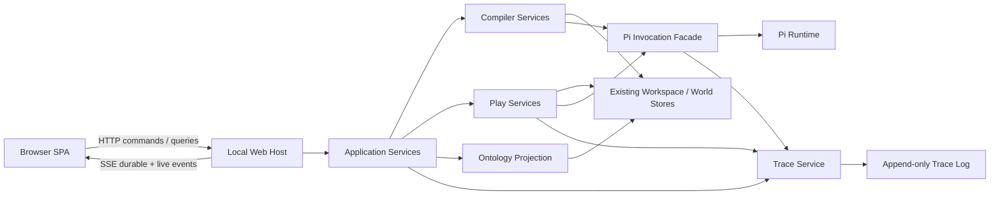
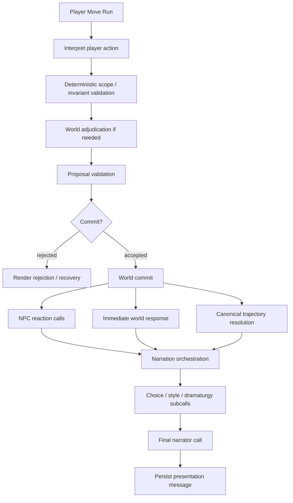

# Novel World Harness Web UI MVP 设计方案

状态：MVP 已实现（设计仍作为后续迭代约束）

日期：2026-08-30

范围：本地单用户、无产品登录鉴权、继续使用 Pi 作为模型运行时；先交付 Play 与 Trace，再补齐浏览器中的完整编译与世界检查工作流。

实现说明：当前代码已交付本设计的浏览器闭环，包括 source register、prepare、proposal review/convergence、instance create/fork/remove、play/resume/clear/archive、追加式 trace/context/trajectory 以及 model/events/places/rules/provenance 五类 ontology 投影。高频 narration delta 在 React 外按 animation frame 合并；operation/SSE/HTTP error 具有最终脱敏边界和可显示的有界 recovery contract。启动恢复会用 content-verified player-turn audit、immutable commit ancestry、branch head 与 presentation message 对账中断的 player move，只追加 recovery diagnostic/修复 observation links，不回写或重放世界事件。核心实现位于 `src/application/*-service.ts`、`src/trace/`、`src/web/` 与 `apps/web/src/`；世界真相和 Pi 边界未改变。

## 1. 结论

新增 Web UI 不应是“把现有 CLI 命令套一层 HTTP”，也不应替换 Pi 或引入另一套 agent runtime。建议建设一个本地 Web Host 和浏览器 SPA，把现有 compiler、world stores、play pipeline 与 Pi adapters 组织为可复用的 application services：CLI/TUI 与 Web 都调用同一组服务，只有交互适配器不同。

本方案的四个核心决定是：

1. **Pi 仍是唯一模型运行边界。** 模型选择、流式输出、tool loop、retry、session、provider auth 都继续由 Pi 承担；Novel Harness 继续拥有 prompt、证据访问策略、proposal、validation、commit 和世界语义。
2. **Trace 是追加式、可重放的本地事件日志，但不是世界真相。** 每次玩家动作形成一个 root run；其内部可以包含多个 Pi agent、多个 LLM request、多个 tool call、一次或零次世界提交，以及提交后的叙事渲染。
3. **Ontology 图是现有规范化存储的派生投影，不新建图数据库。** entity、claim、event、participation、event relation、spatial relation、rule、possibility、branch commit 等继续由现有 store 管理；Web 只请求带时间和分支范围的 typed-property-graph projection。
4. **MVP 优先解决 Play 与 Trace。** 第一阶段允许在已准备好的小说世界里创建、继续、取消和检查会话；第二阶段补齐小说导入、批次编译、proposal 审核、实例创建和完整 ontology 工作台，形成浏览器内闭环。

目标形态如下：



## 2. 当前项目基础与缺口

现有工程已经有大部分领域能力，Web 项目应复用而不是复制：

| 已有能力 | 主要位置 | Web 设计结论 |
| --- | --- | --- |
| 本地 source/workspace/world 文件存储 | [`workspace-store.ts`](../src/storage/workspace-store.ts)、[`runtime-paths.ts`](../src/agent/runtime-paths.ts) | 保持 `$NWH_HOME` 与 `workspaces/v1`，不加外部数据库 |
| canonical entities、claims、events、rules、relations 的不可变 revision/current refs | [`canonical-model.ts`](../src/world/canonical-model.ts)、[`model.ts`](../src/world/model.ts) | 直接作为 ontology projection 的事实输入 |
| character、relationship、spatial、world-rule ontology | [`character-ontology.ts`](../src/world/character-ontology.ts)、[`relationship-ontology.ts`](../src/world/relationship-ontology.ts)、[`spatial-ontology.ts`](../src/world/spatial-ontology.ts)、[`world-rule-ontology.ts`](../src/world/world-rule-ontology.ts) | 不另造一套 Web 专用知识模型 |
| proposal → validate → commit、branch event history、possibility frontier | `src/compiler/`、`src/world/` | Web mutation 必须继续经过同样的校验和提交路径 |
| 角色隔离的 player interpretation/adjudication、NPC response、narration | [`player-action.ts`](../src/world/player-action.ts)、[`play-experience.ts`](../src/world/play-experience.ts)、`src/agent/pi-player-*.ts` | 一个玩家动作要用同一个 trace context 串起全部子调用 |
| 会话指针、展示 transcript、player-turn audit | [`play-session.ts`](../src/world/play-session.ts)、[`play-conversation.ts`](../src/world/play-conversation.ts)、[`player-turn-audit.ts`](../src/world/player-turn-audit.ts) | 可迁移为 Web 会话模型，但现有 audit 不足以回答完整 LLM 上下文问题 |
| Pi 流式、tool、retry、session event hooks | [`pi-session.ts`](../src/agent/pi-session.ts) | 增加统一 invocation/trace facade，不修改 Pi 核心 |
| 删除 instance/analysis/all 的领域语义 | [`removal.ts`](../src/world/removal.ts) | Web 操作必须显示准确影响范围，不做含糊的 `clear all` |

当前最重要的缺口不是“没有一个聊天页面”，而是：

- CLI command 同时承担 orchestration 和终端展示，缺少稳定的 application-service 边界。
- `PlaySession` 主要是 branch/actor/head 指针，没有面向 UI 的稳定 session identity、状态和归档语义。
- `PlayerTurnAudit` 记录了提案、校验、commit 等领域结果，但没有逐次 LLM request 的最终上下文、provider payload、tool timeline、usage 和嵌套关系。
- narration 在世界提交之后发生，当前很难在一个对象里看清“玩家输入 → 解释 → adjudication → commit → NPC/世界反应 → 最终叙事”的全链路。
- ontology 数据已有规范化存储，却没有统一的、按 source/branch/time 投影的图查询协议。
- 长任务的浏览器断线重连、取消、幂等提交和崩溃恢复还没有 Web 级协议。

本方案遵守 [`ADR 0001`](./adr/0001-world-truth-history-and-possibility-space.md)、[`pi-integration.md`](./pi-integration.md) 与 [`tui-interaction-contract.md`](./tui-interaction-contract.md) 中已经确立的边界。

## 3. 第三方调研与取舍

### 3.1 DeepSeek Harness

调研对象是 DeepSeek 官方的开源 [DeepSeek Harness](https://github.com/deepseek-ai/deepseek-harness)，不是简单参考其聊天页面。该项目目前明确标注为 developer preview，因此适合作为设计参考，不适合作为 Novel Harness 的基础依赖。

值得直接借鉴的部分：

- [Architecture](https://github.com/deepseek-ai/deepseek-harness/blob/master/docs/architecture.md) 把 session 表示为追加式事件日志，并把一个 model request 加其 tool calls 定义成一个 step；一个用户 turn 可以有多个 step。这解决了“一个聊天 turn 到底调用了几次 LLM”的歧义。
- [Session package](https://github.com/deepseek-ai/deepseek-harness/blob/master/packages/session/README.md) 默认使用本地 JSONL 持久化，并从事件日志折叠出 projections。这个方向与本项目的本地文件存储约束一致；其可选 SQLite 路径不采用。
- [Conversation subsystem](https://github.com/deepseek-ai/deepseek-harness/blob/master/docs/subsystems/conversation.md) 让 Chat 和 Trajectory 从同一原始事件窗口生成不同投影，而不是维护两份容易漂移的数据。
- [Trajectory UI](https://github.com/deepseek-ai/deepseek-harness/blob/master/packages/client/ui-trajectory/README.md) 提供 turn/step/tool 层级、输入输出、token、duration、TTFT、分页和虚拟列表，和本项目的 trace 检查需求高度吻合。
- [Client package](https://github.com/deepseek-ai/deepseek-harness/blob/master/packages/client/README.md) 将连接、事件折叠与可观察快照放在 React 之外，再让 UI 订阅快照。这适合高频 token/tool 流，能避免把网络协议和业务状态塞进组件树。

不照搬的部分：

- 不引入 DeepSeek Harness runtime。Pi 已经是本项目的 provider、streaming、tool loop 和 session 边界。
- MVP 不建设“everything is a plugin”的通用插件树。当前更需要稳定的领域服务和数据契约；以后可以在页面槽位或 exporter 层增加扩展点。
- 不采用其 SQLite 可选存储，也不把 session log 变成世界真相。Novel Harness 的 branch committed-event history 仍是唯一世界权威。
- 不把普通聊天 transcript 当作模型上下文的唯一来源。角色知识隔离、原文证据、世界状态、工具 schema 等必须显式组装并标注来源。

### 3.2 可观测性与 provenance

[Langfuse 的数据模型](https://langfuse.com/docs/observability/data-model) 使用 session → trace → nested observations，并区分 generation、span 和 event；本方案借用这一层级概念，但不部署 Langfuse 服务，也不让外部系统成为本地 trace 的权威。

[W3C PROV-O](https://www.w3.org/TR/prov-o/) 用 Entity、Activity、Agent 和 derivation 表达 provenance。这里将其作为“source evidence → proposal → validation → committed artifact”的关系设计参考，不在 MVP 中引入 RDF/OWL 存储。

[Cytoscape.js](https://js.cytoscape.org/) 支持浏览器内 typed graph、compound node、交互与可扩展 layout，适合作为 ontology 图谱渲染层。图中数据仍来自服务端 projection，而不是由浏览器推断世界语义。

[OpenTelemetry semantic conventions](https://opentelemetry.io/docs/specs/semconv/) 可作为未来 exporter 的兼容目标；MVP 的本地 schema 必须先表达 Novel Harness 特有的 branch、commit、story time、evidence 和 context-part，不能被通用 span schema 反向限制。

## 4. 设计目标与非目标

### 4.1 MVP 最终目标

- 用户可以只在浏览器中导入小说、执行/继续编译、审查 proposal、创建世界实例、选择角色、play、继续历史会话。
- 每个玩家动作都能回答：调用了多少次 LLM、分别为何调用、使用了什么模型、上下文由哪些部分组成、实际发给 provider 的内容是什么、有哪些 tool calls、发生了什么 validation/commit、故事时间如何变化、最终 response 是什么。
- 用户可以从模型、事件、地点、规则和 provenance 五个视图检查当前已编译内容，并回到证据或 revision。
- 所有长操作可流式查看、取消、断线后恢复观察；重复提交不会重复执行玩家动作。
- `new`、`continue`、`clear`、`archive`、`remove` 具有明确、可预览、可测试的语义。

### 4.2 非目标

- 不做多用户、云同步、协同编辑、产品账号或 RBAC。
- 不在 MVP 中增加外部数据库、向量数据库、RAG 或图数据库。
- 不承诺通过 UI 立即解决任意长篇小说的编译质量；UI 暴露现有 compiler 的状态、证据和失败，并为后续打磨提供观察面。
- 不提供任意文件系统浏览器、任意 shell/tool 执行或通用写工具。
- 不把 future canon、模型猜测或 narrative 文本提升为当前 branch truth。

## 5. 总体架构

### 5.1 进程与边界

新增命令建议为：

```text
nwh web --host 127.0.0.1 --port 3080
```

它在一个 Node 进程内启动：

- Web Host：静态资源、versioned HTTP API、SSE event endpoint。
- Application Services：协调 compiler/play/model settings/lifecycle，返回领域对象和 operation ID，不写 stdout。
- Operation Manager：管理长任务、`AbortController`、workspace/compiler lock、branch/head 并发控制和 pending interaction。
- Trace Recorder：追加事件、管理 blob、提供 run projections。
- 现有 stores 与 Pi adapters。

浏览器只持有 UI projection 和短期输入状态；刷新后可从服务器重新获取 authoritative snapshot，再从 event cursor 衔接实时流。

默认只绑定 `127.0.0.1`。显式绑定非 loopback 地址时必须显示警告；“无登录”不等于允许局域网匿名控制本机小说、provider credentials 和模型调用。

### 5.2 建议目录

```text
apps/web/                         # React + TypeScript + Vite SPA
  src/app/
  src/features/library/
  src/features/compiler/
  src/features/play/
  src/features/trace/
  src/features/ontology/
  src/features/settings/
  src/state/                      # React 外部的 snapshot/event stores

src/application/                  # CLI/TUI/Web 共用 use cases
  source-service.ts
  preparation-service.ts
  play-service.ts
  lifecycle-service.ts
  model-settings-service.ts

src/web/
  host.ts
  routes/
  contracts/                      # Zod runtime schema + inferred TS types
  operation-manager.ts
  event-stream.ts

src/observability/
  model.ts
  trace-store.ts
  trace-recorder.ts
  trace-projection.ts
  pi-trace-extension.ts
  context-manifest.ts

src/world/ontology-projection.ts
```

第一轮不必拆成多个发布包。`apps/web` 产出静态资源，Node host 由现有根包发布；shared contracts 保持在根包，避免客户端和服务端各写一套类型。

### 5.3 技术选型

MVP 建议锁定以下组合，版本由实现时的 lockfile 固定：

- **前端**：React + TypeScript + Vite；TanStack Router 管理可复制的 source/branch/session/run 路由，TanStack Query 管理低频 HTTP snapshot。
- **实时状态**：自研轻量 `EventProjectionStore`，通过 `useSyncExternalStore` 接入 React；不让 Query cache 或组件 local state 承担 token/tool event folding。
- **长列表**：TanStack Virtual；Trace ledger、context messages 和 event history 必须虚拟化。
- **图谱**：Cytoscape.js；详情与无障碍 fallback 同时提供可搜索的表格视图，关键能力不能只靠拖拽画布。
- **服务端**：Fastify，负责静态资源、multipart upload、versioned JSON API、SSE 和统一 error handling；领域对象仍由 application services 产生。
- **契约**：Zod schema 是 runtime boundary，客户端类型从 schema 推导或构建时生成，不能手写同名 DTO。
- **样式**：CSS variables + CSS Modules，先建立颜色、间距、字体、状态和 graph legend tokens；MVP 不引入一整套与领域无关的组件平台。
- **测试**：沿用 Vitest；浏览器关键流程使用 Playwright。

不建议首轮引入 Redux、GraphQL、Electron 或服务端渲染。当前应用是本地交互工作台，最难的问题是 event identity、恢复和领域边界，不是公开网页 SEO 或通用全局状态管理。

### 5.4 Application service 原则

现有 `src/commands/*.ts` 逐步改成薄适配器：解析 CLI 参数、调用 service、把 service events 映射到 TUI。Web route 调用同一 service，不能：

- spawn `nwh` 子进程；
- 解析 stdout；
- 调用 TUI callback 来判断状态；
- 绕过 validation/commit 或自行写 world files。

每个会改变状态的 service 接受 `OperationContext`：

```ts
interface OperationContext {
  operationId: string;
  clientRequestId: string;
  signal: AbortSignal;
  trace?: TraceContext;
  emit(event: OperationEvent): void;
}
```

## 6. 统一概念，消除 “turn/session/model” 歧义

UI、API 与 trace 使用以下词汇：

| 名称 | 精确定义 |
| --- | --- |
| Novel | 一个已注册 source 及其 source-scoped 分析资产 |
| World Instance | 一个 branch 及其 committed event history |
| Play Session | 用户可恢复的 actor + branch + presentation conversation |
| Player Move | 一次玩家输入触发的完整业务动作 |
| Run / Trace | 一次可观察的 operation；player move 是一种 run |
| Stage / Span | run 内部的 host、deterministic 或 agent 子步骤 |
| LLM Call | **恰好一次**发往 provider 的请求及其响应 |
| Tool Call | 一个有稳定 call ID 的工具执行 |
| World Commit | 写入 branch history 的权威提交 |
| Story Time | 世界内时间，使用现有结构化 `StoryTime` |
| Wall Time | 调用观察时间、duration、TTFT 等现实时间 |

页面上避免只写“Turn 3”。应分别显示“Player Move #3”和“LLM Request #7”。“World Model”与“LLM Model”也使用不同标签。

## 7. Play Session v2

当前 play session 与 branch 绑定过紧。建议增加稳定 session ID，同时明确 branch 仍是世界真相：

```ts
interface PlaySessionV2 {
  version: 2;
  id: string;
  sourceId: string;
  branchId: string;
  actorId: string;
  title: string;
  status: "active" | "idle" | "archived" | "detached";
  createdAt: string;
  updatedAt: string;
  lastCommitId?: string;
  lastMoveId?: string;
  conversationId: string;
}
```

MVP 约束：

- 一个 branch 同一时刻最多有一个可写的 active play session。
- “继续”恢复该 session 与当前 branch head。
- “新时间线”从指定 commit fork branch，再创建 session。
- 如果用户希望从相同世界头开始另一段实验，默认 fork，而不是让两个会话并发写同一 branch。
- session transcript 仍是 presentation data；删 transcript 或 session 不改变 committed world history。
- 旧版 branch-based pointer 由 read adapter 懒迁移成 v2；不要求一次性破坏性迁移。

每次提交玩家动作时必须传 `expectedHead` 和 `clientRequestId`。head 已改变则返回可解释的 `409 BRANCH_HEAD_MOVED`，不能静默把动作应用到另一状态。

## 8. Trace 数据模型

### 8.1 真相边界

Trace 的用途是复现“系统看到了什么、调用了什么、为什么产生该结果”，它不是：

- branch world truth；
- actor knowledge；
- compiler proposal 的自动认可；
- 下次模型调用的默认上下文。

只有现有 commit path 能改变世界。Trace 可以引用 `eventHash`、`commitId`、`auditId`，但不能反向生成或修改它们。

### 8.2 存储布局

建议新增：

```text
$NWH_HOME/workspaces/v1/<workspace-id>/observability/v1/
  runs/<yyyy-mm>/<run-id>/
    manifest.json
    events.jsonl
  blobs/sha256/<prefix>/<hash>.json
  indexes/
    runs.json
    sessions.json
```

- `events.jsonl` 只追加，`seq` 在单个 run 内单调递增。
- 大的 context、provider payload、tool result 和最终 message 使用 content-addressed blob；event 只保存 `blobRef`、hash、size 和 media type。
- indexes 是可重建 projection，损坏时从 manifest/events 重建。
- source bytes 继续存放在现有 immutable source archive，不复制进 trace blob；trace 保存 source ID、span/ref 和当时实际发送片段的 blob。
- trace 默认不自动过期。以后可以增加“删除 trace payload、保留 metadata”的显式维护操作，但不能伪装成 `clear`。

### 8.3 Run manifest

```ts
interface RunManifest {
  version: 1;
  id: string;
  kind: "prepare" | "player-move" | "opening" | "narration-retry";
  status: "running" | "succeeded" | "failed" | "cancelled" | "interrupted";
  sourceId: string;
  branchId?: string;
  playSessionId?: string;
  playerMoveId?: string;
  actorId?: string;
  startedAt: string;
  endedAt?: string;
  previousHead?: string;
  finalHead?: string;
  auditId?: string;
  rootSpanId: string;
  lastSeq: number;
  error?: TraceErrorSummary;
}
```

run、span、call、move ID 建议使用 sortable UUIDv7；已有 content hash 仍只用于内容身份，不承担 UI 会话身份。

### 8.4 Trace event

```ts
interface TraceEvent<T = unknown> {
  version: 1;
  runId: string;
  seq: number;
  observedAt: string;
  type: TraceEventType;
  spanId: string;
  parentSpanId?: string;
  callId?: string;
  toolCallId?: string;
  storyTime?: StoryTimeObservation;
  data?: T;
  blobRef?: BlobRef;
}
```

首批 event type：

```text
run.started | run.succeeded | run.failed | run.cancelled | run.interrupted
stage.started | stage.finished | stage.failed
context.assembled | context.finalized
llm.request.started | llm.request.payload
llm.response.delta | llm.response.completed | llm.response.failed | llm.retry
tool.call.started | tool.call.progress | tool.call.completed | tool.call.failed
validation.completed
world.commit.started | world.commit.completed | world.commit.failed
interaction.requested | interaction.resolved
presentation.message.appended
```

token delta 不逐 token `fsync`。Recorder 在内存中按最多约 100 ms 或 8 KiB 合并 chunk，同时最终保存 Pi 的 authoritative completed message；这样保留流式重放能力，又避免超大量小事件。

### 8.5 Context composition：不能事后猜 prompt

仅保存一个大字符串无法回答“哪部分是模型定义、哪部分是小说原文”。因此每个调用必须同时保存：

1. **Semantic context manifest**：Novel Harness 在组装时记录每个部分的来源、权限和用途。
2. **Final logical messages**：Pi 在发起本次请求前看到的 system/tools/messages。
3. **Exact provider payload**：经过 Pi/provider serialization 后实际发出的 payload；认证 header 和 secret 永不进入 trace。

建议数据结构：

```ts
interface ContextSnapshot {
  version: 1;
  callId: string;
  assemblyVersion: string;
  providerId: string;
  modelId: string;
  thinkingLevel?: string;
  parts: ContextPart[];
  tools: ToolDescriptorSnapshot[];
  logicalMessagesRef: BlobRef;
  providerPayloadRef: BlobRef;
  logicalContextHash: string;
  providerPayloadHash: string;
  estimatedInputTokens?: number;
  providerReportedInputTokens?: number;
}

interface ContextPart {
  id: string;
  label: string;
  kind: ContextPartKind;
  role: "system" | "user" | "assistant" | "tool";
  authority: ContextAuthority;
  sourceRefs: SourceRef[];
  contentRef?: BlobRef;
  charCount: number;
  estimatedTokens?: number;
  disposition: "included" | "omitted" | "truncated";
  omissionReason?: string;
  logicalMessageIndexes: number[];
}
```

首批 `kind`：

- `system.core`、`system.role`、`engine.invariant`、`capability.contract`、`tool.schema`
- `player.utterance`、`actor.model`、`actor.state`、`actor.knowledge`
- `scene.current`、`play.recent-history`、`world.committed-state`
- `source.excerpt`、`compiler.batch`、`canonical.reference`
- `tool.result`、`proposal.candidate`、`presentation.context`

首批 `authority`：

- `trusted-system`
- `engine-invariant`
- `committed-world`
- `actor-visible`
- `untrusted-player`
- `untrusted-source`
- `proposal-only`
- `presentation-only`
- `tool-result`

`ContextPart` 的 token 数只能标为 estimate；整次调用最终使用 provider usage 中的 input token 数。不能把估算的分项 token 相加后展示成“精确计费”。

实现上将现有 prompt builder 逐步改为返回 `PromptDocument { text, parts }`，而不是让 Trace Recorder 解析最终字符串。所有 Pi adapter 都接受同一个 `TraceContext`，由统一的 `NwhPiInvocation` 创建 session、加载 tools 并安装 trace extension。

### 8.6 Pi 生命周期映射

当前 Pi 已提供完成该能力所需的 hook。Trace extension 必须最后加载，以便观察其他 extension 处理后的最终请求：

| Pi 观察点 | Trace 用途 |
| --- | --- |
| `before_agent_start` | 记录本次 agent 的 system prompt 结构、已选 tools、context files/skills 元数据 |
| `context` | 记录每个 LLM call 前的最终 logical messages |
| `before_provider_request` | 捕获 provider-specific exact payload，执行 secret redaction 后落 blob |
| `after_provider_response` | 记录 response metadata、provider usage 和结束状态 |
| `turn_start` / `turn_end` | 划分一次 LLM request/tool loop step |
| `message_update` | 合并流式 text/thinking/tool deltas，供实时 UI 使用 |
| `message_end` | 保存 authoritative final message |
| tool execution events | 用 `toolCallId` 关联 input、progress、result、error 和 recovery SOP |
| retry events | 展示 retry 原因、次数与 backoff，不把 retry 伪装成新玩家动作 |

原始 hidden reasoning 不作为产品承诺。默认保存最终 assistant/tool 内容、usage 和 reasoning presence/时长；只有 provider 明确返回且配置允许的可展示 reasoning 内容才可单独、本地、显式地记录，UI 不推断或生成所谓“思维链”。

### 8.7 一个玩家动作的 trace 树



所有节点是同一 root run 下的 span。并行 NPC/specialist 调用共享 root，但各有稳定 span/call ID；UI 不能依赖写入顺序推断父子关系。

`PlayerTurnAudit` 增加 `runId`、`playerMoveId`，run manifest 反向链接 `auditId`、`eventHash`、`commitId`。这提供可核验链路：

```text
source evidence → model context → LLM/tool observations → proposal
→ validation → committed event/world head → narrative presentation
```

### 8.8 取消、失败与恢复

取消语义继续遵守现有 TUI contract：

- commit 前取消：不改变 branch head。
- commit 后、narration 前取消：**不回滚、不重复提交**；run 显示 `world committed / narration interrupted`，提供“只重试叙事”操作。
- 浏览器断线：后台 operation 不自动取消；重连后从 cursor 继续观察。
- Node 崩溃：启动时扫描 `running` manifest，标记为 `interrupted`；compiler 可从既有 checkpoint 恢复。player move 必须先比对 branch head、audit 和 commit link，再决定只能重试未发生的安全阶段，不能盲目重放整个动作。
- Trace 写入在模型调用前无法启动：本 MVP 的 Play 应失败关闭，避免产生不可检查的新动作。
- world commit 已成功但 trace 尾部写入失败：world truth 优先，绝不回滚；通过 audit/head 对账生成 repair diagnostic。

## 9. Ontology 投影设计

### 9.1 不是第二套事实库

新增 `OntologyProjectionService`，从现有 stores 在明确 scope 下构建只读 typed property graph：

```ts
interface OntologyScope {
  sourceId: string;
  branchId?: string;
  atCommit?: string;
  includeCanonicalFuture?: boolean; // 默认 false，且必须单独图层显示
  layers: OntologyLayer[];
}

interface OntologyGraph {
  version: 1;
  scope: OntologyScope;
  nodes: GraphNode[];
  edges: GraphEdge[];
  legend: GraphLegend;
  facets: GraphFacets;
  nextCursor?: string;
}
```

`atCommit` 省略时使用当前 branch head；没有 branch 时是 source-scoped canonical inspection。`includeCanonicalFuture` 不能把未来 canon 合并成当前 branch truth，只能打开一个视觉上明确隔离的“canonical future / possibility”图层。

canonical store 中的 artifact 可能有多个 source 的 evidence，因此 source scope 不能靠 ID 前缀或“任意一条证据命中”后就返回全部详情。Projection 先计算 direct evidence、accepted provenance、initial-world/branch pinned refs 的 membership；共享 artifact 标记为 `shared`，默认只展开当前 source 的 evidence，只有显式跨 source 查询才返回其他来源内容。

### 9.2 节点与边

首批节点：

- Entity：character、location、faction、artifact、institution、relationship、concept、other。
- Proposition、Claim、Attribution：保留“谁认为/何时认为/证据是什么”，不把全部 claim 扁平成客观事实。
- CanonicalEvent、CommittedEvent、WorldCommit。
- WorldRule 及其 revision/effective interval。
- CharacterModel、Goal、Disposition、RelationshipState。
- Possibility 与 proposal/rejection/validation artifact。
- SourceSpan/Evidence（默认聚合，按需展开）。

首批边：

- event participation：`participates-as`、role、presence。
- event relation：before/after、causes、enables、prevents、subevent、coreference 等现有类型。
- spatial：contains、adjacent、route，并保留 temporal/event conditions。
- semantic：claim subject/object、attribution holder/proposition、relationship from/to/type。
- rule：scope、requires、forbids、established-by、retired-by。
- evidence/provenance：supports、contradicts、contextualizes、derived-from、validated-by、supersedes。
- runtime：realizes、causal-parent、committed-in、projects-to-state。

每个 node/edge 至少包含：稳定 ID、kind、label、status、revision hash、evidence count、story-time annotation、details endpoint。状态的视觉编码必须区分：canonical、branch-committed、proposal、possibility、contested、rejected、future-canon。

### 9.3 五个工作视图

1. **World Model**：entity/claim/relationship 主图；点击角色显示模型、目标、知识范围和证据。
2. **Events**：事件的 narrative order 与 story time 分开展示。`StoryTime` 可能是 exact/range/relative/ordinal/unknown；未知或偏序事件不能被 UI 伪造成精确时间线。
3. **Places**：contains/adjacent/route 拓扑图；按 selected commit 展示当时有效的可达条件。
4. **Rules**：规则表 + 依赖图，默认显示在 selected commit 生效的 revision，并能查看 established/retired event。
5. **Provenance**：evidence → proposal → validation → artifact/commit，方便审计编译质量。

### 9.4 性能与交互

- 使用 Cytoscape.js 渲染；layout、缩放、选中状态属于客户端 UI state。
- 服务端负责 scope、权限/知识隔离、图层和邻域查询，浏览器不自行拼接真相。
- 默认返回摘要图和 facets，不一次加载整本小说。建议默认上限 2,000 nodes/edges，支持 `neighborhood(nodeId, depth, edgeKinds)`、分页和按类型过滤。
- 大图先返回节点/边，再异步计算 layout；切换筛选不重复下载未变化详情。
- 点击元素打开右侧 inspector：ID、类型、status、revision、story time、关联边、证据摘录、source span、branch effect。
- 后续可增加 derived cache；cache 必须可删除重建，并用 source/current-ref/head hash 作为 key。

## 10. Web 信息架构

### 10.1 全局布局

```text
┌──────────────┬────────────────────────────────────┬─────────────────┐
│ Novel/Session│ Main workspace                     │ Inspector       │
│ navigation   │ Library / Compile / Play / Graph   │ Context/Node/Run│
│              │                                    │ details         │
└──────────────┴────────────────────────────────────┴─────────────────┘
```

- 左侧：novels、instances、play sessions；支持 archived filter。
- 中间：当前主要工作区。
- 右侧：可固定的 inspector，点击事件、context part、graph node、tool call 时复用。
- 顶部 operation tray：正在运行的 prepare/play/export，显示状态、取消和跳转；页面切换不丢任务。

### 10.2 路由与页面

| 路由 | 页面职责 |
| --- | --- |
| `/` | Library：小说、准备度、未完成操作、活跃实例与最近会话 |
| `/novels/new` | upload/paste/register；只接受当前 compiler 支持的格式 |
| `/novels/:sourceId` | Overview：source、batch/checkpoint、readiness、问题摘要 |
| `/novels/:sourceId/compile` | 执行 next/all、流式日志、proposal inbox、accept/reject、证据检查 |
| `/novels/:sourceId/ontology/:view` | model/events/places/rules/provenance 五个视图 |
| `/instances/:branchId` | branch head、角色、story time、committed history、fork/diff |
| `/play/:sessionId` | transcript、自由输入/choice、当前 actor/time/head、实时状态 |
| `/play/:sessionId/trace/:runId` | 单个玩家动作的完整 trajectory |
| `/traces` | 按 session、stage、model、status、日期筛选所有 runs |
| `/settings/models` | Pi provider credential status、models、角色 profile |

### 10.3 Play 页面

Play 页面必须同时服务“沉浸”和“调试”，但默认不让 trace 噪声淹没正文：

- 中央 transcript：opening、player message、scene response、choices。
- composer：自由文本、选择建议、停止按钮、重新生成叙事（仅在语义允许时）。
- 顶部 status strip：actor、branch、head、当前 story time、run stage。
- 每条玩家消息旁显示一个紧凑 run badge：成功/拒绝/失败、LLM calls、tool calls、commit、耗时；点击打开 trace。
- debug drawer 可实时显示正在执行的 stage，但不会把 tool output 注入 transcript。

### 10.4 Trace 页面

顶部 summary：

- run status、wall duration、previous/final head；
- story time before/after；
- LLM request 数、tool call 数、retry 数；
- input/output/cache token 与可得成本；
- world commit 状态、event/commit/audit links；
- final player-visible response。

主体使用虚拟化 ledger/tree：

```text
Player Move #12
  Interpret action
    LLM Request #1
      Context · Request · Response · Usage
      Tool: inspect_actor_state
  Deterministic validation
  World adjudication
    LLM Request #2
  Commit  eventHash=…  storyTime T→T+1
  NPC reactions
    LLM Request #3  ┐ parallel
    LLM Request #4  ┘
  Narration
    Choice / Style / Dramaturgy
    LLM Request #8 final
  Presentation message
```

选择一次 LLM request 后，右侧 inspector 提供：

1. **Context Composition**：按 semantic part 分组，显示 included/omitted/truncated、authority、来源、字符数和估算 token。
2. **Messages**：最终 logical system/user/assistant/tool messages。
3. **Tools**：本次可用 tool schemas；实际调用另有醒目标记。
4. **Provider Payload**：redacted exact JSON，可搜索、复制和下载。
5. **Response**：流式重放与 authoritative final message。
6. **Usage & Timing**：排队、TTFT、生成、tool、总时长；明确 provider reported 与 locally measured 的区别。
7. **World Effects**：proposal、validation、commit、story time、event links。

提供 Request #N 与 #N+1 的 context diff。diff 依据 `ContextPart.id`、hash 和 logical message index，不按字符串模糊猜测。

## 11. 浏览器协议

### 11.1 为什么 MVP 选择 HTTP + SSE

DeepSeek Harness 使用独立 command channel 与 server event stream 的思路值得保留。对本地单用户 MVP，推荐：

- HTTP GET：snapshot/query。
- HTTP POST/PATCH/DELETE：带 `clientRequestId` 的命令。
- SSE：operation、LLM delta、tool、interaction 和 invalidation events。

Pi 的交互方向本质上仍是“服务器提出问题，浏览器 POST 回答”；不需要为了双向 socket 把整个命令协议塞进 WebSocket。SSE 自带顺序事件 ID 和重连 cursor，部署与测试更简单。如果未来出现多人协作、远程 worker 或高频二进制媒体，再把 event transport 替换为 WebSocket；客户端只依赖 `EventTransport` 接口。

SSE 事件含全局 `eventId`、`operationId`、可选 `runId` 和 payload。浏览器重连时提交 `Last-Event-ID`；服务器先返回新的 authoritative snapshot/invalidation，再补发 durable run events 并接入 live tail，避免只靠内存队列。

客户端在 React 外维护 `AppSnapshotStore` 和每个 run 的 `TraceProjectionStore`，用 immutable snapshot + structural sharing 通知组件；token delta 按 animation frame 合并。长 ledger 使用虚拟列表，用户向上滚动后暂停自动 tail-follow。

### 11.2 首批 API

查询：

```text
GET  /api/v1/bootstrap
GET  /api/v1/novels
GET  /api/v1/novels/:sourceId
GET  /api/v1/novels/:sourceId/preparation
GET  /api/v1/novels/:sourceId/ontology?view=&branchId=&atCommit=&layers=&cursor=
GET  /api/v1/ontology/nodes/:nodeId?sourceId=&branchId=&atCommit=
GET  /api/v1/instances
GET  /api/v1/instances/:branchId
GET  /api/v1/play-sessions
GET  /api/v1/play-sessions/:sessionId
GET  /api/v1/play-sessions/:sessionId/messages
GET  /api/v1/runs?sessionId=&kind=&status=&cursor=
GET  /api/v1/runs/:runId
GET  /api/v1/runs/:runId/events?afterSeq=
GET  /api/v1/calls/:callId/context
GET  /api/v1/events
```

命令：

```text
POST   /api/v1/sources                         # multipart 或 text registration
POST   /api/v1/novels/:sourceId/prepare        # { mode: "next" | "all" }
POST   /api/v1/proposals/:proposalId/accept
POST   /api/v1/proposals/:proposalId/reject
POST   /api/v1/instances
POST   /api/v1/instances/:branchId/fork
POST   /api/v1/play-sessions
POST   /api/v1/play-sessions/:sessionId/moves  # text/intent/expectedHead/clientRequestId
POST   /api/v1/play-sessions/:sessionId/retry-narration # sourceRunId/expectedHead/clientRequestId
PATCH  /api/v1/play-sessions/:sessionId        # title/status
POST   /api/v1/operations/:operationId/cancel
POST   /api/v1/interactions/:interactionId/answer
DELETE /api/v1/play-sessions/:sessionId
DELETE /api/v1/instances/:branchId
POST   /api/v1/novels/:sourceId/reset-analysis
DELETE /api/v1/novels/:sourceId
```

模型设置：

```text
GET    /api/v1/models/providers
GET    /api/v1/models
GET    /api/v1/model-profiles
PATCH  /api/v1/model-profiles/:role
POST   /api/v1/models/providers/:providerId/login
DELETE /api/v1/models/providers/:providerId/credential
```

长任务统一返回 `202 { operationId, statusUrl }`。短命令可以直接返回 `200`。任何 mutation 都验证 Zod schema、scope 和 optimistic concurrency。

### 11.3 错误与 recovery contract

API 错误必须沿用 [`agent-tool-recovery.md`](./agent-tool-recovery.md) 的思想，返回真实错误和有界 SOP：

```ts
interface ApiError {
  code: string;
  message: string;
  details?: unknown;
  retry: {
    kind: "none" | "same-request" | "after-refresh" | "after-user-action";
    maxAttempts?: 1;
    discoveryEndpoint?: string;
    copyField?: string;
  };
}
```

例如 ID miss 返回同 scope 的 discovery endpoint，指出复制哪个字段，只允许一次修正重试；branch head conflict 要求 refresh，不能原样重试；single-use interaction 已消费则明确禁止重试。

## 12. 基础操作的精确定义

| UI 操作 | 语义 | 对世界历史的影响 |
| --- | --- | --- |
| Clear composer | 只清空尚未发送的浏览器输入 | 无 |
| New session | 默认从选定 commit fork 新 branch 并创建 session | 创建 branch；未发送动作前不新增世界事件 |
| Continue | 恢复既有 session，并验证当前 branch head | 无 |
| Archive session | 从默认列表隐藏，可恢复 | 无 |
| Remove session | 删除 presentation conversation/session metadata；trace 默认保留并标为 detached | 无 |
| Retry narration | 只对已提交动作重新执行 presentation 阶段 | 不得新增/重放世界 commit |
| Remove instance | 使用现有 leaf-branch 约束删除 instance；关联 sessions 变为 detached/archived | 删除目标 branch 数据；必须预览影响 |
| Reset analysis | 沿用现有 source-scoped analysis 清理语义 | 不删除 immutable source bytes；准确列出保留的实例/来源 |
| Remove novel | 沿用 `remove all` 语义，移除 registration、analysis 和 owned branches | 不物理删除 content-addressed source bytes |

危险操作先调用 preview endpoint 或在 DELETE response 前展示服务端计算的 effect manifest；确认文本使用明确的 novel/branch ID。不要提供语义不明的全局 “Clear”。

`retry-narration` 只接受同一 session/branch 的原始 `player-move` run。服务端再次核对
原 run 的 accepted `world.commit.completed`、`playerMoveId`、`finalHead` 与当前 branch
head，并确认尚无该 move 的 rendered scene message。重试 run 使用独立
`narration-retry` 身份，trace 明确记录 `worldMutationAllowed: false`；整个路径不调用
player-action translator、validator 或 commit API。

## 13. Provider 与模型设置

“不需要登录鉴权”指 Novel Harness 本身没有用户账号。调用模型仍需要 provider credential。Web 设置页复用 Pi `ModelRuntime` 和 credential store：

- 显示 provider、auth type、是否可用、credential 的 redacted metadata；绝不把 key 回传浏览器。
- API key 输入为 write-only，server 不写 trace、operation event 或普通日志。
- OAuth/device flow 通过 `interaction.requested` 推送 URL/code/prompt，浏览器 POST answer；pending interaction 是单次消费并有超时。
- model profile 按用途配置，例如 compiler、player-action、adjudicator、npc、narrator、specialist；底层仍解析为 Pi model/provider。
- trace 记录 provider/model/profile ID 和非敏感参数，但删除 Authorization header、API key、cookie 及 provider secret。

MVP 的 provider login 作为持久化 `provider-login` operation 运行，直接调用 Pi
`ModelRuntime.login/logout`。Pi 发出的 URL、device code、select/text/secret prompt 经
`AuthInteractionManager` 投影到 operation progress；`POST /interactions/:id/answer`
单次消费答案，答案本身不写 operation、SSE 或响应。API key 只作为第一个 Pi login
prompt 的一次性 seed，服务端只持久化请求 fingerprint。角色 profile 使用
`web-<role>` 路由原子更新同一 `novel-harness.yaml`，保留注释和未展开的 `${…}`
占位符，因此 CLI 与 Web 继续共享配置且不会把环境值写回文件。

## 14. 安全与隐私

即使没有账号系统，也应具备以下本地 Web 防护：

- 默认 loopback bind；非 loopback 必须显式 flag 和启动警告。
- 验证 `Host`/`Origin`，默认关闭跨域；设置严格 CSP。
- 启动时生成随机本地 capability/CSRF token，通过 SameSite 严格 cookie 或首屏 bootstrap 管理，对用户透明但阻止恶意网页驱动 localhost mutation。
- source 通过 upload/paste 或受 workspace 约束的选择器导入；API 不接受任意绝对路径读取。
- 小说文本始终是 untrusted evidence，浏览器输入也是 untrusted player input；不能变成 system instruction。
- Trace 可能包含完整小说片段、prompt 和 tool result，只保存在本地；默认不上传任何 observability 服务。
- exact payload 只包含 body 的安全副本，不保存 provider header；所有 secret field 在落盘前 redaction，测试包含 canary secret。
- HTML/Markdown output 必须 sanitize；模型不能向页面注入 script 或可执行链接。

## 15. 一致性、并发和崩溃恢复

- 每个 compiler workspace 继续使用已有 lock/checkpoint 语义。
- 每个 branch mutation 获取 branch lock，并校验 `expectedHead`。
- `clientRequestId` 在限定时间内幂等；相同 ID/相同 body 返回原 operation，相同 ID/不同 body 返回 conflict。
- operation manifest 在启动任务前原子写入；结束状态原子更新。
- MVP 实现把 operation snapshot 持久化在
  `$NWH_HOME/workspaces/v1/<workspace-id>/web/v1/operations/`。Host 启动时重建
  `clientRequestId` 幂等索引；遗留的 `queued/running` 记录转为
  `interrupted`，并根据是否越过 commit boundary 给出不同的恢复约束。
- 非 operation 的短命令把 request fingerprint 与脱敏后的 result/error 原子写入
  同级 `web/v1/mutations/`；不保存 source 正文、API key 或其他原始请求体。启动时
  遗留的 `running` 记录转为 unknown-outcome `interrupted`，禁止原 ID 原样重放，
  必须先刷新权威 catalog/session/world snapshot 做对账。
- SSE 丢失不是业务失败；浏览器通过 snapshot + cursor 恢复。
- presentation persist 失败不能撤销已提交世界；UI 显示 committed-but-unrendered，并允许安全的 narration/presentation repair。
- 后台 operation 默认只在 server 进程生命周期内运行；关闭进程时先 abort 可取消阶段、flush trace，再退出。MVP 不做 daemon queue。

## 16. 交付计划

### Phase 0：Web foundation（约 1 个迭代）

- 建立 `apps/web`、Web Host、Zod contracts、bootstrap/catalog API。
- 抽出第一批 application services，让 CLI 和 Web 共用。
- 建立 operation manager、SSE、snapshot/reconnect 基础。
- 只读展示 novels、instances、play sessions 和 provider/model 状态。

退出条件：浏览器刷新和 server 重启后能可靠恢复 catalog；没有通过 stdout 或 CLI 子进程取数据。

### Phase 1：Play + Trace MVP（约 2–3 个迭代，首要交付）

- PlaySession v2 与旧数据 read migration。
- 创建/继续/fork/archive/remove session。
- Web composer、choice、opening、streaming、cancel/reconnect。
- `TraceStore`、root run/span/call/tool schema。
- Pi invocation facade 与 trace extension；覆盖 player action、adjudication、NPC/world response、canonical resolver、narrator/specialists。
- context manifest、logical messages、exact provider payload、usage/timing、world-effect links。
- Trace trajectory、request inspector、context diff、run filter。
- provider auth/model profiles 的 Web 交互。

退出条件：产品团队能够仅凭 Trace 页面定位一次 play 的 prompt 构成、所有 LLM/tool 次数、commit 与 narration 结果，并能区分 story time 与 wall time。

### Phase 2：完整 Harness Web MVP（约 2–3 个迭代）

- source upload/paste/register。
- prepare next/all、batch/checkpoint、cancel/recovery。
- proposal inbox、accept/reject、validation/evidence inspector。
- instance 创建、角色选择、branch history/fork。
- model/events/places/rules/provenance 五个 ontology 视图。
- reset analysis/remove novel 的 effect preview。

退出条件：新小说从导入到准备、实例创建、play、继续会话和审计，全程无需终端。

### Phase 3：硬化与扩展

- 大图 neighborhood/pagination/cache 与 trace retention 管理。
- trace export、可选 OpenTelemetry exporter、性能指标。
- branch/commit/context diff，高级搜索，移动端只读适配。
- 在真实长篇小说上的 compiler/ontology 质量迭代；这属于模型与领域质量工作，不与 UI 完成度混为一谈。

## 17. 主要风险与缓解

| 风险 | 后果 | 缓解 |
| --- | --- | --- |
| Pi lifecycle hook 或 provider serialization 随版本变化 | exact payload/usage 漏记或 trace 结构漂移 | 所有 Pi 调用收口到 facade；锁定版本；用 fake provider 做每次升级的 conformance test |
| 部分 nested Pi session 未传播 `TraceContext` | 页面显示的 LLM 次数少于实际调用 | 禁止业务代码直接构造可调用 provider 的 session；lint/code review + root-run integration golden |
| semantic context manifest 与最终 payload 不一致 | UI 对“上下文构成”的解释失真 | 同时保存 manifest、logical messages、payload 三层及 hash；显示 coverage warning，不伪造 byte-level 对应 |
| 高频 delta 与大 prompt 使 JSONL/浏览器膨胀 | 磁盘增长、Trace 页面卡顿 | chunk coalescing、content-addressed blob、分页、虚拟列表；Phase 3 加显式 retention |
| world commit 与 trace finalization 无跨文件事务 | commit 成功但 trace 尾部缺失 | world truth 优先；audit/head link 对账；启动 repair diagnostic，绝不为补 trace 重放 commit |
| 旧 branch-based session 迁移改变 resume 体验 | 用户打开错误角色或产生重复 opening | 懒迁移并保留原 branch/actor/head；golden compatibility test；迁移本身不生成 presentation message |
| 大图把 future canon、claim 或 possibility 视觉上混成事实 | 用户错误判断当前世界状态 | 强制 status/layer legend；branch truth 默认视图关闭 future；服务端 scope 测试而非仅靠颜色 |
| loopback Web 被恶意网页跨站驱动 | 本机数据删除、产生模型费用 | Host/Origin 校验、SameSite capability/CSRF、无 CORS、危险操作 effect preview |

context attribution 的目标是“可核验”，不是制造虚假的精确度。Semantic part 可以精确说明由哪个 builder 加入、引用什么证据；provider payload 可以精确说明实际请求 body；但 provider 自身再次转换、分项 token 计数或服务端内部行为若不可见，UI 必须明确标为 unknown/estimated。

## 18. 验收标准

### 18.1 Play

- 可从已准备小说创建实例/session、选择角色、看到 opening、提交自由动作或 choice，并继续既有 session。
- 相同 `clientRequestId` 的重复 POST 不产生第二个 committed event。
- head conflict 明确阻止提交并提供 refresh/fork 路径。
- commit 前取消不改变 head；commit 后取消不回滚，且只能重试 narration。
- 浏览器在流式输出中断线，重连后显示同一 run，不重复动作。

### 18.2 Trace

- 每个 Player Move 显示准确的 LLM request、tool call 和 retry 数量。
- 每个 LLM Call 可查看 semantic context parts、final logical messages、redacted exact provider payload、最终 response、usage 和 timing。
- 并行/嵌套 agent 调用父子关系稳定，不依赖 timestamp 或数组顺序猜测。
- Trace 能链接 proposal、validation、event hash、commit、previous/final head、audit 和 presentation message。
- UI 同时显示结构化 story time before/after 与 wall-clock timing，未知 story time 不被伪造。
- canary provider secret 永不出现在 trace、SSE、API response 或前端日志中。

### 18.3 Ontology

- 五个视图都从同一 projection service 获取数据；不存在客户端自建第二套关系。
- 任一 node/edge 可回到 revision 和 evidence；graph projection 无 dangling edge。
- canonical future、possibility、proposal、contested claim 与 branch-committed truth 有明确图层和视觉区别。
- `atCommit` 查询得到当时有效的规则、地点关系和世界投影，不泄漏 branch head 之后的事实。

### 18.4 完整工作流

- 用户可在浏览器完成 register → prepare → proposal review → create instance → play → continue → inspect trace/ontology。
- reload、server restart、取消和失败都提供可恢复状态；不会用一个终端异常字符串结束交互。
- remove/reset 操作在确认前展示精确 effect manifest，并符合现有 [`removal.ts`](../src/world/removal.ts) 语义。

## 19. 测试策略

- **Contract tests**：所有 API request/response/SSE event 经相同 Zod schema；前后端 fixture round-trip。
- **Trace golden tests**：使用 fake Pi provider 验证 context parts、logical messages、exact payload hash、tool correlation、retry、usage 和最终 message。
- **Secret tests**：在 header/config/tool input 中植入 canary，验证 disk/API/SSE/UI 均 redacted。
- **Play integration tests**：accepted/rejected/adjudicated、NPC 并行、commit 前后取消、narration failure、重复 request、head conflict。
- **Crash recovery tests**：在模型前、commit 前、commit 后、presentation 前强制退出，重启后检查 run 状态与可重试范围。
- **Ontology projection tests**：scope、temporal rule、spatial condition、epistemic claim、future-canon 隔离、无 dangling edge、稳定 ID。
- **Browser tests**：Playwright 覆盖导入/prepare/play/continue/trace inspector/remove preview；高频 delta 下验证 UI 不冻结。
- **Compatibility tests**：现有 CLI/TUI 测试继续通过，旧 PlaySession 可以只读并迁移。

## 20. 明确拒绝的替代方案

| 方案 | 拒绝原因 |
| --- | --- |
| 直接嵌入 DeepSeek Harness | 替换/重叠 Pi 边界，且上游仍是 developer preview |
| Web server 调 CLI 并解析 stdout | 状态、取消、恢复和错误语义脆弱，形成两套 orchestration |
| 用普通 transcript 作为 trace | 无法表达 tool、retry、exact payload、隐藏上下文和 commit 边界 |
| 事后正则切分 prompt | 无法可靠判断 context part 来源、authority 和省略原因 |
| Neo4j/外部 graph DB | 违反 Phase 0 文件存储约束，并产生第二事实源 |
| Langfuse/OTel 作为唯一 trace store | 无法原生表达本项目的 story time、branch truth、evidence 和本地隐私要求 |
| 单个巨大 WebSocket state blob | 难以重连、分页、测试和保持稳定对象身份 |
| 删除 session 时级联删除 branch/trace | presentation、world truth 与 observability 生命周期不应耦合 |

## 21. 实施前需要锁定的 ADR

正式编码前建议新增一份 ADR，确认：

1. trace 是非权威、追加式、本地的 observation log；world commit 仍是唯一 branch truth；
2. `Player Move → Run → Span → LLM Call/Tool Call` 的术语和身份；
3. exact request capture 与 semantic context manifest 必须同时存在；
4. PlaySession v2 与 branch 的一写者约束；
5. ontology 是 scoped derived projection，不是新图存储；
6. HTTP command + SSE event transport 作为 MVP 协议，可在不改变应用契约的前提下替换 transport。

这六项一旦固定，Phase 0/1 可以并行拆分为：application-service 抽取、trace/Pi instrumentation、Web Host/contract、Play UI/Trace UI 四条实现线，而不会在实现中重新争论世界真相或会话语义。
