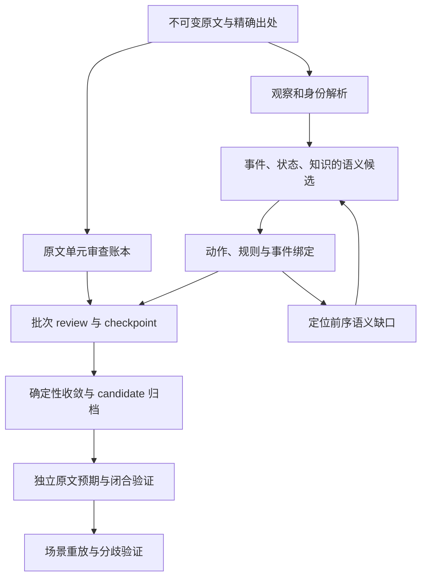

# 《龙族 I》本地世界编译停顿与解析质量深度审计

**日期：2026-09-08。读者：Novel World Harness 的产品、架构与编译器维护者。**

**本地证据快照：2026-09-08 14:32:27 UTC；源码 HEAD：`e00eb9d`；pipeline 34 / prompt 31。**

本报告回答三个问题：当前到底停在哪里；最近几次修复如何改变了现场；为什么流程逐渐可以恢复，却仍没有充分证明“小说已经变成可执行世界”。本报告审计本地 `issues.md` 所指的暂停项，不把它当作 GitHub 全部远端 issues 的审查。交付的是分析与后续验收建议；本次没有恢复模型编译、裁定持久化 obligation、修改既有检查点或发布世界。

## 1. 核心判断

**当前是一个“保住了失败现场、仍未闭合恢复协议、并暴露出语义验收缺口”的编译实例。** 当前硬阻塞是 batch 53 的 `acct-00007-p07` 持久化失败义务；更影响产品目标的问题，是原文观察、事件释义、动作机制、状态效果、角色知识和完成状态之间还没有形成完整的相互校验与返修路径。

这里必须更新过去的判断：9 月 8 日上午报告里的“没有 action-schema / event-execution”已经不适用于最新现场。当前 pending 中已有 **2 个 action-schema、2 个 event-execution、1 个 norm-template**；但两个射击绑定及其所引用的事件都是零状态效果，局部执行绑定验证仍然可以通过。这两项绑定通过了现有局部结构校验，原文结果忠实度尚未得到证明。[当前证据快照][snapshot]、[旧运行分析][analysis-old]、[射击模板][rifle-schema]。

| 要回答的状态 | 当前结论 | 实际依据与边界 |
| --- | --- | --- |
| 全书必需批次完成了吗 | **没有：52/71** | observation 23/23，semantic 23/23，executable 6/23，boundary 0/2；还剩 19 批 |
| 当前暂停在哪里 | **executable batch 53，segment 00007，原文 1066–1252 行** | 最后成功检查点是 batch 51，时间 13:47:16.178 UTC；batch 52 已在此前单独恢复，所以完成集合不是简单按最新运行顺序累计 |
| 候选世界归档了吗 | **未见本轮 candidate revision，无可报告 hash** | 当前 world/v3 只有 evidence、proposals、compiler；默认 prepared 缓存中此 source 的目录不存在；最新运行在归档前失败 |
| 候选闭合检查通过了吗 | **未取得可评估候选，不能报告通过** | 部分工具和局部验证成功不构成 candidate closure receipt |
| 当前世界提案状态 | **403 pending / 0 accepted / 96 rejected** | 这是 world proposal store；与已 accepted 的 annotations、accounting 是不同存储，不能混算 |
| 暂停是否保留了恢复依据 | **是，当前有 1 个 failed obligation** | 19 页当前批 accounting 草案、373 条 decisions、相关 world drafts 与失败审计均保留 |
| 是否仍是 stale lock | **不是当前阻塞** | `compiler.lock` 不存在；最新 manifest 在 14:00:25.425 UTC 记为 failed |
| 全体主要人物可玩认证 | **本轮未完成，也不是原守护任务的交付范围** | 原任务要求“批次、candidate、candidate closure”分别交付，并明确不扩展全体角色长程 Play 认证 |

上述计数来自同一 workspace/source 的文件快照，不是模型自述。没有在本次任务里重新检查原宿主 PID namespace，因此“manifest 已结束、锁不存在”不被扩写成“整个宿主绝无其他 writer”。[检查点][checkpoints]、[最新运行 manifest][manifest-latest]、[原守护任务][guardian]、[归档入口][rebuild-code]。

建议的工作重心是：**先完成失败生命周期的确定性闭合，再以有独立原文预期的短场景证明真实状态、知识与反事实结果，最后恢复全书扩展。** 单纯让剩余 19 批跑完，不能消除下文已经证实的语义缺口。

## 2. 审计方法与时间口径

本次阅读了仓库指导、ADR、运行问题清单、三份既有诊断/修复报告、10,072 行 rebuild 日志中的阶段和异常上下文、6 份 9 月 8 日运行 manifest、最新运行全部 764 条结构化事件，并对关键工具调用读取了对应 content-addressed blob。随后核对当前 proposals、accounting、检查点、obligations、不可变原文和关键源码，执行两个纯内存验证探针。外部研究选择 10 篇论文或预印本及 2 份一手工程报告，优先原始论文、ACL/PMLR/NeurIPS、作者机构与官方工程资料。

证据分为四级：

- **直接事实**：文件字段、原文精确内容、审计事件、检查点和当前代码逻辑。
- **已复现的局部行为**：仅用 pending catalog 调用纯验证函数；不代表完整编译或 runtime 已执行。
- **历史记录所述事实**：例如 8 月旧实例、9 月 7 日缺少完整工具结果的故障；明确说明未再次验证原始现场。
- **设计推断或待检验假设**：例如大上下文可能增加错误、某种调度方式可能提高效率；不当作本地因果事实。

**全文时间统一 UTC。** 9 月美国东部时间 EDT 为 UTC−4，北京时间为 UTC+8。Git 中混有 `-04:00` 与 `+08:00`，不能直接按显示时钟比较。运行时间优先用 `observedAt`、`createdAt`、`reviewedAt` 和 manifest；mtime 只证明文件修改时间，不替代事件发生时间。

还有一个版本追踪限制：历史 `status.md` 把 09:28 启动与 `44669a8` 放在同一段，而该 commit 的 author/committer 时间是当天 **15:04:39 UTC**。它可以关联后续恢复，不足以证明 09:28 时已经运行该提交。类似地，batch 52 修复验证发生在 07:17–07:41，`fb76c04` 到 09:08 才提交；前者应描述为“后来归入该提交的修复工作树”。本报告不会把提交时间与实际使用未提交代码的时间混同。[历史状态记录][status-old]、[Git 时间快照][snapshot]。

原文文件与不可变副本均为 **798,095 bytes**，本次重新计算的 SHA-256 都是：

```text
a28585b1cf867f3e3a1679a09558658338637efd2f0bf15e8d5878b7f9e44fe0
```

source ID 为 `a28585b1cf867f3e3a16`。下面所有本地分析都限定于这份原文和 workspace `novel-world-harness-96fd81aa9a7d`。[原文登记与校验结果][snapshot]。

## 3. 完整时间线：架构背景、运行、修复与再次暂停

### 3.1 先前背景与本轮实例的边界

| UTC 时间 | 事件与上下文 | 对当前分析的意义 |
| --- | --- | --- |
| 2026-08-11，日级记录 | ADR 0001 接受“分支真值为 committed history、state 为 projection、future 为 possibility”的决定 | 验收对象从一开始就是可重放、可分歧的世界系统；提取覆盖不是最终目标 [ADR][adr] |
| 2026-08-27 至 08-28，历史事故报告 | 旧《龙族》实例发生图候选相互污染、finish 未预演实际 commit、缺失工具结果、归因与拒绝诊断问题；修复后仍非 publication-ready | “局部结构修复成功但世界语义不完整”已有先例；本次只读该报告，旧实例数字不与新实例直接比较 [旧事故报告][incident-old] |
| 2026-09-06 04:44:23 | PR #3 合入，涉及 staged rebuild、执行场景契约、角色规则上下文和认证边界等 | 当前版本已具备多项正确的安全边界；问题不能被概括为“没有验证器” [Git 快照][snapshot] |
| 2026-09-07 06:48:12 | `3cf6287` 修复 compiler recovery/reconciliation 的失败边界 | 是本轮开始前可见的代码历史；不据此猜测启动时工作树完全相同 |
| 本轮启动前，具体清理时间未知 | 原守护 prompt 说明旧产物、缓存、分支、会话与中间文件已经清理；保留原文、不可变源和源码 | 这是新实例的重建。旧事件数 139 与当前 75 的差异不能直接解释为数据丢失或质量下降 [原任务背景][guardian] |

### 3.2 9 月 7 日：全书观察与语义阶段，随后 executable 中断

| UTC 时间 | 阶段 / 现场 | 结果与上下文关联 |
| --- | --- | --- |
| 09:28:53 | 守护任务启动时间，来自 status 历史记录 | 该时间不是每个子命令的启动时间 |
| 09:29:34.048 | 原文正式登记；ingest 退出 0 | 23 个 evidence segments；初始计划日志为 69 批，即 23×3 [source][source-record]、[初始日志][rebuild-log] |
| 09:31:06–11:04:33 | observation 首尾样本工件时间范围；批次 1–3 出现受控 withdraw/replace | observation 23/23 最终 checkpoint；区间来自产物创建时间，不能冒充精确的阶段开始/结束时钟 [快照方法][snapshot]、[问题清单][issues] |
| 10:34:30.302；10:46:21.764 | observation 分别请求 00016↔00017、00018↔00019 的边界校准 | 总计划后来从 69 变成 71；新增 2 个 boundary 任务，不是计数错误 [边界请求][boundaries] |
| 11:05 以后 | semantic 开始；batch 31/32 出现 WebSocket 1006；34、45 有图/引用/提案失败 | 传输错误重试后恢复；34、45 在 bounded recovery 后 checkpoint。旧完整 tool result 缺失，不能逐条确定其底层原因 [首次追因][analysis-block] |
| 11:35:43.606 | semantic 生成 `event-accept-00005-v2`；入学接受事件有 plan 效果，路明非 participation 为 experiencer | 这个早期角色标注会在次日 executable binding 成为直接依赖阻塞 [入学事件][accept-event]、[参与关系][accept-part] |
| 11:57:26.835–.845 | semantic 生成射击恺撒、射击楚子航、医疗揭示事件 v2 | 三个事件保存了叙事释义，但 `observedOutcome.operations=[]`；次日无效果模板恰好与它们“匹配” [射击事件][shoot-caesar]、[医疗揭示][medical-event] |
| 12:47 前后；精确失败时刻未保留 | batch 35 因 `铜罐` 缺少 exact resolved mention 停止；`rebuild.exit` mtime 为 12:47:50 | 这是较早命令的退出记录；不能用它解释后来的 batch 52 进程消失 [日志 6708][log-35] |
| 15:04:39 | `44669a8` 加入 unresolved canonical mention 的恢复指引 | 修正方法要求找回精确 `铜罐`，不能把 `黄铜罐` 当成同一精确名称 trace |
| 15:26:09.200 启动恢复；约 15:29 状态记录 | 新持有者 PID 346496 恢复 batch 35，提交 `pr-copper-urn-exact-00012` 后 finish 通过 | 保留原草案、有效身份链和 rejected 历史；这是有实际证据修正的恢复 [batch 35 记录][issues] |
| 17:28:52.093 | pipeline 33 最后成功 checkpoint：batch 51 | 当时有效数 51/71＝23 observation＋23 semantic＋5 executable [旧现场报告][analysis-block] |
| 17:34:09.933 | batch 52 的 accounting p12 最后落盘；之后日志无正常结束 | 12 页、240 个 unit decisions 被保留；没有证据确定最初退出信号或原因 |
| 随后，精确尝试时刻未知 | 后续 rebuild 被 stale compiler lock 拒绝 | 当时安全恢复入口缺失。日志能证明拒绝发生，不能证明 OOM、SIGKILL、网络故障导致最初退出 [日志 9643][log-lock] |

### 3.3 9 月 8 日：修复工作树、契约迁移、batch 50 与 batch 53

| UTC 时间 | 行为 / 版本 | 可审计结果 |
| --- | --- | --- |
| 07:17:16.296 | 新宿主锁恢复协议归档遗留 compiler lock | 恢复记录保存旧 owner 与宿主校验；本报告只核验归档记录，不重新执行解锁 [锁恢复记录][lock-recovery] |
| 07:17:47.889–07:20:15.904 | batch 51 诊断运行；后来归入 `fb76c04` 的工作树 | 捕获 10 次 event-execution 失败，暴露 envelope 结构与 ad-hoc JSON Schema/运行时不一致；该轮曾以 accounting-only 取得检查点，随后通过宿主 API 撤销单批完成标记 [修复报告][fix-block] |
| 07:24:10.304–07:34:10.314 | batch 52 接续 p01–p31；10 分钟超时取消 | 旧 SOP 把 no-artifacts 冲突错误引向撤回页，模型撤回 p01–p12；保留 rejected 历史，无本批 checkpoint |
| 07:40:52.633–.651 | 宿主用 typed API 重提 12 页 | 新 ID 带 restoredFrom，decisions 与旧 rejected 页一致；未抹掉原失败 |
| 07:41:07.811–07:41:43.437 | batch 52 最终恢复；checkpoint 07:41:42.630 | 31 页 accepted；638 个单元＝46 represented＋592 分类投影；新机制 world proposal 为 0 |
| 迁移完成后 | pipeline 33→34；prompt 30 | observation/semantic 保留；旧 executable 需重新审查，因此有效计数由旧 51 改为新 47＝46＋此前恢复的 batch 52。并非倒退删除了四批原文证据 [修复边界][fix-block] |
| 09:08:15 | `fb76c04` 提交 | 覆盖锁恢复、精确覆盖继承、schema 一致性、finish 和审计改动；提交时间晚于上述工作树验证 |
| 10:20:29.477–10:24:25.993 | `run-mtsiqp45…`，`fb76c04` | 47/48/49 新 checkpoint，batch 50 因 action-schema 引句失败停住；有效数 50，不是连续到 50 [旧 run manifest][manifest-50] |
| 13:30:25.273–.274 | 将旧 schema 失败导入新 obligation journal，并作 unsupported-as-submitted 宿主复核 | 只闭合这份跨 scope 无效输入，不代表远程交流机制不存在，也未生成新 binding [失败义务导入][obligation-50] |
| 13:32:53 | `e00eb9d` 提交；prompt 31，pipeline 34 | 失败持久化、finish 前检查、新会话 hydrate、多 selector 诊断等已实施；报告记录 947 项测试通过，不是本次重新跑的测试 [修复结果][fix-obligation] |
| 13:41:47.573–14:00:25.425 | `run-mtspxkmt…`，最新运行 | batch 50、51 checkpoint；跳过已完成的 52；53 失败。最终 52/71，403 pending / 96 rejected [最新 run][manifest-latest] |
| 14:32:27，本报告快照 | 只读复核当前存储，关联原始审计和源码 | 既有 issues/status/日志保持原样；新增独立报告与证据快照 |

历史测试结果、撤销检查点和恢复副本的正确性，在这里以相应修复报告及可见工件为证；本次没有重演这些写操作。

## 4. 当前 issues 应如何重新归类

原 `issues.md` 把多个时期的条目保留下来，这对追因有价值，但不能将所有“block”标题都理解为今天仍未解决。

| 问题 | 原因层 | 当前状态 | 下一步应保留的判断 |
| --- | --- | --- | --- |
| batch 35 `铜罐` trace | 身份与证据 | 已恢复，检查点保留 | 精确匹配保护应保留；不能用宽松子串覆盖身份缺口 |
| batch 52 stale lock | 宿主故障恢复 | 已归档恢复，当前无锁 | 原进程消失原因仍未知；锁机制已修，不等于退出原因已查明 |
| 跨阶段覆盖未继承 | accounting 投影 | pipeline 34 已补齐相同 scope 的前序精确覆盖 | 解决重复分类问题，不赋予观察标注执行语义 |
| ad-hoc 分支出现在模型 schema，却被运行时拒绝 | 工具接口契约 | 已修正为结构化 schema-bound | 不宜再把最新 batch 53 归因于这项旧缺陷 |
| no-artifacts SOP 导致撤回 12 页 | 错误恢复协议 | 已修并恢复新副本；历史保留 | 正确错误信息本身属于可靠性功能 |
| batch 50 refs 与 selectors | 不透明引用、证据范围 | ref 指引和全量 selector 诊断已改；旧 proposal 已审计闭合；最新 batch 50 已 checkpoint | “过期 ref”已被复核为模型拼错命名空间；旧状态文件仍说未 checkpoint，已过时 |
| proposal 失败只存在会话中 | 持久化与完成门禁 | e00eb9d 已修主要直接缺口 | 新 blocker 恰好证明失败跨会话保留生效；仍需补 coverage 改变/替代工作等终态 |
| batch 53 p07 | 动态覆盖与 proposal identity | **当前硬阻塞** | 新页成功不会自动解释旧 ID 的失败；必须有具依据的生命周期闭合 |
| 已要求 host review，却仍进入新 recovery turn | 宿主调度 | **本次新增确认的协议缺口** | 非重试状态应成为宿主控制状态，不能只留在返回文本里 |
| 入学绑定被撤回、射击零效果、规则无时效 | 世界语义与验收 | **当前 pending 质量缺口** | 不应为解除 p07 而忽略；修复 p07 本身不会补齐它们 |

依据：[原清单][issues]、[两次修复报告][fix-block]、[新 obligation 修复][fix-obligation]、[本次直接证据快照][snapshot]。

## 5. batch 53 的完整因果链：源单元待分类数已清零，旧失败身份仍未闭合

### 5.1 从原始调用还原，而不是从最终错误倒推

以下序号均属于最新 `run-mtspxkmt-b07940f0-e82c-4592-b24e-9172c0fc67ea`。

| UTC 时间 / seq | 实际操作 | 状态如何变化 |
| --- | --- | --- |
| 13:47:17.357 / 206 | batch 53 开始 | scope 00007，1066–1252 行，先前语义事件已存在 |
| 13:48:20–13:49:25 | 生成并替换枪械模板，提交两个射击绑定 | 创建 pending executable 工件，未完成 batch |
| 13:51:46.308 / 395 | discovery 返回旧页 `acctpg-d822695e76f3f23a` | 该时刻 unresolved 总数 254；当前页 20 个单元，第 20 个是原文 1142 行的自由一日规则句 |
| 13:52:09.116–.143 / 403–404 | 提交 `prop-norm-freedom-day-00007` | 规则精确 evidence assertion 覆盖上述单元；该句变为 host-derived represented |
| 13:52:20.173–.952 / 412–413 | 用旧 page token 提交 `acct-00007-p07` | 宿主重读实时覆盖，拒绝为已 represented 的单元再赋 model disposition；p07 没有成为有效 accounting 草案，但失败被 journal 保存 |
| 13:52:32.821 / 422 | 按同 scope 重新 discovery | unresolved 变为 253，旧页 19 个单元仍在新页；被覆盖的 1 个移出，下一单元补入 |
| 13:52:46.092–47.262 / 430–431 | 用新页创建 `acct-00007-p07b` | 新 ID 成功记录 20 个 decisions；旧 ID p07 的失败仍未解决 |
| 13:58:12.104 / 656 | 所有后续页处理完 | discovery 返回 unresolved=0；当前批有 19 个 pending 页、373 个 decisions |
| 13:58:26.773 / 665 | finish | 由于旧 p07 obligation 仍 failed，finish 在持久化 acceptance/review 前拒绝 |
| 13:58:45.626 / 674 | 模型尝试 p07 + `decisions: []` | 参数预检拒绝，构成同 identity 第二个不同失败输入 |
| 13:59:05.779 / 683 | 再次调用 p07 | 返回 host-repair-required、retryable=false；跨新 session 也不可重试 |
| 13:59:16.229 / 700 | 外层仍启动一次新的 bounded recovery | 这是宿主调度决定，不是模型自己重启整个 rebuild |
| 14:00:12.957 / 753 | 新回合再次尝试 p07 | 持久化门禁继续拒绝；14:00:25.425 整轮 failed，无 batch 53 checkpoint |

直接定位：[旧页 discovery][audit-395]、[新规则与首次失败][audit-403]、[新页和 p07b][audit-422]、[unresolved 清零][audit-656]、[finish 与空输入失败][audit-665]、[新 recovery][audit-700]、[持久化 p07 journal][obligation-53]。

这条链排除了几个误读：

1. **不是原文缺失。** 原句可读，工具返回的是覆盖变化冲突。
2. **不是一个随机旧 pageToken。** 它确实由本回合同 batch 的 discovery 发出，后来因新语义覆盖失去适用性。
3. **不是剩余源单元尚未分类。** seq 656 为 0，剩下的是操作义务。
4. **不是空数组才造成全部问题。** 空数组是模型试图补救遗留 identity 的第二步失败；更早已经发生旧页失效和新 ID 无法消解旧 ID。
5. **不是保护被绕过。** 失败义务阻止了 finish 和新 session 的重试，所有 drafts 保留；它在安全性上发挥了作用。

### 5.2 这里同时有模型执行错误与宿主协议缺口

现有工具指引已经明确要求：新 semantic proposal 改变 represented coverage 后，重新获取 accounting 页。模型在规则提交后使用旧页，违反了这项规则。不能写成“宿主完全没告诉它要 refetch”。[工具指引][account-find-code]。

但首次错误被包装成泛化的 `unexpected-failure`，只要求使用可用 discovery、具体修正后重试，**没有在这个最容易出错的位置明确要求保留 `proposal_id=acct-00007-p07`**。它也没有返回“这页哪些单元已被哪项新证据覆盖、哪些仍待处理”的结构化差分。模型虽然正确刷新了页，却创建 p07b，将“页面序号”“一次尝试”和“需要闭合的操作身份”混在一起。[原始错误][audit-413]、[页处理实现][account-submit-code]。

当前 journal 的终态主要是 succeeded/unsupported；在模型侧修正路径中，同一个 tool/proposal_id 的成功才解决原失败。宿主已经有 `reviewUnsupported`，可附 reason/auditRef 作保留历史的人工裁定；缺少的是合法后继替代的专用证明与调度，不能无差别地用 unsupported 清零。本次未执行任何宿主裁定。这个约束修复了 batch 50 的“无关成功洗掉失败”，但**业务工作被合法新证据和关联新页共同取代**时，现有模型工具没有直接表达这种闭合的方式。p07b 已经覆盖原页剩余 19 个单元，不能为了满足旧 ID 再给它们重复分类；对 represented 的 1 个单元也不能制造新 disposition。[obligation 实现][obligations-code]、[页集合差分][snapshot]。

合适的设计方向是由宿主核验一种有依赖依据的终态，例如“由 coverage revision 与后继提案共同消解”。这里的名称是建议，不是已实现功能。证明应精确覆盖旧请求的全部单元：1 个由当前有效 norm assertion 覆盖，19 个由 p07b 的有效 decisions 覆盖，并验证同一 source/batch、无丢失、无相互矛盾。coverage 或后继提案后来被撤回，相关证明就必须重新评估。不能把这种操作义务闭合偷换成“对应世界机制完整”。

### 5.3 retryable=false 没有成为宿主的终止依据

`CompilerProposalObligations.assertRetryAllowed` 已经明确禁止再次重试；但是 `isRecoverableCompilerBatchInterruption` 的分支只要看到“模型 stop、未完成 finish、仍有成功提案”，就可能认为存在可恢复中断。[obligation 门禁][obligations-code]、[恢复分类函数][recovery-code]。

最新审计正好实例化了这两种逻辑的冲突：seq 683 已返回 host-repair-required；seq 700 仍启动 recovery；seq 753 再被同一保护拒绝。持久化门禁保住了数据，但外层浪费了 5 次 LLM 请求和 12 次工具调用，也给模型“还能继续尝试”的错误控制信号。[恢复调用证据][audit-700]、[按回合统计][snapshot]。

修复目标应是让 `requiresHostReview / exhausted / interruptedRunning / scopeMismatch` 等状态结构化地进入 batch outcome，优先于一般“有 drafts 就可恢复”的分支。单纯把错误文字写得更严厉，不足以约束宿主重新调度。

## 6. 从当前实例看，语义问题比“跑通”更重要

### 6.1 当前全书语义产物的诊断画像

这些数字描述 14:32 快照中的 **pending canonical-event payloads**，不是最终已接受世界，也不是人工标注的准确率。

| 字段级指标 | 结果 | 能证明什么；不能证明什么 |
| --- | --- | --- |
| canonical events | 75 | 有 75 个事件候选；不证明小说所有关键事件都被覆盖 |
| `observedOutcome.operations` 为空 | 62/75，82.7% | 大部分事件在该字段没有状态转移；不表示每个事件都应有非空物理效果 |
| `preconditions` 为空 | 75/75 | 这些事件自身未声明前提；场景、时间或其他约束可能另外存在，不能说系统所有约束都为空 |
| 有非空 `observedKnowledge.operations` | 0/75 | 事件层知识获取通道没有填入操作；不等于 propositions/claims/attributions 也全为空 |
| `causalParents` 为空 | 57/75，76.0% | 直接父事件关系较稀疏；还需同时审查 19 个 event-relation 候选，不能只据这一字段判断整张图断裂 |
| 有 `timeAdvance` | 0/75 | 该通道没有时长效果；storyTime 标签仍存在，不应混同“没有任何时间表示” |
| 当前 executable 草案 | 2 schema、2 binding、1 norm | 已有产出；仅数量不能判定机制质量 |

本次使用纯内存脚本直接汇总上述字段，并调用现有验证函数；结果记录于 [evidence-snapshot 的 memoryProbes][snapshot]。这组数字不宜直接变成“强制每个事件非空”的优化指标，否则会逼模型伪造效果。它应触发按原文结果重要性抽样的独立审查。

### 6.2 案例 A：入学选择——语义角色错误变成 executable 阶段无法直接修复的依赖

**时间关系：** 9 月 7 日 11:35:43 生成事件及参与关系；9 月 8 日 13:46:48 的 executable finish 报 `EVENT_EXECUTION_AGENCY_UNPROVEN`；随后模型撤回入学 binding，13:47:16 本批仅保留 schema 和 accounting 完成。

原文第 766 行是：`“我……”路明非说，“想好了，我接受。”`。当前事件释义与 plan delta 都把接受选择归于路明非，但 typed participation 把他标成 **experiencer**，诺诺标成 agent。模型申请以路明非为 initiator 执行入学选择时，验证器要求该事件有对应 typed agent participation，因此拒绝。[原文 766][source-766]、[入学事件][accept-event]、[参与关系][accept-part]、[失败审计][audit-185]。

这次拒绝是合理的；它揭露的是**前一阶段内部语义不一致**。值得批评的不是 gate 严格，而是当前 executable 回合不能提交 `propose_event_participation`，并且该回合最终没有调度一个具有明确证据范围的语义返修任务。以撤回 binding 结束本批，保住了完整性，却留下了能力缺口。[阶段权限][stage-code]、[binding 校验][execution-code]。

此外，该轮先后提交的引句 `我想好了，我接受。` 及加外层引号的版本，都不是原文中的连续子串。原句被省略号和叙述插入语打断；给“意思一样”的句子补引号仍不是精确证据。这和 batch 50 的 `诺诺上线`/`“诺诺”上线`、跨 segment 引句错误属于同一家族：**释义可以合理，证据指针仍然不合法**。[引句失败][audit-95]、[旧 selector 分析][analysis-old]。

建议：把这个失败转交为“事件—参与角色一致性”的宿主受限返修，再重新验证 binding。不要为了通过 gate 把诺诺强行改成决策动作的 initiator，也不要要求 executable 工具直接改写已经 checkpoint 的语义事件。

### 6.3 案例 B：自由一日射击——空事件与空机制可以相互验证

**时间关系：** 9 月 7 日 11:57:26 建立三个事件 v2；9 月 8 日 13:48:44 建立 rifle schema v2；13:49:25 建立两个 binding；本次 14:27:56 做纯内存验证。

两个事件释义明确记录了击倒恺撒、子弹击中楚子航；医疗揭示事件说明了弗里嘉子弹和非致命后果。但三者的 observedOutcome 都是空数组，医疗揭示也没有 observedKnowledge。[恺撒事件][shoot-caesar]、[楚子航事件][shoot-chu]、[医疗揭示][medical-event]。

新 `schema-rifle-fire-00007` 又规定：

- `preconditions=[]`、`stateEffects=[]`；
- `maxStateOperations=0`，所有 state fields、knowledge、time、scene 效果关闭；
- weapon role 可选，实际两个 binding 只绑定 initiator 与 target。

这些是 pending 工件的实值，不是推测。[rifle schema][rifle-schema]、[两个绑定][binding-caesar]。

本次把这些当前 catalog 输入 `validateEventExecutions`，得到 **0 issues**。函数实际比较 schema effect envelope 与 event.observedOutcome；当两边都为空时，这一比较自然可以通过。这个探针没有执行 finish、创建 candidate、构造初始世界或跑场景重放，因而也没有证明完整闭合检查会放行。[验证函数][execution-code]、[效果检查][action-code]、[探针结果][snapshot]。

产品层面的缺口是：如果先前事件没表达原文发生的后果，后续验证只能证明“后来模板与遗漏后的事件相容”。物理事件是否需要机制的部分场景检查还从 `observedOutcome` 的非空物理字段判断，进一步说明不能让同一组生成字段同时定义“应检查什么”和“正确答案是什么”。独立的 scene entry/exit 与其他 gate 可能继续拦住候选；本报告没有越过这些 gate。[场景检查代码][scene-contract-code]。

这一段原文尤其适合作为高质量验收切片：第 1115/1128 行呈现看似严重枪伤，第 1142–1145 行通过解释与演示补充非致命机制。编译器需要把**表面观察、后续解释、来源归因、实际状态和路明非何时知道真相**区分开。不能立即把“洞穿”写成死亡，也不能因为效果难表达就写成什么都没发生。[原文射击][source-1115]、[原文机制揭示][source-1142]。

若现有状态字段不能充分表达昏迷、恢复或所需机制，应记录具体表示缺口，先审查已有宿主机制是否可复用；不能虚构原著规则，也不能让渲染层补写世界效果。

### 6.4 案例 C：自由一日规则——精确证据存在，适用范围仍被抹掉

**时间关系：** 9 月 8 日 13:52:09，规范提案成功入 pending；它随即改变 source accounting 覆盖，并引出 p07 的失效。

原文第 1142 行把规则限定为“今天”“学院”“学生”“不会受到校规处罚”。当前 `norm-freedom-day-00007` 却是 `actionPattern:any`、`appliesWhen:[]`、`exceptions:[]`、`visibility:public`、`status:supported`。它记录了 authorityEntityId，但没有把活动、成员身份或时间适用范围写入 predicates。[规范提案][freedom-norm]、[原文 1142][source-1142]。

纯内存调用 `resolveEffectiveNormTemplates([norm], {}, 'char-lumingfei')`，该模板仍出现在 effective 结果里；原因是空 `appliesWhen` 的 every 判断为真。**这证明当前模板的适用条件没有随原文限制收窄**。[norm 解析函数][norm-code]、[探针][snapshot]。

边界也要说清楚：pending template 尚未提交；template 本身不等于已实例化的 branch norm，也没有在本次审计中真的豁免任何处罚。问题是晋升前必须补齐的语义约束，不是已发生的 runtime 权限绕过。

自由一日的“日”也提醒了一个重要建模区别：**编译日志时间、文本叙述位置、世界内故事时间**是三套不同坐标。原文“今天”必须绑定场景的 story-time 条件或激活/失效事件，不能绑定到系统当前日期、chapter index 或长期全局开关。

### 6.5 source accounting 的 represented，只证明锚点相交

旧实现不继承前序精确覆盖，导致 executable 重新分类大量已读句子；pipeline 34 的修复是必要的。但当前 `find_source_accounting_units` 判断 represented 的核心仍是：source 一致，且句子 byte range 与某个 assertion/annotation anchor **存在 overlap**。[覆盖查询逻辑][account-find-code]。

这不是“句中所有事实已经正确解析”的证明，更不是“动作效果、知识变更、因果条件均已执行化”的证明。一句话里只标到一个角色 mention，也可能满足这种覆盖语义。这里指出的是实现保证的边界，不声称当前全部 represented 单元都错。

本次 accounting manifest 有 2,216 条 records：1,406 duplicate-description、578 background-only、229 represented、3 paratext；它是目前六个 executable reviews 的物化记录，**不是全书 10,957 个 base units 的最终语义完成度**。batch 53 的 373 条 pending decisions 也不能再加到这个 accepted review 数上冒充全书进度。[当前账本][accounting-manifest]、[结构与计数][snapshot]。

报告应分别显示“原文有定位/已被审阅”“事实已建模”“状态或知识效果已验证”“机制已绑定”“无法表达/等待跨域返修”。把这些维度压成一个 represented 标签，会产生错误的成功激励。

## 7. 外部研究能支持什么，不能支持什么

以下结论均来自一手来源；右侧的项目启示属于本报告对本地证据的迁移判断。研究中使用“world model”一词，并不意味着它与本仓库的可执行分支世界具有同一验收范围。

| 研究或报告 | 原始研究支持的结论 | 对本次问题的启示与限制 |
| --- | --- | --- |
| Riedl & Young，2010，JAIR：[叙事规划][paper-ipo] | 叙事因果连贯与角色意图可信是不同要求；IPOCL 同时处理因果及动机依赖 | 事件排序、动作合法、人物为何这样做要分别验证。该工作给定 domain theory 与作者目标，不证明能从小说自动归纳世界，更不能把作者终局强制装进分支调度器 |
| Kočiský 等，2018，TACL：[NarrativeQA][paper-qa] | 根据剧情摘要构造叙事问答，分别测摘要/全文作答；找到相关材料与利用材料是不同难点 | QA、检索、摘要质量有价值，但不能代替 event/state 或反事实验收；摘要来源的问题本身不覆盖原文全部事实 |
| Sims、Park、Bamman，2019，ACL：[文学事件检测][paper-event] | 按事实性标准标注实际发生事件，排除否定、愿望、假设等；主要任务是词级事件触发检测 | 原文动词不能直接成为 committed event；希望、相信、假设须进入不同语义通道。数据来自 100 部英语作品开头样本，任务不提供完整执行效果 |
| Bamman、Lewke、Mansoor，2020，LREC：[文学共指][paper-coref] | 共指标注可以利用后文揭示，从全文“文本现实”判断身份，而不是模拟当前读者知识 | 全文 identity registry 与某时刻角色知识必须分离。其 100 部作品是篇段样本，并非全书正确共指的保证 |
| Guan 等，2023，NeurIPS：[动作世界模型构建][paper-world] | 区分 VAL 语法检查与事实纠错；实验中 59 个 GPT-4 错误仅 3 个是语法错误，其余涉及前提/效果等事实问题 | 直接支持“schema 通过不足以保证世界模型正确”。实验是三个有限动作域和 2023 年模型，允许专家/常识纠错，不能作为本项目错误率或无证据补全许可 |
| Kambhampati 等，2024，ICML：[LLM-Modulo][paper-modulo] | hard critics 与 soft critics 各有职责；正确性保证来自检查器实际检查的性质，候选生成仍影响完备性 | 保留 proposal→validate→commit 边界，同时独立检查原文忠实度与能力覆盖。这是立场框架，不能把标题泛化成所有当前模型永远不能规划 |
| Liu 等，2024，TACL：[Lost in the Middle][paper-middle] | 改变证据位置和上下文长度会改变受测模型表现，容纳输入不等于稳定利用输入 | 本地巨大工具 schema 是实验变量；该论文不能证明本次引句或 ID 错误就是上下文过长造成的 |
| Zhou 等，2025，ACL：[CHARToM-QA][paper-chartom] | 1,035 道小说角色心智题考查 belief、intention、emotion、desire；人工研究表明熟悉作品与解释表现有关 | 应保存角色经历与心理判断证据；该基准不是严格逐时刻知识泄漏测试，不能直接认证角色隔离 |
| Hamilton 等，2026，LaTeCH-CLfL：[TLDM][paper-tldm] | 拆测摘要、角色最后位置、故事经过时间；受测模型的整书输出与短上下文输出稳定性不同 | 适合设计状态/时间/摘要分别测的验收。没有人工全书 ground truth，只有英语和 2025 年受测模型；64k 不是本项目的普适硬阈值 |
| Saifullah 等，2026-07，预印本：[Narrative World Model][paper-nwm] | 提出带出处、时间和叙事分解的小说记忆；实验侧重证据问答 | 可借鉴按问题组织证据、分开事件发生与揭示。作者承认未隔离叙事专用分解与一般细粒度分解，去掉类型标签不降准确率，生成评测仍待做；不能视为反事实 runtime 已获验证 |
| Featonby，AWS Builders’ Library，2021 上新：[幂等 API][report-aws] | 唯一请求标识、实际副作用与回执要关联；响应丢失不代表操作未发生 | 直接启发 attempt、proposal、review、checkpoint 的可恢复衔接。不是要求使用云或外部数据库，更不支持对 scope/schema 失败无限重试 |
| Young，Anthropic Engineering，2025-11-26：[长任务 harness][report-harness] | 工程实验发现跨窗口交接、部分完成后误报结束、只做局部测试等问题；用持久清单与真实验收改进 | status 应从真实状态生成，能力通过应附运行证据。这是 Web 开发经验，不能证明某模型、多代理或某框架天然适合小说编译 |

这些来源共同支持一种分层判断：**文本理解产物、显式世界表示、对表示的形式检查、对原文的忠实性、实际运行能力，是不同证明责任。** 本地两个零效果射击 binding 的通过，说明“此次局部结构一致性检查通过”与“原文效果表达不足”可以同时成立；本次没有证明验证器对所有输入的整体健全性。这里的具体结论来自本地探针，论文提供的是方法论依据。

从世界观解析角度，还要承认一个信息边界：有限小说轨迹可能与多种转移机制相容，而它们在原文未出现的行动上给出不同结果。原文完整读完，并不逻辑上唯一决定所有反事实。这是本报告的建模推论。因此合理目标是一个带证据与适用边界的**部分可执行世界**：哪些规则明确支持，哪些是待裁定的可能性，哪些需要通用宿主机制，哪些超出当前证据，都应可查；不能把未知偷偷补成 canon 真值。

## 8. 整体根因：四组契约没有完全衔接

### 8.1 安全性在加强，恢复的可达性还不完整

从 8 月 finish 过早成功、9 月 7 日 stale lock、9 月 8 日会话级失败遗忘，到最新 durable obligation，系统逐步封住了实际的错误完成路径。当前停止主要说明保护存在；但恢复状态机还没有完整覆盖“工作已经被新证据/关联提案替代”“需要返修前一阶段”“必须宿主裁定”等情形。

batch 53 暴露的不是应该删除失败记录，而是失败记录还需要**可证明的业务终态**。既防止伪成功，又让合法完成有路可走，必须作为同一协议设计。

### 8.2 阶段分离限制了越权，但缺少明确的返修闭环

当前 observation→semantic→executable 的权限边界符合产品原则；从 executable 随意改过去的事件会破坏 provenance。另一方面，实际机制验证能发现只有到后期才显现的早期错误：例如入学 initiator 与 experiencer 冲突、射击事件没有原文效果。

所以 stage boundary 不能只有禁止写入，还要有**受限返修调度**：定位被诊断的 artifact/revision，收集所需原文，创建相应阶段的任务，保留替代链，重新验证受影响依赖，再继续。已有 repair、closure 与 boundary 能力应优先复用；不能据本次回合没有调度就宣称仓库完全没有任何修复系统。[阶段约束][stage-code]、[现有重建入口][rebuild-code]。

### 8.3 三种“覆盖”被容易混淆的进度语言聚在一起

本地存在 source accounting 清零、finish handshake、checkpoint、pending world 数量、candidate closure 和 Play certification 等多个状态。它们各自有作用，但数值不共享语义：



图中的返修箭头是应完善的受限工作流，不是允许模型直接跨阶段写状态。source accounting 的终态不能代替 M/V/R 的终态。计数界面至少要展示批次审阅、机制绑定、未解义务、语义返修与 candidate 结果，且分别附版本和最后更新时间。

### 8.4 证据作用域、机制归纳作用域与模型工作集不匹配

单个 source-pattern action schema 要求至少两个支持事件，但普通编译任务只持有一个可引用 segment；全书 artifact discovery 又能返回范围更大的语义上下文。这在 batch 50 已表现为“可发现事件属于其他段，而 selector 被强塞进当前段”。[旧失败链][analysis-old]、[归纳 schema][action-induction-code]。

边界校准能处理相邻切片，但一般机制的多个支持 occurrence 可能相距很远。应由宿主提供明确的**跨 occurrence 证据包**，列出可读 context 与合法 citable spans，按支持事件依赖供给资料；不能让模型自行扩大权限，也不能要求它从当前切片“凑够两个例子”。

这不要求引入 embeddings、向量数据库或小说 RAG 聊天层。当前文件、词法索引、稳定 ID、dependency graph 与按需精确读取，就可以服务这种调度。

## 9. 上下文、耗时与成本：只报告实际可审计的数据

### 9.1 9 月 8 日保存的运行

| UTC 区间 | 运行短标识 / 目的 | manifest 结局 | LLM 请求 | 工具调用 | input / output / cacheRead tokens |
| --- | --- | --- | ---: | ---: | --- |
| 07:17:47–07:20:15 | mtsc7r3l / batch 51 诊断 | succeeded，检查点后来撤销 | 6 | 26 | 160,360 / 3,820 / 722,432 |
| 07:24:10–07:34:10 | mtscfy68 / batch 52 中间验证 | cancelled，timeout | 44 | 54 | 212,539 / 5,417 / 7,087,104 |
| 07:40:52 | mtsd1fkp / 恢复 12 页 | succeeded，宿主操作 | 0 | 0 | 0 / 0 / 0 |
| 07:41:07–07:41:43 | mtsd1rab / batch 52 最终验证 | succeeded | 2 | 2 | 150,720 / 200 / 148,992 |
| 10:20:29–10:24:25 | mtsiqp45 / batch 50 停止 | failed | 13 | 22 | 628,449 / 4,428 / 1,442,304 |
| 13:41:47–14:00:25 | mtspxkmt / 最新运行 | failed，batch 53 | 75 | 106 | 705,173 / 15,912 / 11,836,928 |

来源是各 run manifest，完整路径、计数、usage、cost 原值收入 [证据快照][snapshot]。这六份记录合计 140 次 LLM 请求、210 次工具调用、23,124,778 totalTokens；**不包含缺少同等审计的 9 月 7 日初始全量运行**，不能报告为整个项目或本轮从头的总成本。

manifest 的 cost 字段合计为 `0.8319358`，最新运行是 `0.39686756`。这里仅引用已记录数值；这些 manifest 没有独立账单或货币元数据，本报告不把它核验为真实支付费用，不根据它外推全书预算。

### 9.2 最新运行的回合拆分

| 回合 | LLM 请求 | 工具调用 | 工具失败结果 | 单次最大 input+cacheRead |
| --- | ---: | ---: | ---: | ---: |
| batch 50 | 3 | 6 | 0 | 156,879 |
| batch 51 | 16 | 25 | 5 | 156,418 |
| batch 53 初始回合 | 51 | 63 | 4 | 196,108 |
| batch 53 宿主恢复回合 | 5 | 12 | 1 | 154,741 |

该表来自 event span 层级聚合。注意 manifest 的 `counts.retries=0` 与“宿主启动过 recovery”不矛盾：它并未完整表达这类 recovery 的计数。直接审计 seq 700 和日志 10038 就能看到新回合；状态面板应分别统计 provider retry、tool corrected retry、host recovery，而不是把一个 0 解释成没有任何重试。[最新审计][audit-latest]、[分回合统计][snapshot]。

最新第一份 provider request 有 26 个 tools；其 tools 数组以 UTF-8 解码后、`ensure_ascii=False` 且紧凑 JSON 序列化计算为 **310,301 个字符**。第一轮实际 input 为 **150,492 tokens**。这是整个输入包含的大量宿主说明、工具定义和材料，不是当前原文章节本身的 token 数。累计 1,255 万 totalTokens 也不是一次上下文窗口。[请求计量][snapshot]。

大工作集增加了需要模型同时维持的协议和引用负担，是有证据的工程成本；它是否导致某一次引用拼错，尚没有受控实验。文献支持的是应控制长度、材料位置和组织方式进行对照，而不是从一次失败推定模型能力不足。[长上下文实验][paper-middle]、[小说长上下文研究][paper-tldm]。

## 10. 建议的修复与验收顺序

以下为建议，未在本次审计中实施。优先级按“阻止错误完成/恢复”与“证明产品能力”排序，不按增加字段或提高提案数量排序。

### P0：使当前恢复协议具有清晰、可证明的终态

1. **将持久失败状态传给宿主调度器。** 有 requiresHostReview 或 exhausted 时，不启动通用 fresh-session recovery；保留事件和准确 blocker。不能仅以 proposalSucceeded>0 作为可恢复依据。
2. **为 coverage 改变提供专用错误类别与差分。** 返回相同 scope 的 discovery 工具、必须复制的 pageToken、必须保留的 proposal_id，以及已覆盖单元与仍待处理单元；旧页不再走泛化 unexpected-failure。
3. **补操作被合法替代的审计闭合。** 对本例精确核验旧 20 个单元的去向；只在全部有有效 coverage/后继 decision 时结束旧操作义务。保留原失败、关联 proposal IDs、覆盖 revision 与 source hash，不以空数组或无关成功结案。
4. **将状态说明从现场派生。** 当前 status 顶部仍为 50/71、batch 50 未 checkpoint，更新时间早于最新运行。生成状态时绑定 run ID、source hash、pipeline/prompt、completed set、unresolved obligations、candidate hash 与是否执行 closure，保留历史快照。[旧状态][status-old]。

就当前 p07 而言，已经具备审查“1 个新 evidence 覆盖＋19 个后继 decisions”所需的现场，但本次没有作宿主裁定，也不声称现有任意重跑已经安全。先确定语义上正确的终态，再做受限恢复，避免把泛化 unsupported 当成清零工具。

### P1：先用两个真实短场景闭合可执行链

**入学选择切片，约 748–766 行：** 修正事件/参与角色的互相矛盾；以原文精确引句重建 schema→binding；验证接受选择的 plan 变化及所需条件。再构造一个改变选择的分支，检查它不因“原文后来入学”而自动恢复接受。原文未规定的拒绝后果保持待裁定，不编造确定规则。

**自由一日切片，约 1101–1145 行：** 独立标出射击、可观察倒地/失能、后续解释与演示、人物认知变化、规则适用时段。用原文预期检查实际状态和知识投影；将“无弹药/不处于活动/未听到解释”等改变条件的情况作为受限反事实测试。缺少前提证据或状态表示的项目应返回明确的 unknown/unsupported，而不是默认允许或添加无依据 canon。

两者都应以**已有实体、事件与来源的受控新修订**推进，尽量复用宿主动作/时间/状态模块，不从头清空全书，也不把 runtime repair、candidate closure 与全体人物长程认证一次性扩在同一任务里。

### P1：建立独立的可执行能力验收记录

已有 source accounting 可继续承担原文审查，但需要另一个能力视角，按重要 occurrence/scene 记录：

| 验收维度 | 每项需要附带的证据 |
| --- | --- |
| 来源与事实性 | 精确 span、attribution、发生/假设/信念的分类；必要反证 |
| 事件与身份 | stable identity、typed participation、动作 initiator、场景归属 |
| 状态效果 | 独立原文预期、可表达字段、实际 delta 与 replay 后投影 |
| 知识与视角 | acquisition 来源、知道的角色、获得时刻、当前 branch cut |
| 规则与机制 | 适用前提、时间/辖域、例外、效果、支持 occurrence 及反例 |
| 执行与分歧 | canonical replay 结果、改变一个条件后的结果或明确未知 |
| 闭合状态 | reviewed、bound、verified、deferred、unsupported 或 blocked；每种状态有明确定义 |

“无效果事件”可以是合法结果，但应有明确的事件类别与原文审查依据；不能因为模型没有填 effects，就自动推断没有物理或知识结果。对于物理枪击、明确认知揭示、承诺变化这类重要事件，应有来源独立于 schema 的预期检查。

### P2：压缩工具与材料负担，再做模型对比

先把 discovery、机制提案、binding 验证、accounting 分成可控工作步骤；按当前任务只供给必要工具 schema 和依赖索引。需要跨 occurrence 归纳时，由宿主发放受限证据包，而不是给每轮整个全书目录。

设计至少两组对照：同一模型下比较当前工具/上下文与精简工作集；固定精简工作集后再比较模型或推理配置。保持原文、证据范围、gold、schema 与验证标准相同，冻结版本，记录首次提交通过率、修正后通过率、scope 错引率、因果/知识错误、正确闭合率、请求数和 token。不要把 throughput 或提案数作为唯一胜负依据。

### P2：补齐多文件 finish 的可恢复回执

e00eb9d 把 obligation gate 移到 acceptance/review 之前，修复了这次直接门禁问题；但原修复报告也明确没有实现全流程多文件原子提交 journal。[实现边界][fix-obligation]。

建议围绕一次 finish 建立可恢复 receipt：绑定输入/依赖指纹、拟接受工件、review、checkpoint 与终态。中断后从 receipt 和落盘事实判断尚缺的步骤，并以幂等方式继续；不能只凭 accounting accepted 推断整个 batch complete。AWS 的关联请求身份与副作用原则可作参照，但具体仍使用现有本地文件模型和并发锁，无需引入外部数据库。[AWS 工程原则][report-aws]。

## 11. 可直接转成验收任务的测试矩阵

这些是未来修复的验收要求，不是本次已经运行的测试。优先使用此次审计中的真实输入和隔离副本，避免测试只复述实现。

| 用例 | 固定的本地上下文 | 应满足的验收结果 |
| --- | --- | --- |
| 新证据使旧页失效 | seq 395→404→413 | 精确报告覆盖变更；无部分 staging；有一次正确同身份修正或转交路径 |
| 后继页替代旧业务工作 | p07 / p07b，19+1 单元去向 | 仅在完整覆盖证明成立时消解操作义务；无关成功不能消解 |
| coverage 回撤 | 在隔离样本中撤回 norm 或后继页 | 依赖它的消解证明失效/重审，不能永久掩盖未处理单元 |
| 预算耗尽 | p07 两个不同失败输入 | 宿主直接标注 needs-host-review；不新增 LLM recovery 请求 |
| 精确引句被释义改写 | 766 行被拼成连续句；batch 50 跨段引句 | 一次报告全部 selector 问题，保留 scope；不归一化原文来迁就提案 |
| 早期角色错误 | 路明非 experiencer，但申请 initiator | 生成受限 semantic repair 任务；未修正前禁止 binding 完成 |
| 空效果的相互迎合 | 两个射击事件＋rifle schema | 形式检查与独立原文效果检查分别报告；不能以局部 0 issues 认定能力通过 |
| 规则失去时间/辖域 | 自由一日 norm | 在活动内、活动外、不同主体/地点上分别测试；未知条件不能默认为许可 |
| 角色知识泄漏 | 解释弗里嘉子弹前后两个 cut | 解释前不能自动知道后段结论；解释后须有来源正确的获取路径 |
| 多文件中断 | acceptance、review、checkpoint 之间故障注入 | 同 receipt 恢复无重复副作用、无虚假 checkpoint、无丢失 drafts |
| 计数与版本迁移 | 51→47→50→52 的实际集合 | 展示完整集及版本，不把数量当连续批次序号 |
| candidate 验收 | 全部 required batches 以后 | 批次完成、candidate 实际存在、closure 通过分别举证；不用退出码 0 代替 |

这些验收对有限 fixture 的确定性边界应全部满足；它们不允许把有限用例的通过外推成整本小说或所有分支都正确。全书扩展以后仍需独立场景抽样与回归。

## 12. 尚未解决的证据缺口与最终评估

| 问题 | 当前证据能到哪里 | 仍缺什么 |
| --- | --- | --- |
| 9 月 7 日 batch 52 进程为什么消失 | 最后 p12 落盘、无 finish、后来 stale-lock 拒绝 | 原宿主退出信号、父进程/会话生命周期或系统记录；不能断言 OOM/SIGKILL |
| 原始启动使用的精确工作树 | status 记录、Git 时间、后续恢复提交 | 每次 invocation 的 commit＋dirty diff 指纹；不能把最后记录的 SHA 回填给全天 |
| 旧 batch 34/45 每个提案为何失败 | 日志失败数量、模型总结、后来 checkpoint | 缺少当时完整 tool results；不从新 validator 的报错反推旧错误 |
| 长上下文是否是本次错误的主因 | 工具 schema 和实际 input/cache 计量 | 固定证据与任务的对照实验；论文结果只能帮助设计实验 |
| 75 个事件的全书召回与事实准确率 | 当前候选字段统计、三个有原文对照的案例 | 独立人工/可审计 gold 和全书分层抽样；本次没有逐句为 10,957 个单元打正确率分数 |
| 最终闭合/可玩性 | 当前无 candidate，局部检查和历史测试可见 | 成功归档与完整闭合 receipt；全体人物 Play 是另一个明确范围的验收 |

最可信的整体评价是：**项目的原文、身份、proposal、事件历史和角色知识边界方向正确；最近修复确实提升了失败可追溯性，也开始产出 executable 草案。当前不足集中在“操作如何闭合”和“语义如何证明充分”两方面。**

batch 53 可以作为恢复协议的真实验收样本；入学选择和自由一日可以作为世界模型的真实验收样本。下一次进度报告最有价值的变化，不是 pending 增加多少或又完成几页，而是能够指出：哪一条原文结果已经由经过验证的机制产生，哪一个角色在什么故事时刻获得了什么知识，改变哪个前提后世界确实产生了合理分歧，以及这些结论如何从事件历史重放出来。

## 附录 A. 引用的一手研究与专业报告

访问日期均为 2026-09-08。ACL/会议页用于核对正式发表信息，正文用于核对方法与限制；NWM 明确按预印本使用。下列文献没有作为本地错误的替代证据。

1. Mark O. Riedl, R. Michael Young. 2010. *Narrative Planning: Balancing Plot and Character*. JAIR. [作者机构全文][paper-ipo]。
2. Tomáš Kočiský et al. 2018. *The NarrativeQA Reading Comprehension Challenge*. TACL. [正式论文][paper-qa]。
3. Matthew Sims, Jong Ho Park, David Bamman. 2019. *Literary Event Detection*. ACL. [正式论文][paper-event]。
4. David Bamman, Olivia Lewke, Anya Mansoor. 2020. *An Annotated Dataset of Coreference in English Literature*. LREC. [正式论文][paper-coref]。
5. Lin Guan, Karthik Valmeekam, Sarath Sreedharan, Subbarao Kambhampati. 2023. *Leveraging Pre-trained Large Language Models to Construct and Utilize World Models for Model-based Task Planning*. NeurIPS. [会议全文][paper-world]。
6. Subbarao Kambhampati et al. 2024. *Position: LLMs Can’t Plan, But Can Help Planning in LLM-Modulo Frameworks*. ICML, PMLR 235. [正式论文][paper-modulo]。
7. Nelson F. Liu et al. 2024. *Lost in the Middle: How Language Models Use Long Contexts*. TACL. [正式论文][paper-middle]。
8. Chulun Zhou, Qiujing Wang, Mo Yu et al. 2025. *The Essence of Contextual Understanding in Theory of Mind: A Study on Question Answering with Story Characters*. ACL. [正式论文][paper-chartom]。
9. Sil Hamilton, Rebecca Hicke, Mia Ferrante, Matthew Wilkens, David Mimno. 2026-03. *Too Long, Didn’t Model: Decomposing LLM Long Context Understanding With Novels*. LaTeCH-CLfL. [正式全文][paper-tldm]。
10. Mohammad Saifullah et al. 2026-07-06. *Narrative World Model: Narratology-Grounded Writer Memory for Long-Form Fiction*. arXiv:2607.05577v1，预印本。 [作者论文][paper-nwm]。
11. Malcolm Featonby. *Making retries safe with idempotent APIs*. Amazon Builders’ Library；2021-01-15 上新公告，关联 PDF 版权年份 2020。 [官方技术报告][report-aws]。
12. Justin Young. 2025-11-26. *Effective harnesses for long-running agents*. Anthropic Engineering. [官方工程报告][report-harness]。

## 附录 B. 本地证据索引与复核范围

| 本地来源 | 时间/版本上下文 | 用途 |
| --- | --- | --- |
| [本次证据快照][snapshot] | 2026-09-08 14:32:27 UTC，e00eb9d | 保存 source hash、Git 时间、计数、原始路径、文件 hash、回合统计、关键工件与内存探针结果 |
| [issues][issues]、[status][status-old]、[原任务][guardian] | 原文档保持原样；部分状态已落后于最新运行 | 理解暂停协议、任务范围和历史措辞；不能单独作为当前状态真值 |
| [rebuild 日志][rebuild-log] | 9 月 7–8 日，多次命令追加 | 还原阶段和恢复顺序；无绝对时间行只给顺序，不编造时刻 |
| [首次阻塞追因][analysis-block]、[锁/覆盖修复][fix-block] | pipeline 33→34 | 解释 51→47 的计数变化、stale lock、旧 schema 和 accounting SOP |
| [batch 50 分析][analysis-old]、[obligation 修复][fix-obligation] | fb76c04→e00eb9d，prompt 30→31 | 区分已修缺陷与最新阻塞；明确测试和实现边界 |
| [最新 manifest][manifest-latest]、[events.jsonl][audit-latest] | 13:41:47.573–14:00:25.425 UTC | 最新运行与 p07 因果链的主要直接证据 |
| [当前检查点][checkpoints]、[账本][accounting-manifest]、[边界请求][boundaries] | pipeline 34 当前有效集合 | 验证 52/71、各阶段完成数、账本分母和 boundary 数量 |
| [p07 obligation][obligation-53] | 13:52:20–13:58:45 的持久化尝试 | 原失败、第二次预检失败和宿主复核要求 |
| [proposal tools][account-submit-code]、[obligations][obligations-code]、[恢复分类][recovery-code] | 当前 e00eb9d | 解释 page coverage、proposal identity 与外层 recovery 的关联 |
| [事件绑定验证][execution-code]、[动作效果检查][action-code]、[规范适用性][norm-code] | 当前 e00eb9d；本次纯内存调用 | 证明局部 0 issues 与无条件 effective 的实际含义 |

本次没有改动生产源码或已有运行工件，没有跑新的真实模型编译，没有以写操作复现旧事故。交付文件做了链接、表格、数字、时间与来源的一致性检查；Markdown 以原生文本报告交付，未声称完成 PDF/DOCX 排版或视觉渲染验收。外部检索在各关键论点有一手来源、强结论的适用边界明确、剩余缺口主要需要本地实验而非更多论文时停止；这不是覆盖全部世界建模文献的系统综述。

[snapshot]: /root/workplace/novel-world-harness/run-records/2026-09-07-longzu1-full-rebuild/deep-review-2026-09-08/evidence-snapshot.json
[analysis-old]: /root/workplace/novel-world-harness/run-records/2026-09-07-longzu1-full-rebuild/new-run-analysis-2026-09-08.md
[rifle-schema]: /root/.novel-harness/workspaces/v1/novel-world-harness-96fd81aa9a7d/world/v3/proposals/pending/prop-schema-rifle-fire-00007-v2.json
[checkpoints]: /root/.novel-harness/workspaces/v1/novel-world-harness-96fd81aa9a7d/world/v3/compiler/batches/a28585b1cf867f3e3a16.json
[manifest-latest]: /root/.novel-harness/workspaces/v1/novel-world-harness-96fd81aa9a7d/observability/v1/runs/2026-09/run-mtspxkmt-b07940f0-e82c-4592-b24e-9172c0fc67ea/manifest.json
[guardian]: /root/workplace/novel-world-harness/run-records/2026-09-07-longzu1-full-rebuild/guardian-prompt-original.md
[rebuild-code]: /root/workplace/novel-world-harness/src/commands/rebuild.ts:13
[status-old]: /root/workplace/novel-world-harness/run-records/2026-09-07-longzu1-full-rebuild/status.md
[adr]: /root/workplace/novel-world-harness/docs/adr/0001-world-truth-history-and-possibility-space.md
[incident-old]: /root/workplace/novel-world-harness/docs/incidents/2026-08-28-session-01a04389-compiler-repair.md
[source-record]: /root/.novel-harness/workspaces/v1/novel-world-harness-96fd81aa9a7d/sources/a28585b1cf867f3e3a16.json
[rebuild-log]: /root/workplace/novel-world-harness/run-records/2026-09-07-longzu1-full-rebuild/rebuild.log
[issues]: /root/workplace/novel-world-harness/run-records/2026-09-07-longzu1-full-rebuild/issues.md
[boundaries]: /root/.novel-harness/workspaces/v1/novel-world-harness-96fd81aa9a7d/world/v3/compiler/boundary-calibrations/a28585b1cf867f3e3a16.json
[analysis-block]: /root/workplace/novel-world-harness/run-records/2026-09-07-longzu1-full-rebuild/block-analysis-2026-09-08.md
[accept-event]: /root/.novel-harness/workspaces/v1/novel-world-harness-96fd81aa9a7d/world/v3/proposals/pending/event-accept-00005-v2.json
[accept-part]: /root/.novel-harness/workspaces/v1/novel-world-harness-96fd81aa9a7d/world/v3/proposals/pending/part-accept-lu-00005.json
[shoot-caesar]: /root/.novel-harness/workspaces/v1/novel-world-harness-96fd81aa9a7d/world/v3/proposals/pending/event-lu-shoot-caesar-00007-v2.json
[shoot-chu]: /root/.novel-harness/workspaces/v1/novel-world-harness-96fd81aa9a7d/world/v3/proposals/pending/event-lu-shoot-chu-00007-v2.json
[medical-event]: /root/.novel-harness/workspaces/v1/novel-world-harness-96fd81aa9a7d/world/v3/proposals/pending/event-medical-reveal-00007-v2.json
[log-35]: /root/workplace/novel-world-harness/run-records/2026-09-07-longzu1-full-rebuild/rebuild.log:6708
[log-lock]: /root/workplace/novel-world-harness/run-records/2026-09-07-longzu1-full-rebuild/rebuild.log:9643
[lock-recovery]: /root/.novel-harness/workspaces/v1/novel-world-harness-96fd81aa9a7d/locks/recovered/compiler-147a15c3-bcab-4348-a669-cadf620c94d0.lock/recovery.json
[fix-block]: /root/workplace/novel-world-harness/run-records/2026-09-07-longzu1-full-rebuild/fix-results-2026-09-08.md
[manifest-50]: /root/.novel-harness/workspaces/v1/novel-world-harness-96fd81aa9a7d/observability/v1/runs/2026-09/run-mtsiqp45-33329f86-0903-440a-a2f2-1e1f5f6d208e/manifest.json
[obligation-50]: /root/.novel-harness/workspaces/v1/novel-world-harness-96fd81aa9a7d/world/v3/compiler/proposal-obligations/b4ee9d64fa100f087b226c40034f55ef5153eb65c5c1326759310d36c6d4d9d5/0fca004932d09c3d70eaab91387b73eb26a2228d823d670f7d3383bc022e09e6.json
[fix-obligation]: /root/workplace/novel-world-harness/run-records/2026-09-07-longzu1-full-rebuild/obligation-fix-results-2026-09-08.md
[obligation-53]: /root/.novel-harness/workspaces/v1/novel-world-harness-96fd81aa9a7d/world/v3/compiler/proposal-obligations/1bb6fc42bd37e2b6c8ce7c794a4f0729638241a50be429d630a8fc2aa2e5f037/64d0211d0652392452ccc45478fd786d278f302c8b51efb4f0264c2b1e2b2f4c.json
[account-find-code]: /root/workplace/novel-world-harness/src/compiler/proposal-tools.ts:1756
[account-submit-code]: /root/workplace/novel-world-harness/src/compiler/proposal-tools.ts:1910
[obligations-code]: /root/workplace/novel-world-harness/src/compiler/proposal-obligations.ts:74
[recovery-code]: /root/workplace/novel-world-harness/src/compiler/batch-outcome.ts:224
[stage-code]: /root/workplace/novel-world-harness/src/compiler/batches.ts:749
[execution-code]: /root/workplace/novel-world-harness/src/world/event-execution.ts:19
[action-code]: /root/workplace/novel-world-harness/src/world/action-ontology.ts:153
[binding-caesar]: /root/.novel-harness/workspaces/v1/novel-world-harness-96fd81aa9a7d/world/v3/proposals/pending/prop-exec-lu-shoot-caesar-00007.json
[scene-contract-code]: /root/workplace/novel-world-harness/src/compiler/scene-execution-contracts.ts:55
[freedom-norm]: /root/.novel-harness/workspaces/v1/novel-world-harness-96fd81aa9a7d/world/v3/proposals/pending/prop-norm-freedom-day-00007.json
[norm-code]: /root/workplace/novel-world-harness/src/world/norm-ontology.ts:199
[accounting-manifest]: /root/.novel-harness/workspaces/v1/novel-world-harness-96fd81aa9a7d/world/v3/compiler/observations/v1/accounting/a28585b1cf867f3e3a16.json
[action-induction-code]: /root/workplace/novel-world-harness/src/world/action-ontology.ts:114
[audit-latest]: /root/.novel-harness/workspaces/v1/novel-world-harness-96fd81aa9a7d/observability/v1/runs/2026-09/run-mtspxkmt-b07940f0-e82c-4592-b24e-9172c0fc67ea/events.jsonl
[paper-ipo]: https://faculty.cc.gatech.edu/~riedl/pubs/jair.pdf
[paper-qa]: https://aclanthology.org/Q18-1023/
[paper-event]: https://aclanthology.org/P19-1353/
[paper-coref]: https://aclanthology.org/2020.lrec-1.6.pdf
[paper-world]: https://proceedings.neurips.cc/paper_files/paper/2023/file/f9f54762cbb4fe4dbffdd4f792c31221-Paper-Conference.pdf
[paper-modulo]: https://proceedings.mlr.press/v235/kambhampati24a.html
[paper-middle]: https://aclanthology.org/2024.tacl-1.9/
[paper-chartom]: https://aclanthology.org/2025.acl-long.1103/
[paper-tldm]: https://aclanthology.org/2026.latechclfl-1.28.pdf
[paper-nwm]: https://arxiv.org/html/2607.05577v1
[report-aws]: https://aws.amazon.com/builders-library/making-retries-safe-with-idempotent-APIs/
[report-harness]: https://www.anthropic.com/engineering/effective-harnesses-for-long-running-agents
[audit-95]: /root/.novel-harness/workspaces/v1/novel-world-harness-96fd81aa9a7d/observability/v1/runs/2026-09/run-mtspxkmt-b07940f0-e82c-4592-b24e-9172c0fc67ea/events.jsonl:95
[audit-185]: /root/.novel-harness/workspaces/v1/novel-world-harness-96fd81aa9a7d/observability/v1/runs/2026-09/run-mtspxkmt-b07940f0-e82c-4592-b24e-9172c0fc67ea/events.jsonl:185
[audit-395]: /root/.novel-harness/workspaces/v1/novel-world-harness-96fd81aa9a7d/observability/v1/runs/2026-09/run-mtspxkmt-b07940f0-e82c-4592-b24e-9172c0fc67ea/events.jsonl:395
[audit-403]: /root/.novel-harness/workspaces/v1/novel-world-harness-96fd81aa9a7d/observability/v1/runs/2026-09/run-mtspxkmt-b07940f0-e82c-4592-b24e-9172c0fc67ea/events.jsonl:403
[audit-413]: /root/.novel-harness/workspaces/v1/novel-world-harness-96fd81aa9a7d/observability/v1/runs/2026-09/run-mtspxkmt-b07940f0-e82c-4592-b24e-9172c0fc67ea/events.jsonl:413
[audit-422]: /root/.novel-harness/workspaces/v1/novel-world-harness-96fd81aa9a7d/observability/v1/runs/2026-09/run-mtspxkmt-b07940f0-e82c-4592-b24e-9172c0fc67ea/events.jsonl:422
[audit-656]: /root/.novel-harness/workspaces/v1/novel-world-harness-96fd81aa9a7d/observability/v1/runs/2026-09/run-mtspxkmt-b07940f0-e82c-4592-b24e-9172c0fc67ea/events.jsonl:656
[audit-665]: /root/.novel-harness/workspaces/v1/novel-world-harness-96fd81aa9a7d/observability/v1/runs/2026-09/run-mtspxkmt-b07940f0-e82c-4592-b24e-9172c0fc67ea/events.jsonl:665
[audit-700]: /root/.novel-harness/workspaces/v1/novel-world-harness-96fd81aa9a7d/observability/v1/runs/2026-09/run-mtspxkmt-b07940f0-e82c-4592-b24e-9172c0fc67ea/events.jsonl:700
[source-766]: /root/workplace/novel-world-harness/fixtures/corpus/longzu_1.txt:766
[source-1115]: /root/workplace/novel-world-harness/fixtures/corpus/longzu_1.txt:1115
[source-1142]: /root/workplace/novel-world-harness/fixtures/corpus/longzu_1.txt:1142
